

# EVA adaptors

MaybeCube supports the [EVA modular printhead system](https://main.eva-3d.page). This allows a wide variety of hotends
and extruders to be used.

Since the belt spacing used by the EVA system is different to that used by the MaybeCube
adaptors are required, an adaptor for the EVA top part and an adaptor for the EVA bottom part.

The bottom adaptor is **EVA_MC_bottom_mgn12_short_duct.stl**.
The top adaptor varies according to the extruder used - the part name is the same as the EVA part, but prefixed by **EVA_MC_**.
So for example if you wanted to used the BMG extruder then you should use part **EVA_MC_bmg_mgn12.stl**
(rather than part **bmg_mgn12.stl** that you would ordinarily use).

## License

EVA is licensed under the [GNU General Public License v3.0](https://github.com/EVA-3D/eva-main/blob/main/LICENSE)
and EVA parts may be used under those terms.

The MaybeCube EVA adaptors (ie all `.stl` files prefixed by "EVA_MC_") are hereby declared as a community contribution
to the EVA project and are so licensed under the [CC BY-SA 4.0 license](https://creativecommons.org/licenses/by-sa/4.0/)
as are all EVA community contributions.

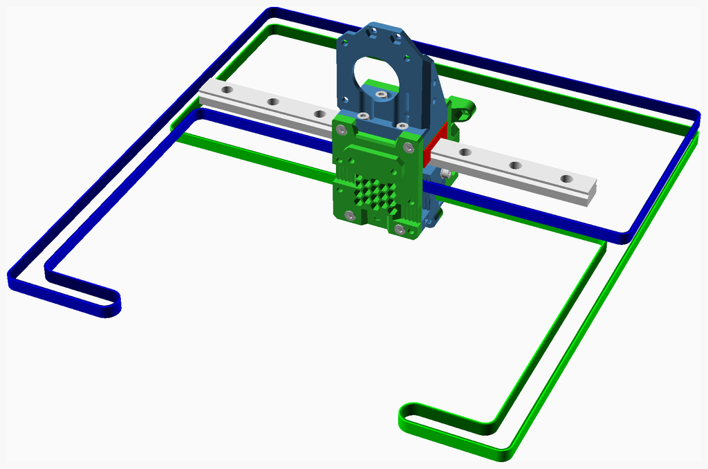

---

## Table of Contents

1. [Parts list](#Parts_list)
1. [EVA_Stage_1 assembly](#EVA_Stage_1_assembly)
1. [EVA assembly](#EVA_assembly)

[Top](#TOP)

---

## Parts list

| EVA Stage 1 | EVA | TOTALS |  |
|-----:|-----:|------:|:---|
|      |      |       | **Vitamins** |
|   4  |   .  |    4  |  Bolt M3 caphead x  8mm |
|   4  |   4  |    8  |  Bolt M3 caphead x 10mm |
|   2  |   .  |    2  |  Bolt M3 caphead x 40mm |
|   2  |   .  |    2  |  Bolt M3 countersunk x 10mm |
|   2  |   .  |    2  |  Washer  M3 |
|  14  |   4  |   18  | Total vitamins count |
|      |      |       | **3D printed parts** |
|   1  |   .  |    1  | EVA_MC_bottom_mgn12_short_duct.stl |
|   1  |   .  |    1  | EVA_MC_top_bmg_mgn12.stl |
|   1  |   .  |    1  | EVA_MC_top_lgx_mgn12_a.stl |
|   1  |   .  |    1  | EVA_MC_top_mgn12.stl |
|   1  |   .  |    1  | EVA_MC_top_orbiter_mgn12.stl |
|   1  |   .  |    1  | EVA_MC_top_titan_mgn12.stl |
|   1  |   .  |    1  | X_Carriage_Belt_Clamp_EVA.stl |
|   2  |   .  |    2  | X_Carriage_Belt_Tensioner.stl |
|   1  |   .  |    1  | back_corexy.stl |
|   .  |   1  |    1  | universal_face.stl |
|  10  |   1  |   11  | Total 3D printed parts count |

[Top](#TOP)

---

## EVA_Stage_1 assembly

### Vitamins

|Qty|Description|
|---:|:----------|
|4| Bolt M3 caphead x  8mm|
|4| Bolt M3 caphead x 10mm|
|2| Bolt M3 caphead x 40mm|
|2| Bolt M3 countersunk x 10mm|
|2| Washer  M3|

### 3D Printed parts

| 1 x EVA_MC_bottom_mgn12_short_duct.stl | 1 x EVA_MC_top_bmg_mgn12.stl | 1 x EVA_MC_top_lgx_mgn12_a.stl |
|---|---|---|
| 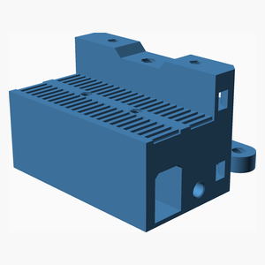 | 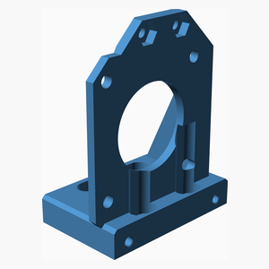 | 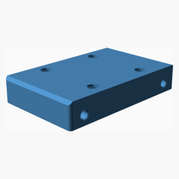 

| 1 x EVA_MC_top_mgn12.stl | 1 x EVA_MC_top_orbiter_mgn12.stl | 1 x EVA_MC_top_titan_mgn12.stl |
|---|---|---|
|  |  | 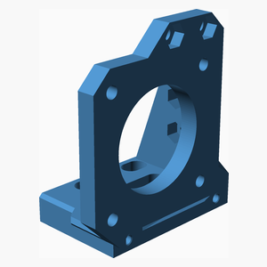 

| 1 x X_Carriage_Belt_Clamp_EVA.stl | 2 x X_Carriage_Belt_Tensioner.stl | 1 x back_corexy.stl |
|---|---|---|
| 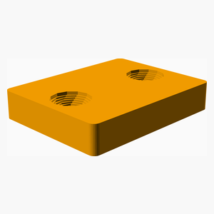 | 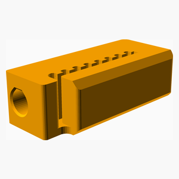 | 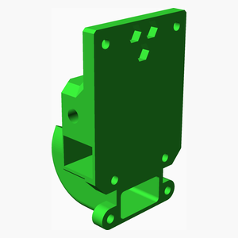 

### Assembly instructions

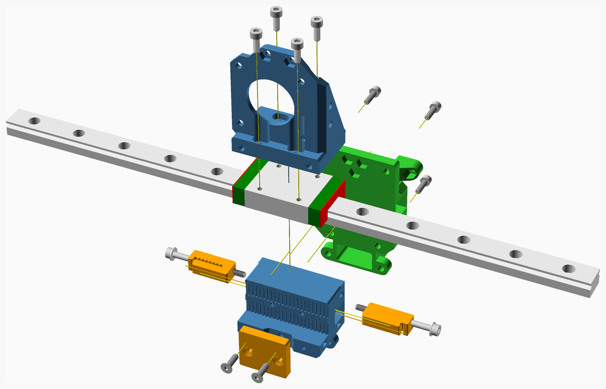

1. Bolt the top part to the MGN12 carriage. This example uses the **EVA_MC_top_bmg_mgn12.stl** part, you should use the part
appropriate to your extruder.
2. Bolt the **back_corexy.stl** part to the top part.
3. Bolt the **EVA_MC_bottom_mgn12_short_duct.stl** part to the **back_corexy.stl** part.
4. Insert the belts into the **X_Carriage_Belt_Tensioner.stl**s and then bolt the tensioners into the
**EVA_MC_bottom_mgn12_short_duct.stl** part as shown.
5. Thread the belts through the printer pulleys and then clamp them to the **EVA_MC_bottom_mgn12_short_duct.stl** part.

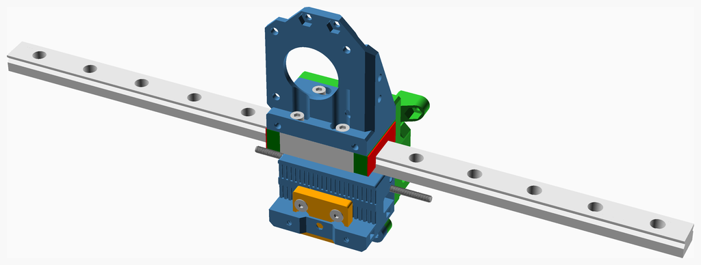

[Top](#TOP)

---

## EVA assembly

### Vitamins

|Qty|Description|
|---:|:----------|
|4| Bolt M3 caphead x 10mm|

### 3D Printed parts

| 1 x universal_face.stl |
|---|
| 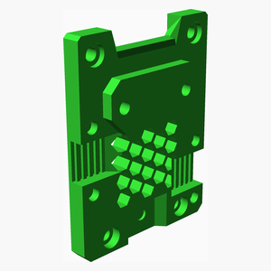 

### Sub-assemblies

| 1 x EVA_Stage_1_assembly |
|---|
| 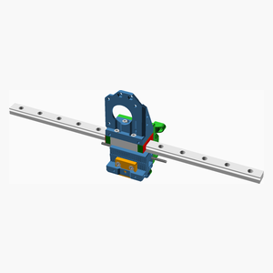 

### Assembly instructions

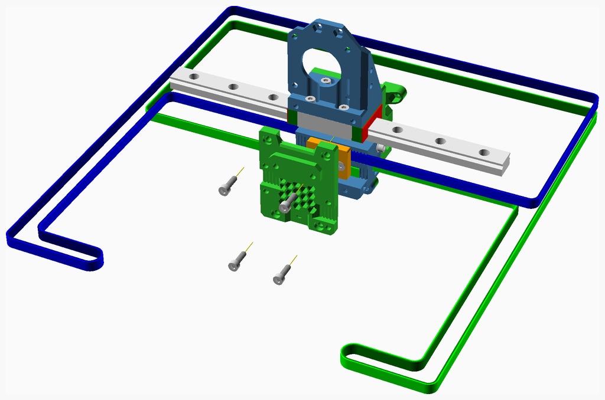

Bolt the **universal_face.stl** part to the **EVA_MC_top_bmg_mgn12** and **EVA_MC_bottom_mgn12_short_duct** parts.

[Top](#TOP)
