

# MaybeCube Assembly Instructions

These are the assembly instructions for the MaybeCube. These instructions are not fully comprehensive, that is they do
not show every small detail of the construction and in particular they do not show the wiring. However there is sufficient
detail that someone with a good understanding of 3D printers can build the MaybeCube.

## Printing the parts

A number of parts are in proximity with heat sources, namely the hotend, the heated bed and the motors. Ideally these should be
printed in ABS, but I have used PETG successfully. These parts are insulated from direct contact with the heat sources, by
cork underlay (for the heated bed) and by cork dampers (for the motors). These insulators should not be omitted from the build.

---

## Table of Contents

1. [Parts list](#Parts_list)

1. [Printhead_E3DV6_MGN12H assembly](#Printhead_E3DV6_MGN12H_assembly)
1. [X_Carriage_Belt_Side_MGN12H assembly](#X_Carriage_Belt_Side_MGN12H_assembly)
1. [XY_Motor_Mount_Right assembly](#XY_Motor_Mount_Right_assembly)
1. [XY_Idler_Right assembly](#XY_Idler_Right_assembly)
1. [XY_Motor_Mount_Left assembly](#XY_Motor_Mount_Left_assembly)
1. [XY_Idler_Left assembly](#XY_Idler_Left_assembly)
1. [Y_Carriage_Right assembly](#Y_Carriage_Right_assembly)
1. [Right_Side_Upper_Extrusion assembly](#Right_Side_Upper_Extrusion_assembly)
1. [Y_Carriage_Left assembly](#Y_Carriage_Left_assembly)
1. [Left_Side_Upper_Extrusion assembly](#Left_Side_Upper_Extrusion_assembly)
1. [Face_Top_Stage_1 assembly](#Face_Top_Stage_1_assembly)
1. [Face_Top_Stage_2 assembly](#Face_Top_Stage_2_assembly)
1. [Face_Top assembly](#Face_Top_assembly)
1. [Back_Panel assembly](#Back_Panel_assembly)
1. [Extruder_Bracket assembly](#Extruder_Bracket_assembly)
1. [IEC_Housing assembly](#IEC_Housing_assembly)
1. [Right_Side assembly](#Right_Side_assembly)
1. [Display_Cover_TFT35_E3 assembly](#Display_Cover_TFT35_E3_assembly)
1. [Base_Plate_Stage_1 assembly](#Base_Plate_Stage_1_assembly)
1. [Base_Plate assembly](#Base_Plate_assembly)
1. [Z_Carriage_Right assembly](#Z_Carriage_Right_assembly)
1. [Z_Carriage_Left assembly](#Z_Carriage_Left_assembly)
1. [Z_Carriage_Center assembly](#Z_Carriage_Center_assembly)
1. [Printbed_Frame assembly](#Printbed_Frame_assembly)
1. [Printbed_Frame_with_Z_Carriages assembly](#Printbed_Frame_with_Z_Carriages_assembly)
1. [Printbed assembly](#Printbed_assembly)
1. [Left_Side assembly](#Left_Side_assembly)
1. [Stage_1 assembly](#Stage_1_assembly)
1. [Stage_2 assembly](#Stage_2_assembly)
1. [Stage_3 assembly](#Stage_3_assembly)
1. [Stage_4 assembly](#Stage_4_assembly)
1. [Stage_5 assembly](#Stage_5_assembly)
1. [Main assembly](#main_assembly)

[Top](#TOP)

---

## Parts list

| Printhead E3DV6 MGN12H | X Carriage Belt Side MGN12H | Face Top | Back Panel | Right Side | Printbed | Left Side | Main | TOTALS |  |
|-----:|-----:|-----:|-----:|-----:|-----:|-----:|-----:|------:|:---|
|      |      |      |      |      |      |      |      |       | **Vitamins** |
|   .  |   .  |   .  |   .  |   .  |   .  |   .  |   1  |    1  |  Aluminium sheet 340mm x 340mm x 3mm |
|   .  |   .  |   1  |   .  |   .  |   .  |   .  |   .  |    1  |  Belt GT2 x 6mm x nanmm |
|   .  |   .  |   1  |   .  |   .  |   .  |   .  |   .  |    1  |  Belt GT2 x 6mm x nanmm |
|   .  |   .  |   .  |   1  |   .  |   .  |   .  |   .  |    1  |  BigTreeTech SKR E3 Turbo |
|   .  |   .  |   .  |   .  |   .  |   .  |   .  |   1  |    1  |  BigTreeTech TFT35 E3 v3.0 |
|   4  |   .  |   .  |   .  |   .  |   .  |   .  |   .  |    4  |  Bolt M2 caphead x  6mm |
|   .  |   .  |   .  |   .  |   2  |   2  |   .  |   2  |    6  |  Bolt M3 buttonhead x  8mm |
|   .  |   .  |   4  |   5  |   .  |   .  |   .  |   .  |    9  |  Bolt M3 buttonhead x 10mm |
|   .  |   .  |   8  |   .  |   .  |   .  |   .  |   8  |   16  |  Bolt M3 buttonhead x 12mm |
|   .  |   .  |   .  |   .  |   2  |   .  |   .  |   .  |    2  |  Bolt M3 buttonhead x 16mm |
|   2  |   .  |   .  |   .  |   .  |   .  |   .  |   .  |    2  |  Bolt M3 buttonhead x 25mm |
|   .  |   .  |   .  |   5  |   .  |   .  |   .  |   4  |    9  |  Bolt M3 caphead x  6mm |
|   .  |   .  |   .  |   .  |   .  |   4  |   .  |   .  |    4  |  Bolt M3 caphead x  8mm |
|   .  |   .  |  28  |   .  |   .  |   .  |   .  |   .  |   28  |  Bolt M3 caphead x 10mm |
|   .  |   .  |   6  |   .  |   .  |   .  |   .  |   .  |    6  |  Bolt M3 caphead x 16mm |
|   .  |   .  |   .  |   .  |   .  |   3  |   .  |   .  |    3  |  Bolt M3 caphead x 20mm |
|   .  |   .  |   2  |   .  |   .  |   .  |   .  |   4  |    6  |  Bolt M3 caphead x 25mm |
|   .  |   .  |   2  |   .  |   .  |   .  |   .  |   .  |    2  |  Bolt M3 caphead x 30mm |
|   .  |   2  |   .  |   .  |   .  |   .  |   .  |   .  |    2  |  Bolt M3 caphead x 40mm |
|   .  |   .  |   .  |   .  |   .  |   2  |   .  |   .  |    2  |  Bolt M3 countersunk x 10mm |
|   .  |   .  |   2  |   .  |   .  |   .  |   .  |   2  |    4  |  Bolt M3 countersunk x 12mm |
|   .  |   .  |   8  |   .  |   .  |   .  |   .  |   .  |    8  |  Bolt M3 countersunk x 25mm |
|   .  |   .  |   .  |   .  |   .  |   .  |   .  |   4  |    4  |  Bolt M3 countersunk x 30mm |
|   .  |   .  |   .  |   .  |   8  |   .  |   .  |  24  |   32  |  Bolt M4 buttonhead x  8mm |
|   .  |   .  |  14  |   .  |   .  |   8  |   2  |  12  |   36  |  Bolt M4 buttonhead x 10mm |
|   .  |   .  |   .  |   .  |   2  |   .  |   2  |   .  |    4  |  Bolt M4 buttonhead x 12mm |
|   .  |   .  |   .  |  18  |   .  |   .  |   .  |   .  |   18  |  Bolt M4 countersunk x  8mm |
|   .  |   .  |  20  |   .  |   .  |   .  |   8  |   .  |   28  |  Bolt M4 countersunk x 10mm |
|   .  |   .  |   4  |   .  |   .  |   .  |   .  |   .  |    4  |  Bolt M5 buttonhead x 10mm |
|   .  |   .  |  10  |   .  |   8  |   8  |   8  |  12  |   46  |  Bolt M5 buttonhead x 12mm |
|   .  |   .  |   .  |   .  |   .  |   8  |   .  |   .  |    8  |  Bolt M5 countersunk x 12mm |
|   .  |   .  |   2  |   .  |   1  |   .  |   .  |   1  |    4  |  Cork damper NEMA 17 |
|   .  |   .  |   .  |   .  |   .  |   1  |   .  |   .  |    1  |  Cork underlay 214mm x 214mm |
|   .  |   .  |   .  |   .  |   .  |   2  |   .  |   .  |    2  |  Extrusion E2020 x 260mm |
|   .  |   .  |   1  |   .  |   .  |   .  |   .  |   .  |    1  |  Extrusion E2020 x 300mm |
|   .  |   .  |   .  |   .  |   2  |   .  |   2  |   .  |    4  |  Extrusion E2020 x 400mm |
|   .  |   .  |   .  |   .  |   .  |   2  |   .  |   .  |    2  |  Extrusion E2040 x 188mm |
|   .  |   .  |   3  |   .  |   2  |   .  |   2  |   1  |    8  |  Extrusion E2040 x 300mm |
|   .  |   .  |   .  |   .  |   .  |   .  |   .  |   1  |    1  |  Extrusion E2080 x 300mm |
|   1  |   .  |   .  |   .  |   .  |   .  |   .  |   .  |    1  |  Fan 30mm x 10mm |
|   .  |   .  |   .  |   .  |   1  |   .  |   .  |   .  |    1  |  Filament sensor |
|   .  |   .  |   .  |   .  |   .  |   1  |   .  |   .  |    1  |  Heated Bed 214mm x 214mm |
|   1  |   .  |   .  |   .  |   .  |   .  |   .  |   .  |    1  |  Hot end E3D V6 direct 1.75mm |
|   .  |   .  |   .  |   .  |   1  |   .  |   .  |   .  |    1  |  IEC320 C14 switched fused inlet module |
|   .  |   .  |   .  |   1  |   .  |   .  |   .  |   .  |    1  |  LED Switching Power Supply 24V 15A 360W |
|   .  |   .  |   .  |   .  |   .  |   1  |   .  |   .  |    1  |  Leadscrew nut 8 x 2 |
|   .  |   .  |   1  |   .  |   .  |   .  |   .  |   .  |    1  |  Linear rail MGN12 x 250mm |
|   .  |   .  |   2  |   .  |   .  |   .  |   .  |   .  |    2  |  Linear rail MGN12 x 300mm |
|   .  |   .  |   3  |   .  |   .  |   .  |   .  |   .  |    3  |  Linear rail carriage MGN12H |
|   .  |   .  |   .  |   .  |   .  |   .  |   .  |   2  |    2  |  Linear rod 12mm x 300mm |
|   .  |   .  |   .  |   .  |   1  |   .  |   .  |   .  |    1  |  MK10 Dual Pulley Extruder |
|   .  |   .  |  18  |   .  |   .  |   2  |   .  |   4  |   24  |  Nut M3 hammer |
|   .  |   .  |   .  |   .  |   .  |   3  |   .  |   .  |    3  |  Nut M3 sliding T |
|   .  |   .  |  12  |  14  |   6  |   .  |   .  |  36  |   68  |  Nut M4 hammer |
|   .  |   .  |  20  |   .  |   2  |   8  |  12  |   .  |   42  |  Nut M4 sliding T |
|   .  |   .  |   .  |   .  |   .  |   9  |   .  |   .  |    9  |  O-ring nitrile 3mm x 2mm |
|   .  |   .  |   .  |   .  |   .  |   .  |   .  |   1  |    1  |  PTFE Bowden tube, 500 mm |
|   .  |   .  |   .  |   .  |   2  |   .  |   .  |   .  |    2  |  Pillar hex nylon F/F M3x14 |
|   .  |   .  |   .  |   5  |   .  |   .  |   .  |   .  |    5  |  Pillar hex nylon F/F M3x20 |
|   .  |   .  |   8  |   .  |   .  |   .  |   .  |   .  |    8  |  Pulley GT2 idler 16 teeth |
|   .  |   .  |   4  |   .  |   .  |   .  |   .  |   .  |    4  |  Pulley GT2 idler smooth 9.63mm |
|   .  |   .  |   2  |   .  |   .  |   .  |   .  |   .  |    2  |  Pulley GT2OB 20 teeth |
|   .  |   .  |   .  |   .  |   .  |   2  |   .  |   .  |    2  |  SCS12LUU bearing block |
|   .  |   .  |   .  |   .  |   .  |   .  |   4  |   .  |    4  |  SK12 shaft support bracket |
|   .  |   .  |   .  |   1  |   .  |   .  |   .  |   1  |    2  |  Sheet polycarbonate 340mm x 400mm x 3mm |
|   1  |   .  |   .  |   .  |   .  |   .  |   .  |   .  |    1  |  Square radial fan 3010 |
|   .  |   .  |   2  |   .  |   .  |   .  |   .  |   .  |    2  |  Stepper motor NEMA17 x 40mm |
|   .  |   .  |   .  |   .  |   .  |   .  |   .  |   1  |    1  |  Stepper motor NEMA17 x 40mm, 280mm integrated leadscrew |
|   .  |   .  |   .  |   .  |   1  |   .  |   .  |   .  |    1  |  Stepper motor NEMA17 x 47mm |
|   .  |   .  |   .  |   .  |   1  |   .  |   .  |   .  |    1  |  Stepper motor cable, 200mm |
|   .  |   .  |   1  |   .  |   .  |   .  |   .  |   .  |    1  |  Stepper motor cable, 300mm |
|   .  |   .  |   1  |   .  |   .  |   .  |   .  |   .  |    1  |  Stepper motor cable, 500mm |
|   .  |   .  |   .  |   .  |   .  |   .  |   .  |   1  |    1  |  Stepper motor cable, 750mm |
|   .  |   2  |  26  |   .  |   .  |   9  |   .  |   .  |   37  |  Washer  M3 |
|   .  |   .  |   2  |   .  |   .  |   .  |   .  |   .  |    2  |  Washer  M4 |
|   .  |   .  |   .  |   .  |   .  |   6  |   .  |   .  |    6  |  Washer penny  M4 |
|   3  |   .  |   .  |   .  |   .  |   .  |   .  |   .  |    3  |  Ziptie 2.5mm x 100mm min length |
|  12  |   4  | 218  |  50  |  42  |  81  |  40  | 123  |  570  | Total vitamins count |
|      |      |      |      |      |      |      |      |       | **3D printed parts** |
|   .  |   .  |   .  |   .  |   .  |   .  |   .  |   1  |    1  | Display_Housing_Bracket_TFT35_E3.stl |
|   .  |   .  |   .  |   .  |   .  |   .  |   .  |   1  |    1  | Display_Housing_TFT35_E3.stl |
|   .  |   .  |   .  |   .  |   .  |   .  |   .  |   2  |    2  | E20_ChannelCover_50mm.stl |
|   .  |   .  |   .  |   .  |   .  |   .  |   .  |   3  |    3  | E20_RibbonCover_50mm.stl |
|   .  |   .  |   .  |   .  |   1  |   .  |   .  |   .  |    1  | Extruder_Bracket.stl |
|   1  |   .  |   .  |   .  |   .  |   .  |   .  |   .  |    1  | Fan_Duct.stl |
|   .  |   .  |   .  |   .  |   .  |   .  |   .  |   4  |    4  | Foot_LShaped_12mm.stl |
|   .  |   .  |   .  |   .  |   .  |   .  |   .  |   1  |    1  | Front_Cover.stl |
|   .  |   .  |   .  |   .  |   .  |   .  |   .  |   1  |    1  | Front_Display_Wiring_Cover.stl |
|   1  |   .  |   .  |   .  |   .  |   .  |   .  |   .  |    1  | Hotend_Clamp.stl |
|   .  |   .  |   .  |   .  |   1  |   .  |   .  |   .  |    1  | IEC_Housing.stl |
|   .  |   .  |   .  |   .  |   1  |   .  |   .  |   .  |    1  | IEC_Housing_Mount.stl |
|   .  |   .  |   .  |   1  |   .  |   .  |   .  |   .  |    1  | PCB_Mount.stl |
|   .  |   .  |   .  |   1  |   .  |   .  |   .  |   .  |    1  | PSU_Lower_Mount.stl |
|   .  |   .  |   .  |   1  |   .  |   .  |   .  |   .  |    1  | PSU_Upper_Mount.stl |
|   .  |   .  |   .  |   .  |   .  |   1  |   .  |   .  |    1  | Printbed_Strain_Relief.stl |
|   .  |   .  |   .  |   .  |   .  |   1  |   .  |   .  |    1  | Printbed_Strain_Relief_Clamp.stl |
|   .  |   .  |   .  |   .  |   .  |   .  |   .  |   1  |    1  | Spool_Holder.stl |
|   .  |   .  |   4  |   .  |   .  |   .  |   .  |   .  |    4  | Top_Corner_Piece.stl |
|   .  |   .  |   1  |   .  |   .  |   .  |   .  |   .  |    1  | Wiring_Guide.stl |
|   .  |   .  |   .  |   .  |   .  |   .  |   .  |   1  |    1  | Wiring_Guide_Clamp.stl |
|   .  |   .  |   1  |   .  |   .  |   .  |   .  |   .  |    1  | XY_Idler_Left.stl |
|   .  |   .  |   1  |   .  |   .  |   .  |   .  |   .  |    1  | XY_Idler_Right.stl |
|   .  |   .  |   1  |   .  |   .  |   .  |   .  |   .  |    1  | XY_Motor_Mount_Brace_Left.stl |
|   .  |   .  |   1  |   .  |   .  |   .  |   .  |   .  |    1  | XY_Motor_Mount_Brace_Right.stl |
|   .  |   .  |   1  |   .  |   .  |   .  |   .  |   .  |    1  | XY_Motor_Mount_Left.stl |
|   .  |   .  |   1  |   .  |   .  |   .  |   .  |   .  |    1  | XY_Motor_Mount_Right.stl |
|   .  |   .  |   1  |   .  |   .  |   .  |   .  |   .  |    1  | X_Carriage_Belt_Clamp.stl |
|   .  |   1  |   .  |   .  |   .  |   .  |   .  |   .  |    1  | X_Carriage_Belt_Side_MGN12H.stl |
|   .  |   2  |   .  |   .  |   .  |   .  |   .  |   .  |    2  | X_Carriage_Belt_Tensioner.stl |
|   1  |   .  |   .  |   .  |   .  |   .  |   .  |   .  |    1  | X_Carriage_Groovemount_MGN12H.stl |
|   .  |   .  |   1  |   .  |   .  |   .  |   .  |   .  |    1  | Y_Carriage_Brace_Left.stl |
|   .  |   .  |   1  |   .  |   .  |   .  |   .  |   .  |    1  | Y_Carriage_Brace_Right.stl |
|   .  |   .  |   1  |   .  |   .  |   .  |   .  |   .  |    1  | Y_Carriage_Left.stl |
|   .  |   .  |   1  |   .  |   .  |   .  |   .  |   .  |    1  | Y_Carriage_Right.stl |
|   .  |   .  |   .  |   .  |   .  |   1  |   .  |   .  |    1  | Z_Carriage_Center.stl |
|   .  |   .  |   .  |   .  |   .  |   1  |   .  |   .  |    1  | Z_Carriage_Left.stl |
|   .  |   .  |   .  |   .  |   .  |   1  |   .  |   .  |    1  | Z_Carriage_Right.stl |
|   .  |   .  |   .  |   .  |   .  |   .  |   1  |   .  |    1  | Z_Motor_Mount.stl |
|   .  |   .  |   .  |   .  |   .  |   .  |   1  |   .  |    1  | Z_Motor_MountGuide_19mm.stl |
|   .  |   .  |   .  |   .  |   .  |   .  |   2  |   .  |    2  | Z_RodMountGuide_50mm.stl |
|   3  |   3  |  16  |   3  |   3  |   5  |   4  |  15  |   52  | Total 3D printed parts count |
|      |      |      |      |      |      |      |      |       | **CNC routed parts** |
|   .  |   .  |   .  |   1  |   .  |   .  |   .  |   .  |    1  | Back_Panel.dxf |
|   .  |   .  |   .  |   .  |   .  |   .  |   .  |   1  |    1  | BaseAL.dxf |
|   .  |   .  |   .  |   .  |   .  |   .  |   .  |   1  |    1  | Left_Side_Panel.dxf |
|   .  |   .  |   .  |   1  |   .  |   .  |   .  |   2  |    3  | Total CNC routed parts count |

[Top](#TOP)

---

## Printhead_E3DV6_MGN12H assembly

### Vitamins

|Qty|Description|
|---:|:----------|
|4| Bolt M2 caphead x  6mm|
|2| Bolt M3 buttonhead x 25mm|
|1| Fan 30mm x 10mm|
|1| Hot end E3D V6 direct 1.75mm|
|1| Square radial fan 3010|
|3| Ziptie 2.5mm x 100mm min length|

### 3D Printed parts

| 1 x Fan_Duct.stl | 1 x Hotend_Clamp.stl | 1 x X_Carriage_Groovemount_MGN12H.stl |
|---|---|---|
| 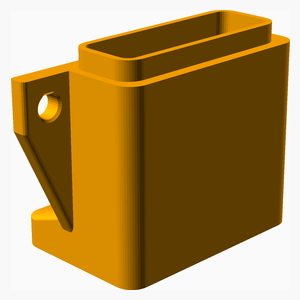 | 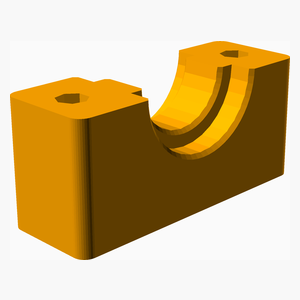 | 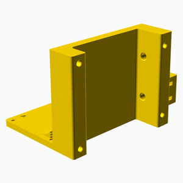 

### Assembly instructions

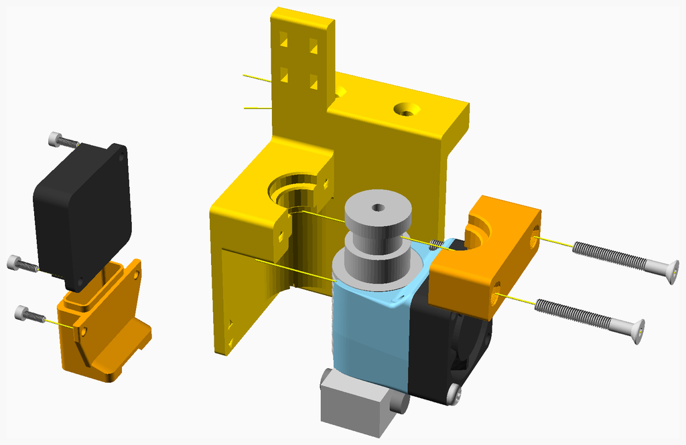

1. Bolt the fan onto the side of the **X_Carriage_Groovemount_MGN12H**, secure the fan wire with a ziptie.
2. Ensure a good fit between the fan and the fan duct and bolt the fan duct to the X_Carriage.
3. Assemble the E3D hotend, including fan, thermistor cartridge and heater cartridge.
4. Use the **Hotend_Clamp** to attach the E3D hotend to the X_Carriage.
5. Collect the wires together, wrap them in spiral wrap,  and secure them to the X_Carriage using the zipties. Note that the wiring is not shown in this diagram.

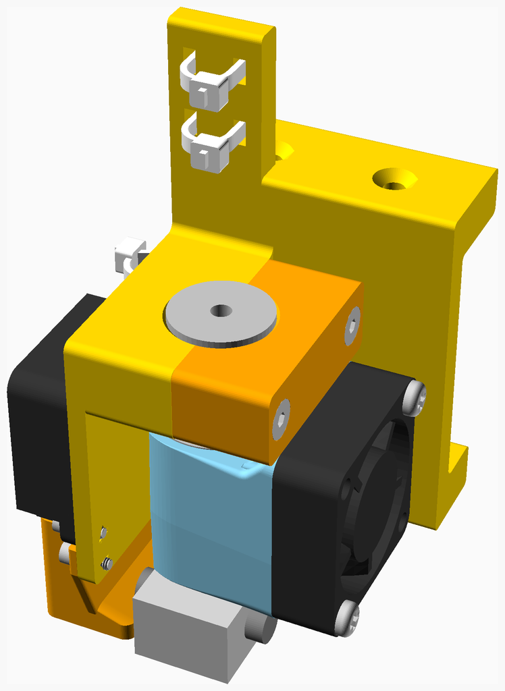

[Top](#TOP)

---

## X_Carriage_Belt_Side_MGN12H assembly

### Vitamins

|Qty|Description|
|---:|:----------|
|2| Bolt M3 caphead x 40mm|
|2| Washer  M3|

### 3D Printed parts

| 1 x X_Carriage_Belt_Side_MGN12H.stl | 2 x X_Carriage_Belt_Tensioner.stl |
|---|---|
| 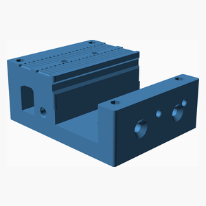 | 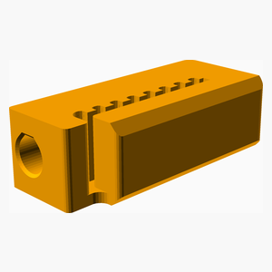 

### Assembly instructions

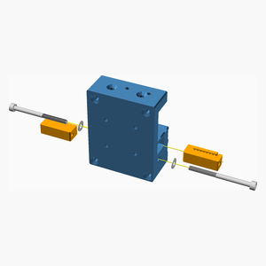

Insert the belts into the **X_Carriage_Belt_Tensioner**s and then bolt the tensioners into the
**X_Carriage_Belt_Side_MGN12H** part as shown. Note the belts are not shown in this diagram.

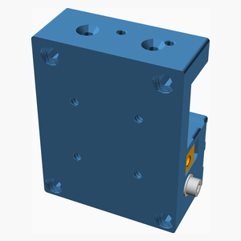

[Top](#TOP)

---

## XY_Motor_Mount_Right assembly

### Vitamins

|Qty|Description|
|---:|:----------|
|4| Bolt M3 buttonhead x 12mm|
|4| Bolt M3 countersunk x 25mm|
|3| Bolt M4 buttonhead x 10mm|
|1| Cork damper NEMA 17|
|3| Nut M4 hammer|
|1| Pulley GT2 idler 16 teeth|
|1| Pulley GT2 idler smooth 9.63mm|
|1| Pulley GT2OB 20 teeth|
|1| Stepper motor NEMA17 x 40mm|
|1| Stepper motor cable, 300mm|
|4| Washer  M3|

### 3D Printed parts

| 1 x XY_Motor_Mount_Brace_Right.stl | 1 x XY_Motor_Mount_Right.stl |
|---|---|
| 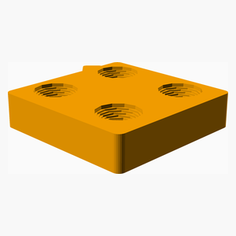 |  

### Assembly instructions

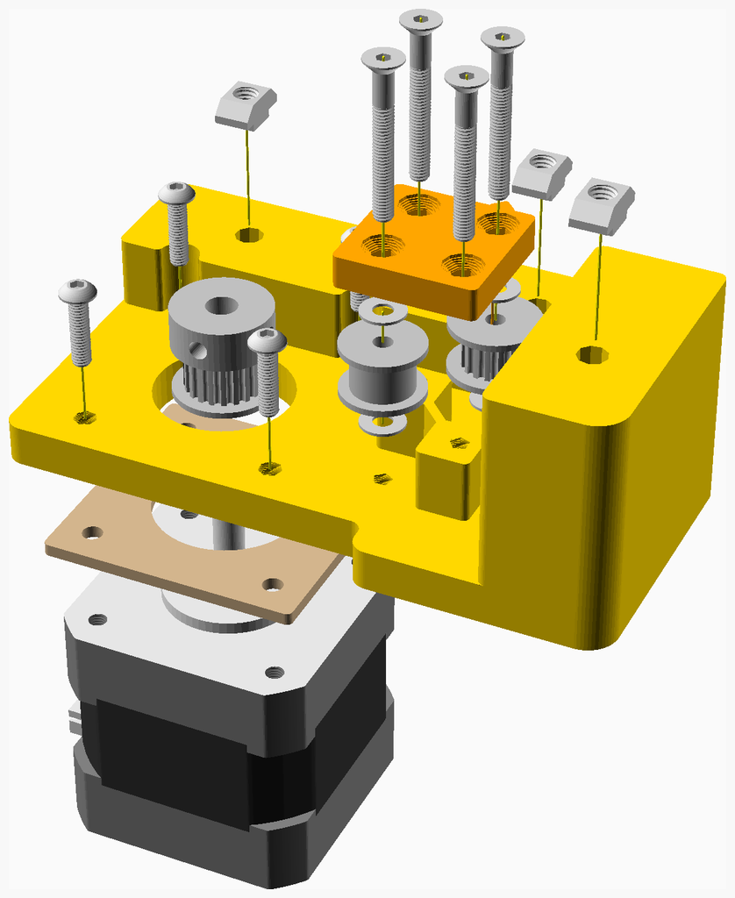

1. Bolt the idler pulleys and the **XY_Motor_Mount_Brace_Right** to the **XY_Motor_Mount_Right**. Note the brace is not
symmetrical - there is an orientation indicator and this should point towards the back of the printer. Tighten the
pulley bolts until the pulleys no longer turn freely, and then loosen the bolts by about 1/4 turn until the pulleys
turn freely again.
2. Bolt the motor and the cork damper to the motor mount. The core damper thermally insulates the motor from the mount
and should not be omitted.
3. Align the drive pulley with the idler pulleys and bolt it to the motor shaft.
4. Add the bolts and t-nuts in preparation for later attachment to the frame.

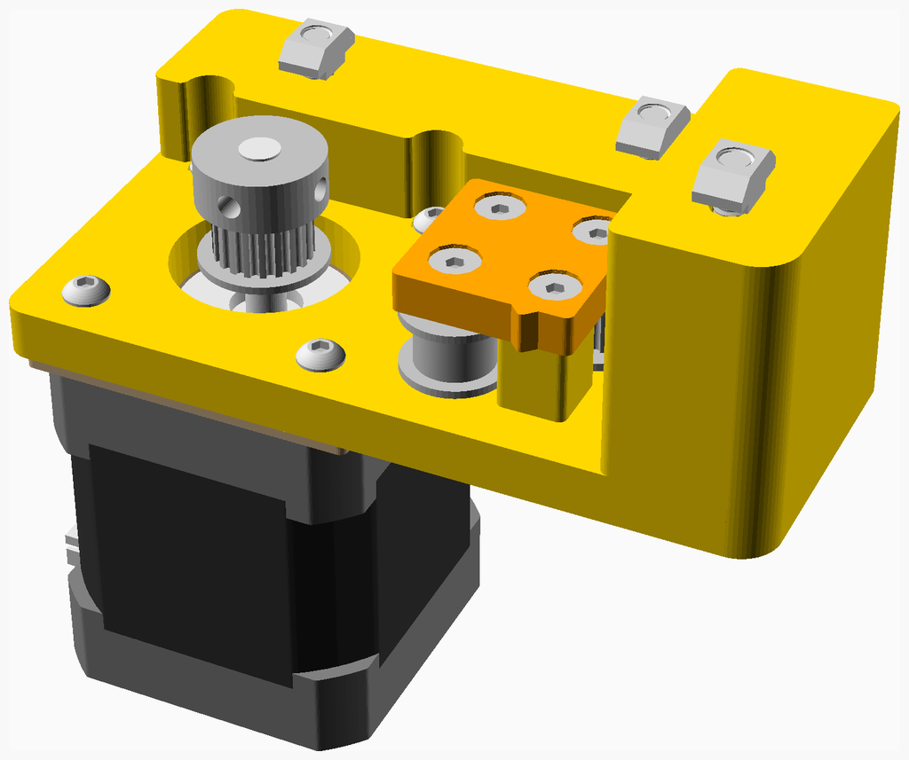

[Top](#TOP)

---

## XY_Idler_Right assembly

### Vitamins

|Qty|Description|
|---:|:----------|
|1| Bolt M3 caphead x 30mm|
|4| Bolt M4 buttonhead x 10mm|
|3| Nut M4 hammer|
|2| Pulley GT2 idler 16 teeth|
|6| Washer  M3|
|1| Washer  M4|

### 3D Printed parts

| 1 x XY_Idler_Right.stl |
|---|
| 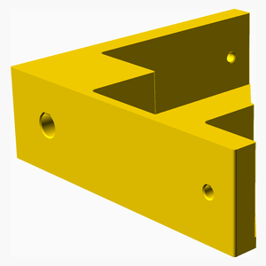 

### Assembly instructions

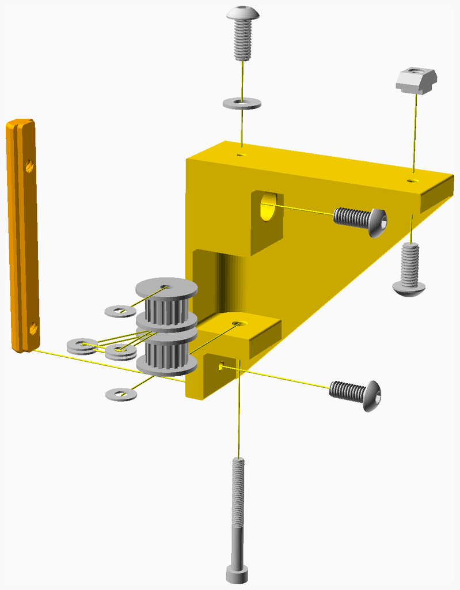

1. Bolt the pulley stack into the **XY_Idler_Right**. Note that there are 4 washers between the two pulleys and one
washer at the top and the bottom of the pulley stack.
2. Tighten the bolt until the pulleys no longer turn freely, and then loosen the bolt by about 1/4 turn to allow the pulleys
to turn freely again.
3. Add the bolts and t-nuts in preparation for later attachment to the frame.
4. Add the button head bolt and washer.

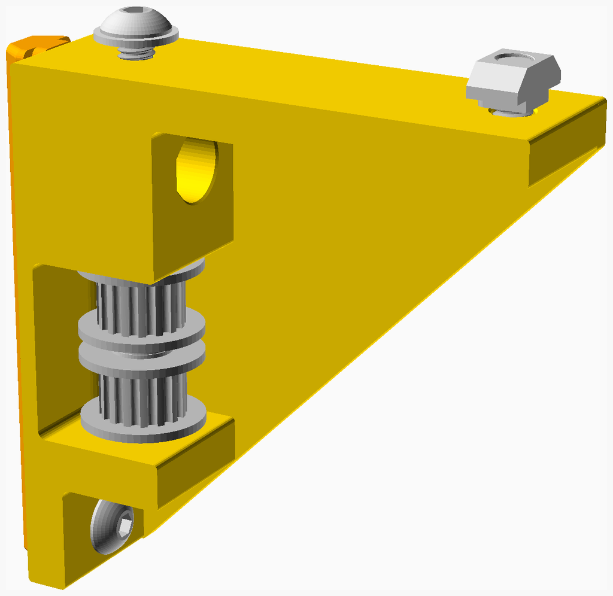

[Top](#TOP)

---

## XY_Motor_Mount_Left assembly

### Vitamins

|Qty|Description|
|---:|:----------|
|4| Bolt M3 buttonhead x 12mm|
|4| Bolt M3 countersunk x 25mm|
|3| Bolt M4 buttonhead x 10mm|
|1| Cork damper NEMA 17|
|3| Nut M4 hammer|
|1| Pulley GT2 idler 16 teeth|
|1| Pulley GT2 idler smooth 9.63mm|
|1| Pulley GT2OB 20 teeth|
|1| Stepper motor NEMA17 x 40mm|
|1| Stepper motor cable, 500mm|
|4| Washer  M3|

### 3D Printed parts

| 1 x XY_Motor_Mount_Brace_Left.stl | 1 x XY_Motor_Mount_Left.stl |
|---|---|
| 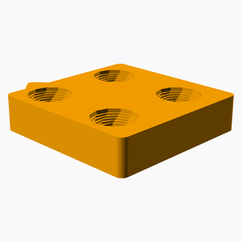 | 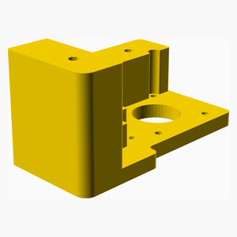 

### Assembly instructions

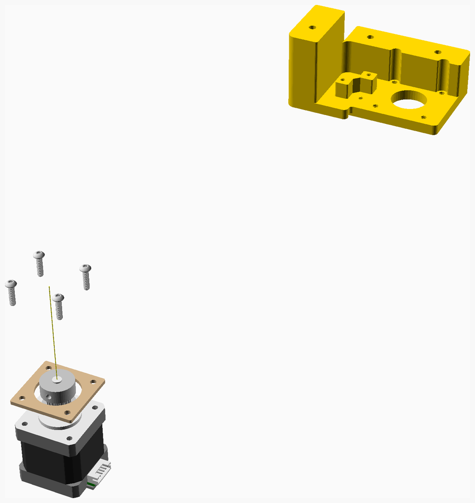

1. Bolt the idler pulleys and the **XY_Motor_Mount_Brace_Left** to the **XY_Motor_Mount_Left**. Note the brace is not
symmetrical - there is an orientation indicator and this should point towards the back of the printer. Tighten the
pulley bolts until the pulleys no longer turn freely, and then loosen the bolts by about 1/4 turn until the pulleys
turn freely again.
2. Bolt the motor and the cork damper to the motor mount. The core damper thermally insulates the motor from the mount
and should not be omitted.
3. Align the drive pulley with the idler pulleys and bolt it to the motor shaft.
4. Add the bolts and t-nuts in preparation for later attachment to the frame.

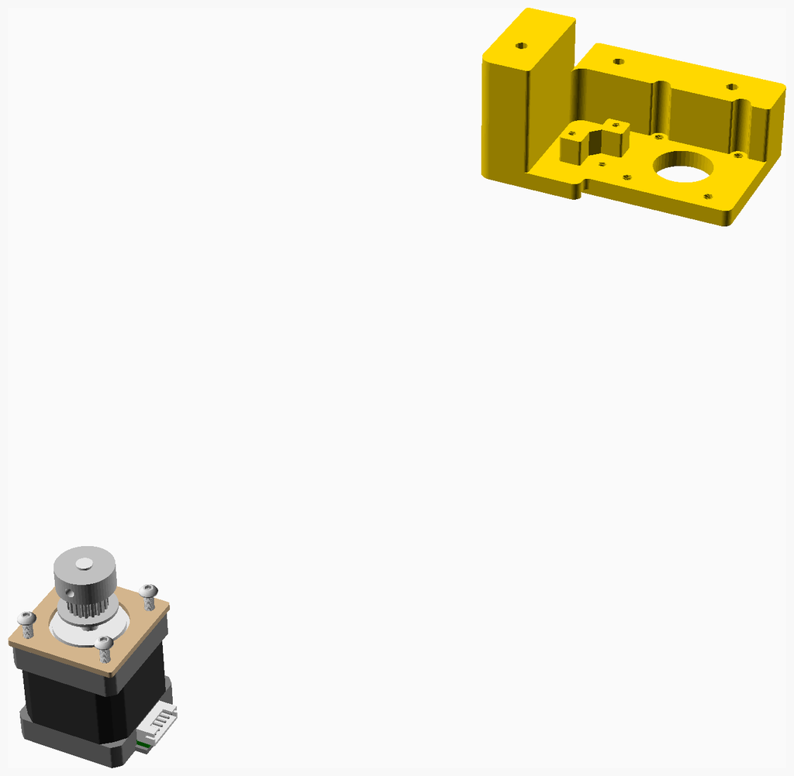

[Top](#TOP)

---

## XY_Idler_Left assembly

### Vitamins

|Qty|Description|
|---:|:----------|
|1| Bolt M3 caphead x 30mm|
|4| Bolt M4 buttonhead x 10mm|
|3| Nut M4 hammer|
|2| Pulley GT2 idler 16 teeth|
|6| Washer  M3|
|1| Washer  M4|

### 3D Printed parts

| 1 x XY_Idler_Left.stl |
|---|
| 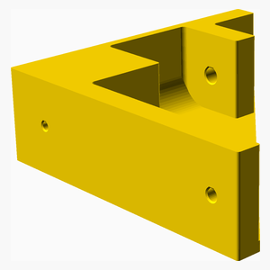 

### Assembly instructions

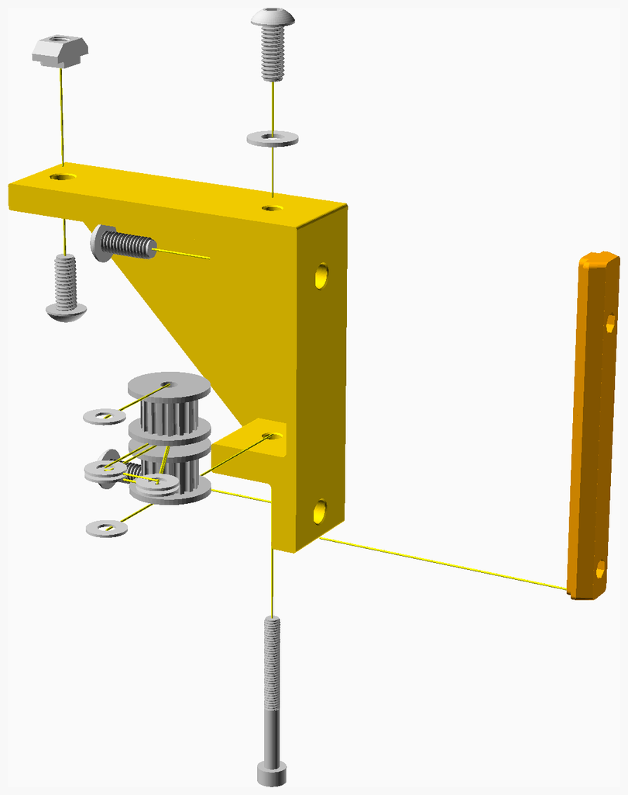

1. Bolt the pulley stack into the **XY_Idler_Left**. Note that there are 4 washers between the two pulleys and one
washer at the top and the bottom of the pulley stack.
2. Tighten the bolt until the pulleys no longer turn freely, and then loosen the bolt by about 1/4 turn to allow the pulleys
to turn freely again.
3. Add the bolts and t-nuts in preparation for later attachment to the frame.
4. Add the button head bolt and washer.

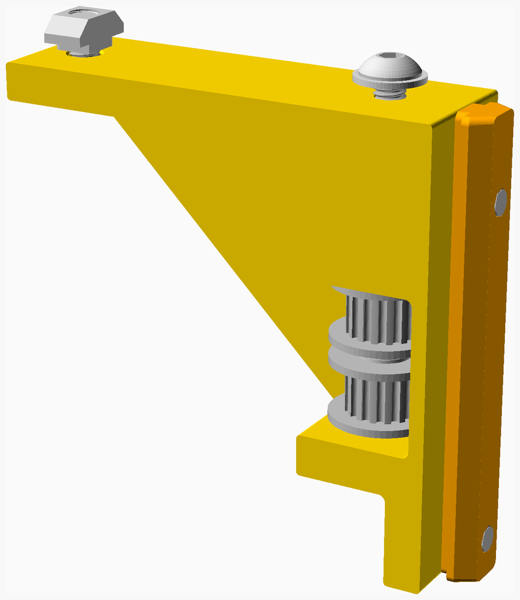

[Top](#TOP)

---

## Y_Carriage_Right assembly

### Vitamins

|Qty|Description|
|---:|:----------|
|3| Bolt M3 caphead x 16mm|
|1| Bolt M3 caphead x 25mm|
|1| Pulley GT2 idler 16 teeth|
|1| Pulley GT2 idler smooth 9.63mm|
|3| Washer  M3|

### 3D Printed parts

| 1 x Y_Carriage_Brace_Right.stl | 1 x Y_Carriage_Right.stl |
|---|---|
| 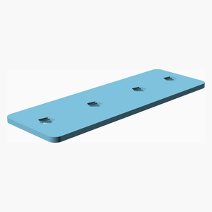 | 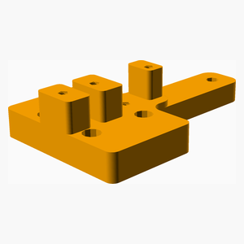 

### Assembly instructions

1. Bolt the **Y_Carriage_Brace_Right* and the pulleys to the **Y_Carriage_Right** as shown. Note the position of the washers.
2. Tighten the bolts until the pulleys no longer turn freely and then loosen by about 1/4 turn so the pulleys can again turn.

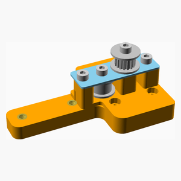

[Top](#TOP)

---

## Right_Side_Upper_Extrusion assembly

### Vitamins

|Qty|Description|
|---:|:----------|
|12| Bolt M3 caphead x 10mm|
|4| Bolt M5 buttonhead x 12mm|
|1| Extrusion E2040 x 300mm|
|1| Linear rail MGN12 x 300mm|
|1| Linear rail carriage MGN12H|
|8| Nut M3 hammer|

### Sub-assemblies

| 1 x Y_Carriage_Right_assembly |
|---|
|  

### Assembly instructions

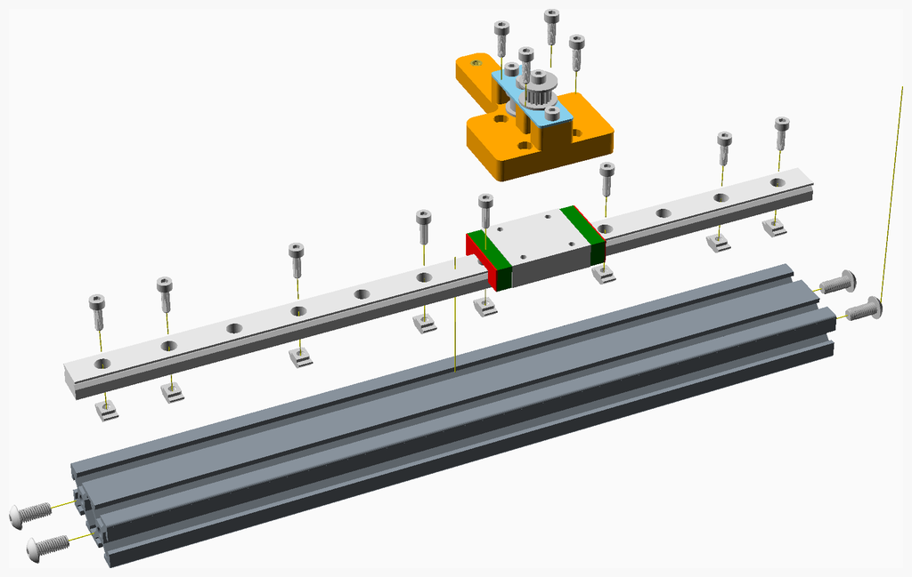

1. Bolt the MGN linear rail to the extrusion, using the **Rail_Centering_Jig** to align the rail. Do not fully tighten the
bolts at this stage - they will be fully tightened when the rail is racked at a later stage.
2. Bolt the **Y_Carriage_Right_assembly** to the MGN carriage.
3. Screw the bolts into ends of the extrusion in preparation for attachment to the rest of the top face.

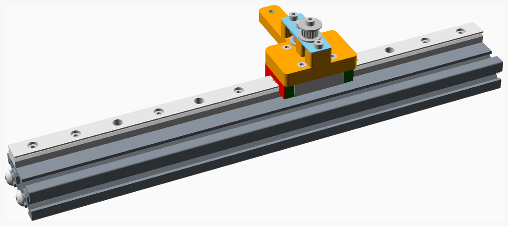

[Top](#TOP)

---

## Y_Carriage_Left assembly

### Vitamins

|Qty|Description|
|---:|:----------|
|3| Bolt M3 caphead x 16mm|
|1| Bolt M3 caphead x 25mm|
|1| Pulley GT2 idler 16 teeth|
|1| Pulley GT2 idler smooth 9.63mm|
|3| Washer  M3|

### 3D Printed parts

| 1 x Y_Carriage_Brace_Left.stl | 1 x Y_Carriage_Left.stl |
|---|---|
| 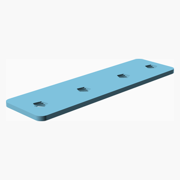 | 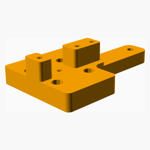 

### Assembly instructions

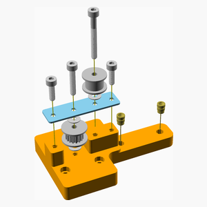

1. Bolt the **Y_Carriage_Brace_Left* and the pulleys to the **Y_Carriage_Left** as shown. Note the position of the washers.
2. Tighten the bolts until the pulleys no longer turn freely and then loosen by about 1/4 turn so the pulleys can again turn.

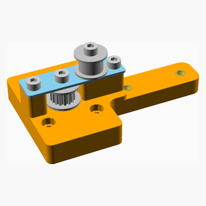

[Top](#TOP)

---

## Left_Side_Upper_Extrusion assembly

### Vitamins

|Qty|Description|
|---:|:----------|
|12| Bolt M3 caphead x 10mm|
|4| Bolt M5 buttonhead x 12mm|
|1| Extrusion E2040 x 300mm|
|1| Linear rail MGN12 x 300mm|
|1| Linear rail carriage MGN12H|
|8| Nut M3 hammer|

### Sub-assemblies

| 1 x Y_Carriage_Left_assembly |
|---|
|  

### Assembly instructions

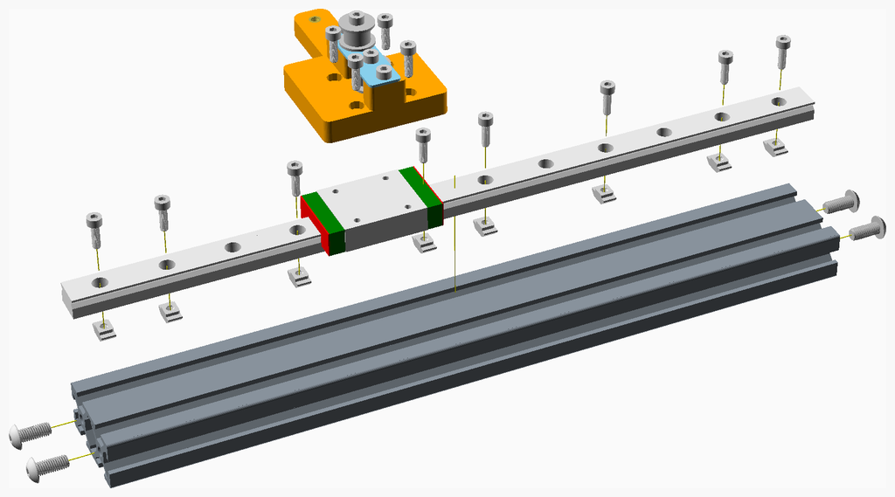

1. Bolt the MGN linear rail to the extrusion, using the **Rail_Centering_Jig** to align the rail. Fully tighten the
bolts - the left rail is the fixed rail and the right rail will be aligned to it.
bolts at this stage - they will be fully tightened when the rail is racked at a later stage.
2. Bolt the **Y_Carriage_Left_assembly** to the MGN carriage.
3. Screw the bolts into ends of the extrusion in preparation for attachment to the rest of the top face.

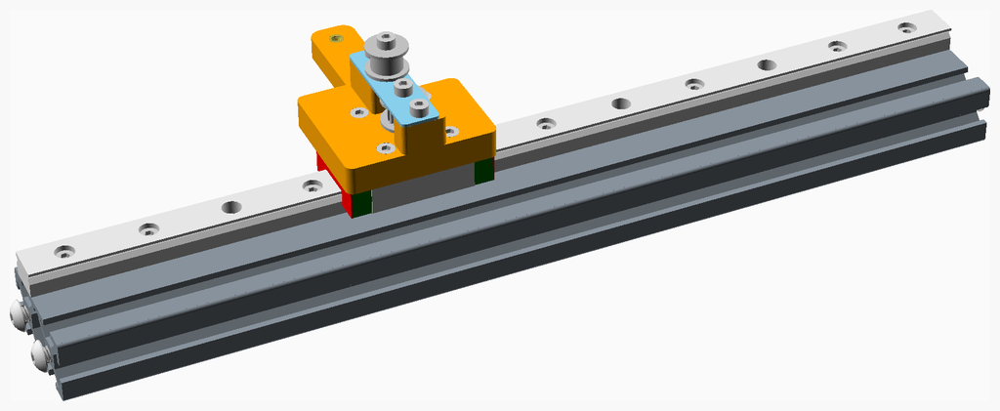

[Top](#TOP)

---

## Face_Top_Stage_1 assembly

### Vitamins

|Qty|Description|
|---:|:----------|
|2| Bolt M3 buttonhead x 10mm|
|20| Bolt M4 countersunk x 10mm|
|4| Bolt M5 buttonhead x 10mm|
|2| Bolt M5 buttonhead x 12mm|
|1| Extrusion E2020 x 300mm|
|1| Extrusion E2040 x 300mm|
|2| Nut M3 hammer|
|20| Nut M4 sliding T|

### 3D Printed parts

| 4 x Top_Corner_Piece.stl | 1 x Wiring_Guide.stl |
|---|---|
| 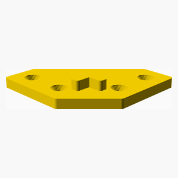 |  

### Sub-assemblies

| 1 x Left_Side_Upper_Extrusion_assembly | 1 x Right_Side_Upper_Extrusion_assembly | 1 x XY_Idler_Left_assembly |
|---|---|---|
| 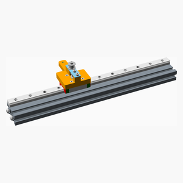 | 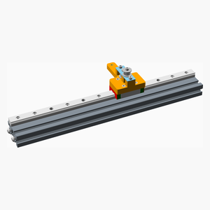 | 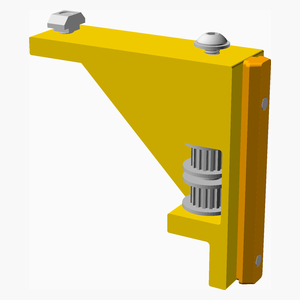 

| 1 x XY_Idler_Right_assembly | 1 x XY_Motor_Mount_Left_assembly | 1 x XY_Motor_Mount_Right_assembly |
|---|---|---|
| 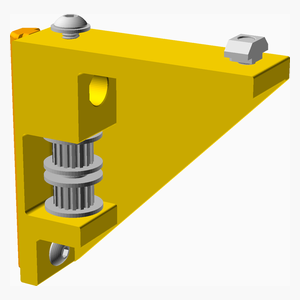 | 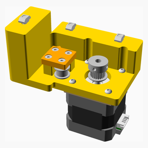 | 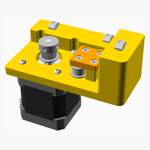 

### Assembly instructions

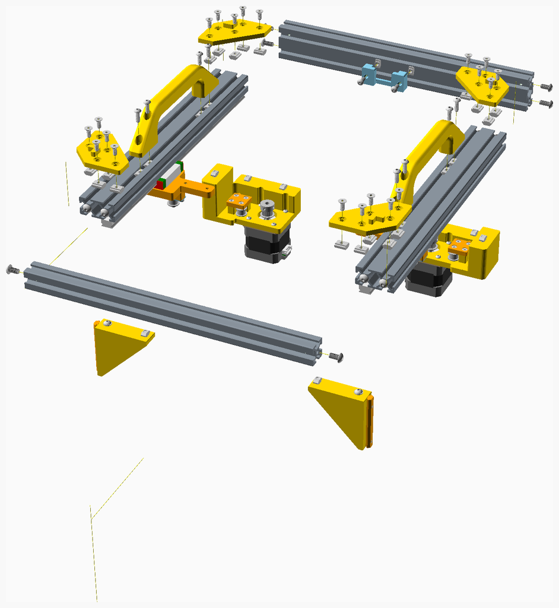

1. Bolt the two motor mounts and the **Wiring_Guide** to the rear extrusion.
2. Bolt the two idlers to the front extrusion.
3. Screw the bolts into the ends of the front and rear extrusions.
4. Insert the t-nuts for the **Top_Corner_Piece**s into the extrusions.
5. Bolt the front and rear extrusions to the side extrusions, leaving the bolts slightly loose.
6. Bolt the **Top_Corner_Piece**s to the extrusions leaving the bolts slightly loose.
7. Turn the top face upside down and place on a flat surface. Ensure it is square and tighten the hidden bolts.
8. Turn the top face the right way up and tighten the bolts on the **Top_Corner_Piece**s.

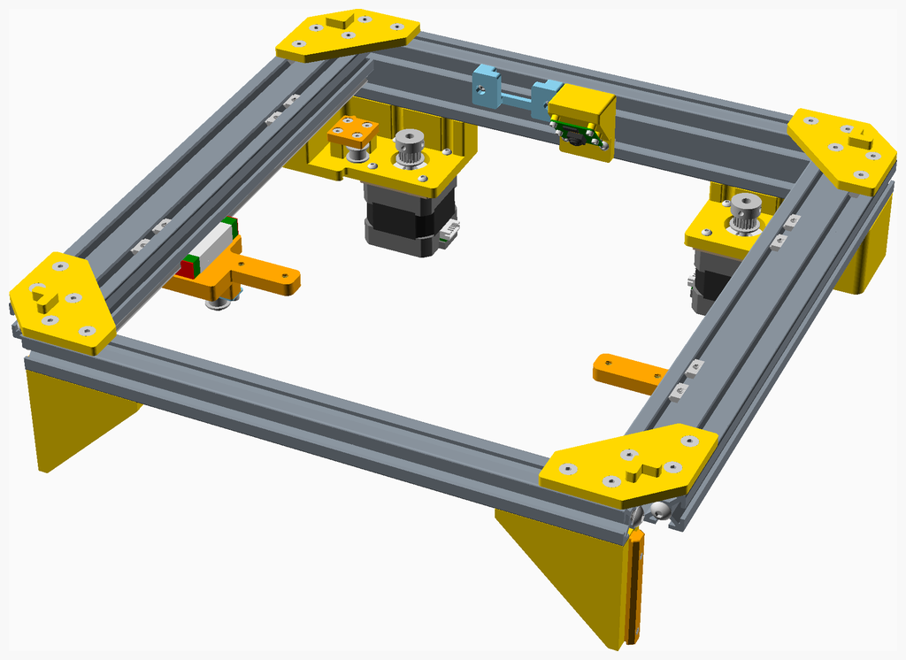

[Top](#TOP)

---

## Face_Top_Stage_2 assembly

### Vitamins

|Qty|Description|
|---:|:----------|
|4| Bolt M3 caphead x 10mm|
|1| Linear rail MGN12 x 250mm|
|1| Linear rail carriage MGN12H|

### Sub-assemblies

| 1 x Face_Top_Stage_1_assembly |
|---|
| 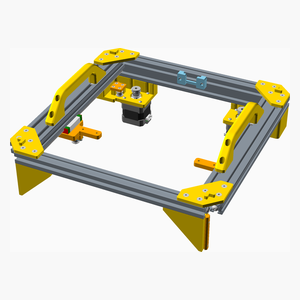 

### Assembly instructions

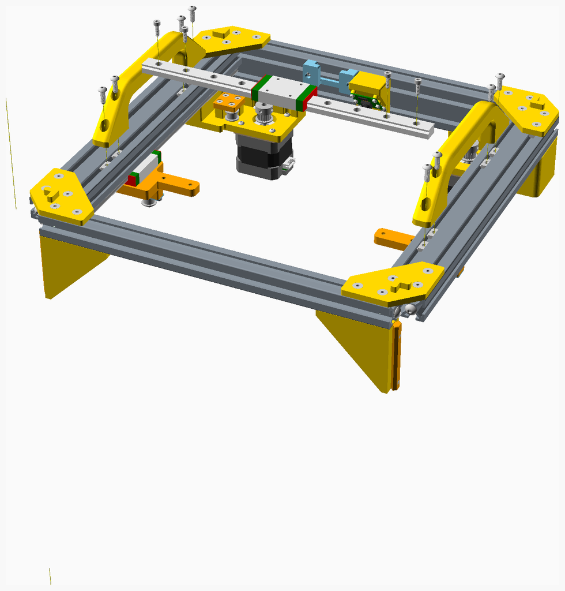

1. Bolt the MGN rail to the Y_Carriages as shown. Ensure the MGN rail is square to the frame.
2. Turn the top face upside down and place on a flat surface. Rack the right side linear rail - move the X-rail
to one extreme of the frame and tighten the bolts on that end of the Y-rail. Then move the X-rail to the other
extreme and tighten the bolts on that end of the Y-rail. Finally tighten the remaining bolts on the Y-rail.
3. Ensure the X-rail moves freely, if it doesn't loosen the bolts you have just tightened and repeat step 2.

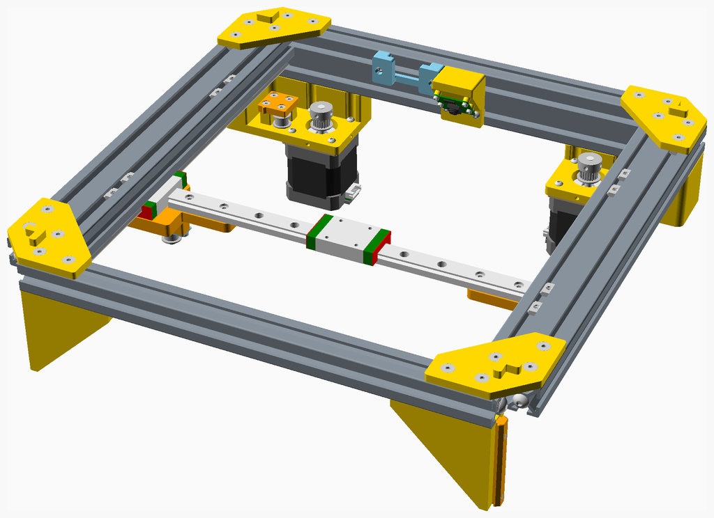

[Top](#TOP)

---

## Face_Top assembly

### Vitamins

|Qty|Description|
|---:|:----------|
|1| Belt GT2 x 6mm x nanmm|
|1| Belt GT2 x 6mm x nanmm|
|2| Bolt M3 buttonhead x 10mm|
|2| Bolt M3 countersunk x 12mm|

### 3D Printed parts

| 1 x X_Carriage_Belt_Clamp.stl |
|---|
|  

### Sub-assemblies

| 1 x Face_Top_Stage_2_assembly | 1 x X_Carriage_Belt_Side_MGN12H_assembly |
|---|---|
| 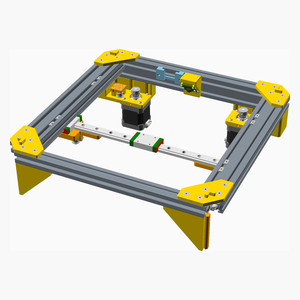 |  

### Assembly instructions

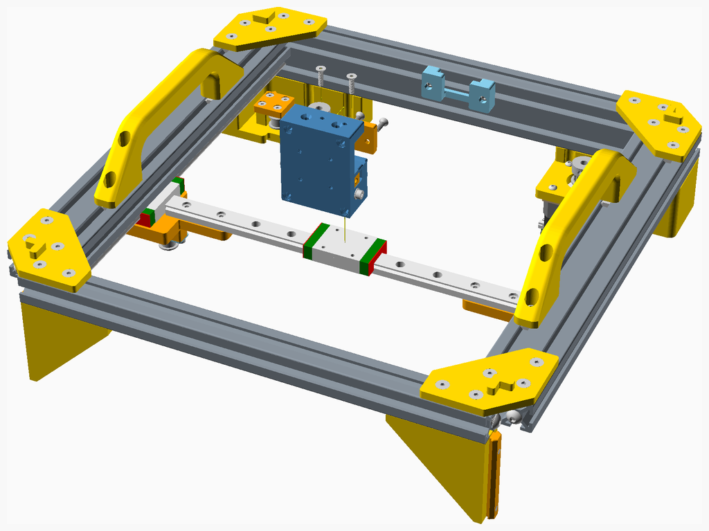

1. Bolt the **X_Carriage_Belt_Side_MGN12H_assembly** to the MGN carriage.
2. Thread the belts as shown and attach them to the **X_Carriage_Belt_Side_MGN12H_assembly**
using the **X_Carriage_Belt_Clamp**s
3. Leave the belts fairly loose - tensioning of the belts is done after the frame is assembled.

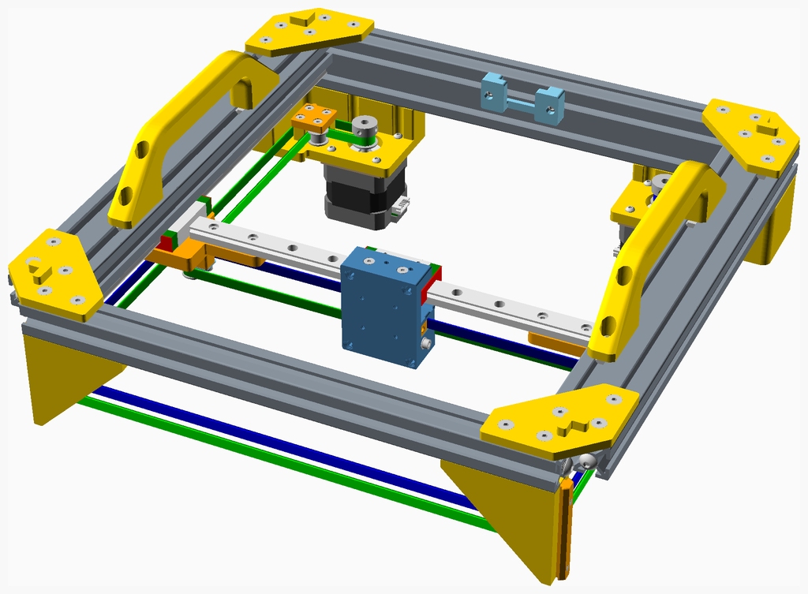

[Top](#TOP)

---

## Back_Panel assembly

### Vitamins

|Qty|Description|
|---:|:----------|
|1| BigTreeTech SKR E3 Turbo|
|5| Bolt M3 buttonhead x 10mm|
|5| Bolt M3 caphead x  6mm|
|18| Bolt M4 countersunk x  8mm|
|1| LED Switching Power Supply 24V 15A 360W|
|14| Nut M4 hammer|
|5| Pillar hex nylon F/F M3x20|
|1| Sheet polycarbonate 340mm x 400mm x 3mm|

### 3D Printed parts

| 1 x PCB_Mount.stl | 1 x PSU_Lower_Mount.stl | 1 x PSU_Upper_Mount.stl |
|---|---|---|
| 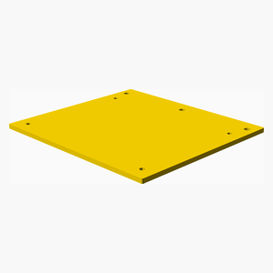 | 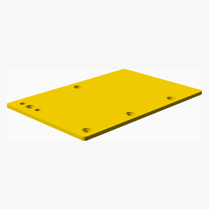 | 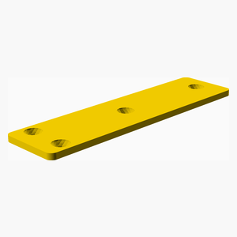 

### CNC Routed parts

| 1 x Back_Panel.dxf |
|---|
|  

### Assembly instructions

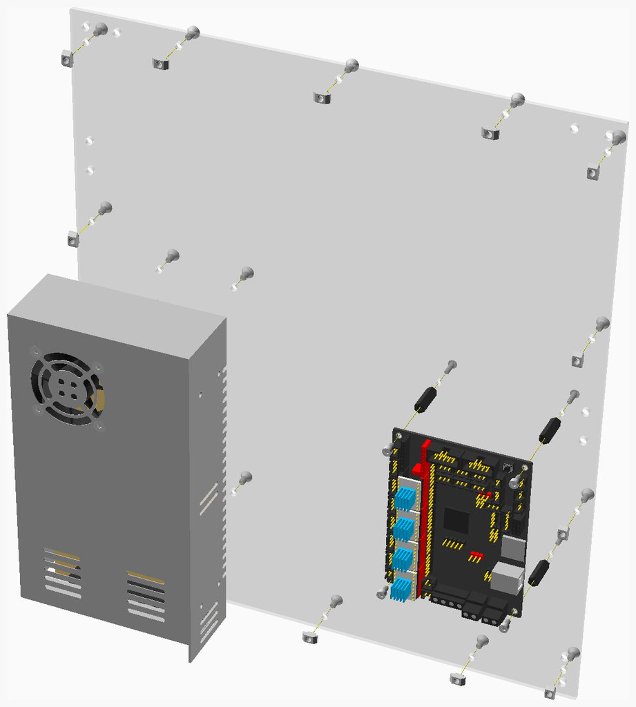

There are three options for the back panel: use a polycarbonate sheet, use an aluminium sheet, or use the three
mounts **PCB_Mount**, **PSU_Lower_Mount**, and **PSU_Upper_Mount**. If you have access to a CNC, you can machine
the back sheet using **Back_Panel.dxf**, if not you can use the **Panel_Jig** and the PCB and PSU mounts as
templates to drill the holes in the back sheet.

Once you have the back sheet prepared:
1. Bolt the PSU to the back sheet.
2. Bolt the mainboard to the back sheet, using the nylon standoffs.
3. Add the bolts and t-nuts in preparation for later attachment to the frame. Take take to use the correct holes
and don't place bolts into the access holes for the hidden bolts used to assemble the frame.

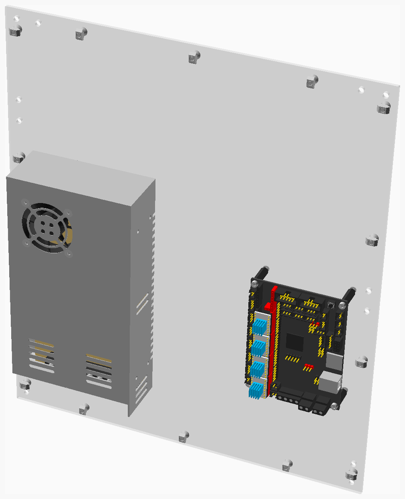

[Top](#TOP)

---

## Extruder_Bracket assembly

### Vitamins

|Qty|Description|
|---:|:----------|
|2| Bolt M3 buttonhead x  8mm|
|2| Bolt M3 buttonhead x 16mm|
|4| Bolt M4 buttonhead x  8mm|
|1| Cork damper NEMA 17|
|1| Filament sensor|
|1| MK10 Dual Pulley Extruder|
|4| Nut M4 hammer|
|2| Pillar hex nylon F/F M3x14|
|1| Stepper motor NEMA17 x 47mm|
|1| Stepper motor cable, 200mm|

### 3D Printed parts

| 1 x Extruder_Bracket.stl |
|---|
| 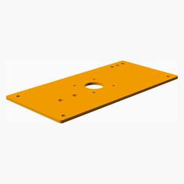 

### Assembly instructions

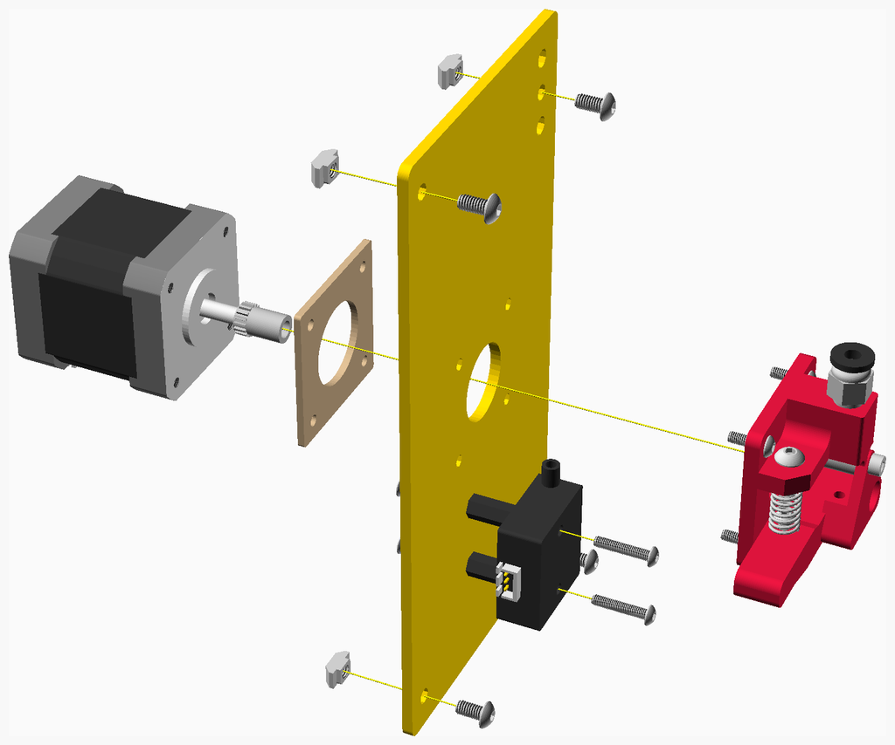

1. Bolt the stepper motor and cork damper through the **Extruder_Bracket** to the extruder as shown. The cork damper
thermally isolates the motor from the **Extruder_Bracket* and should not be omitted.
2. Align the hobb gear on the stepper motor shaft with the the hobb gear in the extruder and tighten the grub screws.
3. Bolt the filament sensor to the hex pillars and bolt them to the **Extruder_Bracket**.
4. Add the bolts and t-nuts in preparation for later attachment to the frame.

[Top](#TOP)

---

## IEC_Housing assembly

### Vitamins

|Qty|Description|
|---:|:----------|
|4| Bolt M4 buttonhead x  8mm|
|2| Bolt M4 buttonhead x 12mm|
|1| IEC320 C14 switched fused inlet module|
|2| Nut M4 hammer|
|2| Nut M4 sliding T|

### 3D Printed parts

| 1 x IEC_Housing.stl | 1 x IEC_Housing_Mount.stl |
|---|---|
| 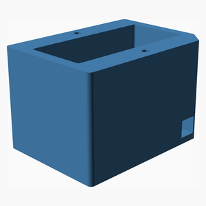 | 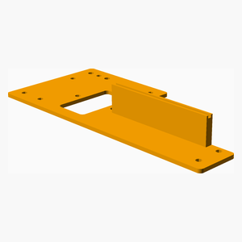 

### Assembly instructions

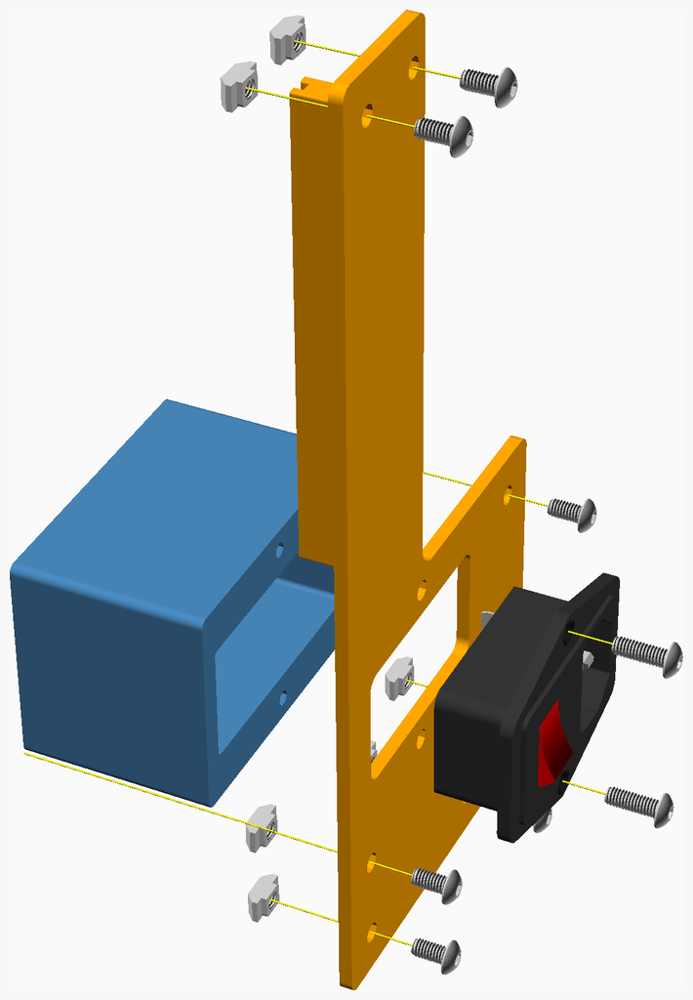

1. Attach the power cables to the IEC connector.
2. Thread the power cables through the hole in the **IEC_Housing** and bolt the **IEC_Housing_Mount** to the **IEC_housing**.
3. Add the bolts and t-nuts in preparation for attachment to the frame.

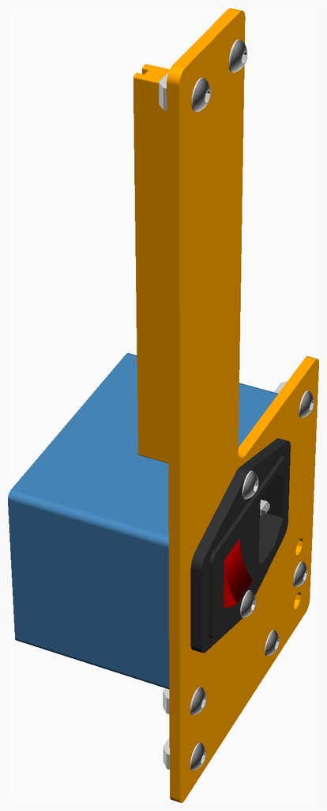

[Top](#TOP)

---

## Right_Side assembly

### Vitamins

|Qty|Description|
|---:|:----------|
|8| Bolt M5 buttonhead x 12mm|
|2| Extrusion E2020 x 400mm|
|2| Extrusion E2040 x 300mm|

### Sub-assemblies

| 1 x Extruder_Bracket_assembly | 1 x IEC_Housing_assembly |
|---|---|
| 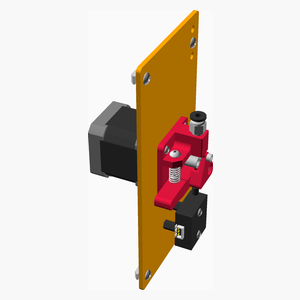 | 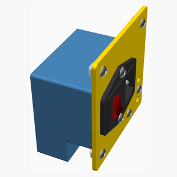 

### Assembly instructions

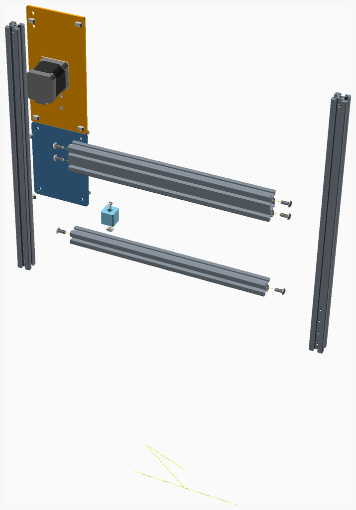

1. On a flat surface, bolt the upper and lower extrusions into the left and right uprights as shown.
2. Bolt the **IEC_Housing_assembly** to the lower extrusion and upright.
3. Bolt the **Extruder_Bracket_assembly** to the upper extrusion and upright.

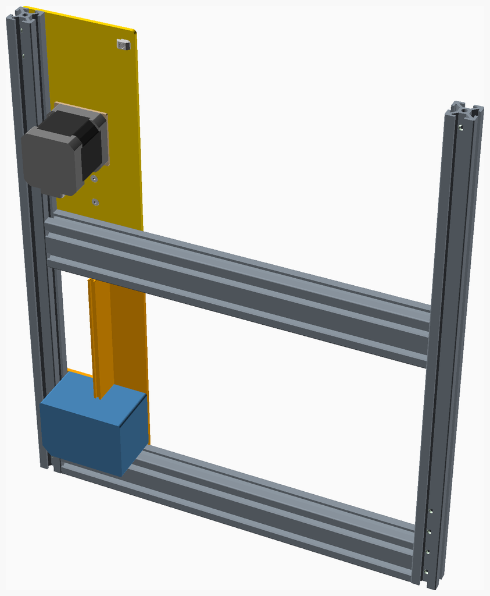

[Top](#TOP)

---

## Display_Cover_TFT35_E3 assembly

### Vitamins

|Qty|Description|
|---:|:----------|
|1| BigTreeTech TFT35 E3 v3.0|
|4| Bolt M3 caphead x  6mm|

### 3D Printed parts

| 1 x Display_Housing_TFT35_E3.stl |
|---|
|  

### Assembly instructions

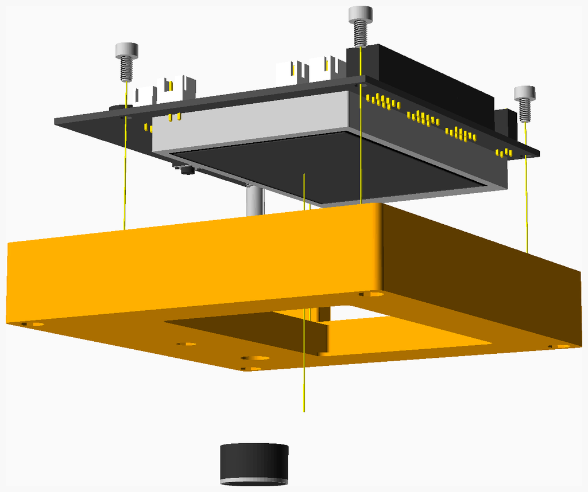

1. Bolt the TFT35 E3 display to the **Display_Housing_TFT35_E3**.
2. Attach the knob to the display.

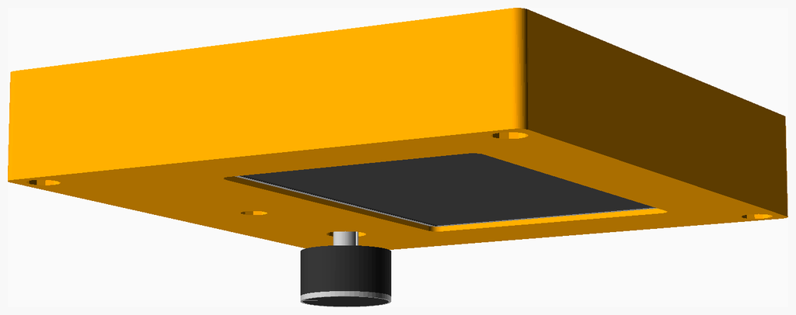

[Top](#TOP)

---

## Base_Plate_Stage_1 assembly

### Vitamins

|Qty|Description|
|---:|:----------|
|1| Aluminium sheet 340mm x 340mm x 3mm|
|8| Bolt M4 buttonhead x  8mm|
|8| Bolt M4 buttonhead x 10mm|
|12| Bolt M5 buttonhead x 12mm|
|1| Extrusion E2040 x 300mm|
|1| Extrusion E2080 x 300mm|
|16| Nut M4 hammer|

### 3D Printed parts

| 4 x Foot_LShaped_12mm.stl |
|---|
| 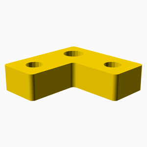 

### CNC Routed parts

| 1 x BaseAL.dxf |
|---|
|  

### Assembly instructions

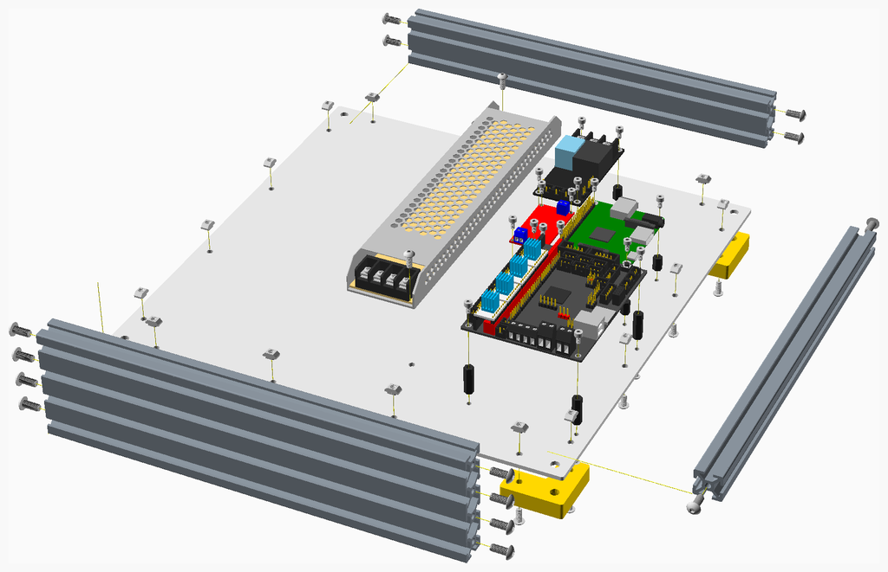

If you have access to a CNC, you can machine the base plate using **BaseAL.dxf**, if not you can use the **Panel_Jig**
as a template to drill the holes in the base plate.

1. Insert the bolts into the ends of the E2040 and E2080 extrusions in preparation for connection to the frame uprights.
2. Bolt the extrusions and the L-shaped feet to the baseplate as shown.

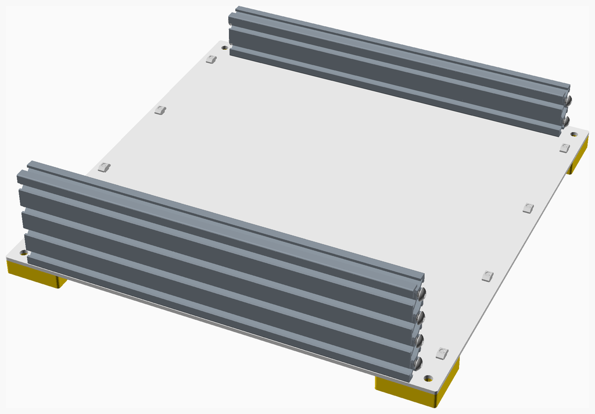

[Top](#TOP)

---

## Base_Plate assembly

### Vitamins

|Qty|Description|
|---:|:----------|
|4| Bolt M3 buttonhead x 12mm|
|4| Bolt M3 caphead x 25mm|
|4| Bolt M4 buttonhead x 10mm|
|4| Nut M3 hammer|
|4| Nut M4 hammer|

### 3D Printed parts

| 1 x Display_Housing_Bracket_TFT35_E3.stl | 1 x Front_Cover.stl | 1 x Front_Display_Wiring_Cover.stl |
|---|---|---|
| 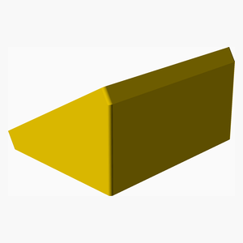 |  |  

### Sub-assemblies

| 1 x Base_Plate_Stage_1_assembly | 1 x Display_Cover_TFT35_E3_assembly |
|---|---|
|  | 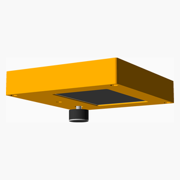 

### Assembly instructions

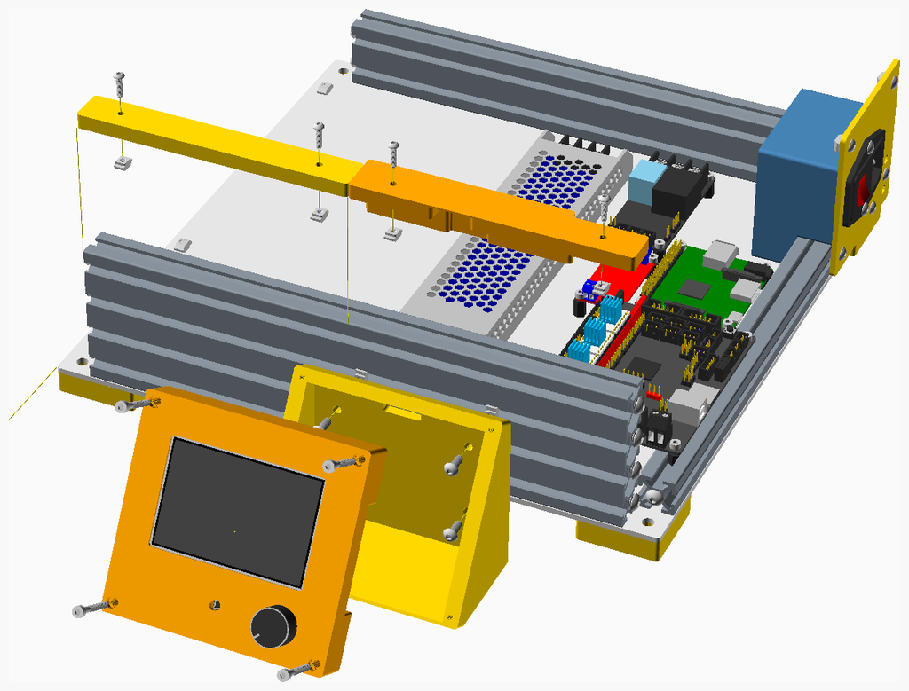

1. Bolt the **Display_Housing_Bracket_TFT35_E3** to the 2080 extrusion.
2. Thread the display wiring through the hole in the **Display_Housing_Bracket_TFT35_E3** and connect it to the TFT display.
3. Bolt the **Display_Cover_TFT35_E3_assembly** to the **Display_Housing_Bracket_TFT35_E3**.
4. Bolt the **Front_Cover** to the top of the 2080 extrusion.
5. Bolt the **Front_Display_Wiring_Cover** to the top of the 2080 extrusion, covering the wiring.
6. Route the wiring to the back of the base, ready for later connection to the mainboard.

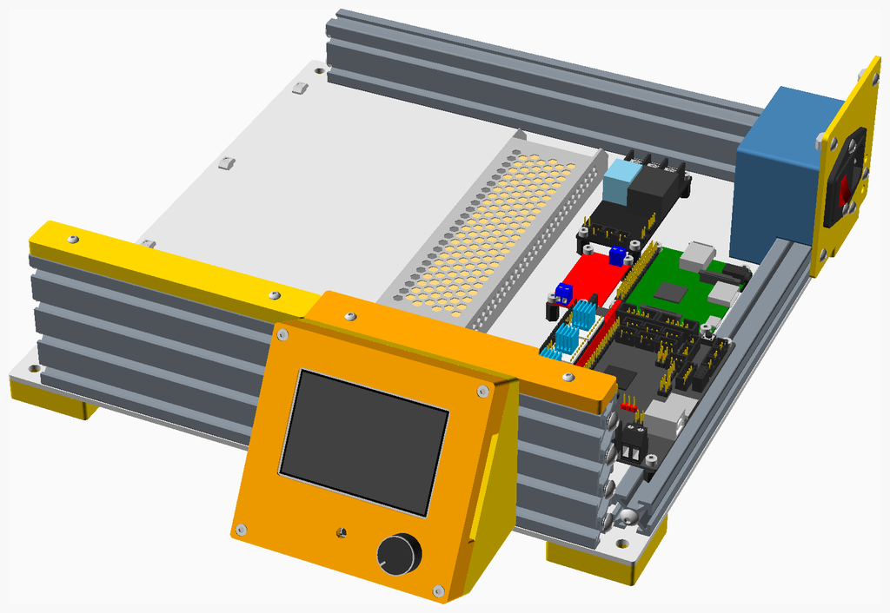

[Top](#TOP)

---

## Z_Carriage_Right assembly

### Vitamins

|Qty|Description|
|---:|:----------|
|2| Bolt M4 buttonhead x 10mm|
|4| Bolt M5 countersunk x 12mm|
|2| Nut M4 sliding T|
|1| SCS12LUU bearing block|

### 3D Printed parts

| 1 x Z_Carriage_Right.stl |
|---|
| 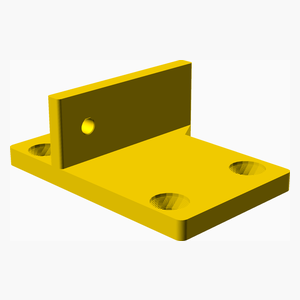 

### Assembly instructions

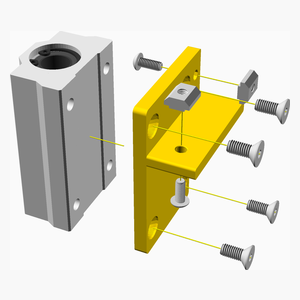

1. Bolt the SCS bearing block to the **Z_Carriage_Right**.
2. Add the bolts and t-nuts in preparation for connection to the printbed.

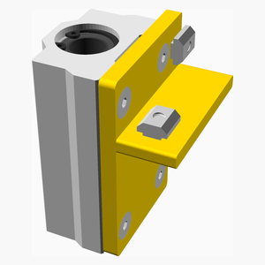

[Top](#TOP)

---

## Z_Carriage_Left assembly

### Vitamins

|Qty|Description|
|---:|:----------|
|2| Bolt M4 buttonhead x 10mm|
|4| Bolt M5 countersunk x 12mm|
|2| Nut M4 sliding T|
|1| SCS12LUU bearing block|

### 3D Printed parts

| 1 x Z_Carriage_Left.stl |
|---|
| 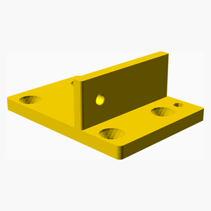 

### Assembly instructions

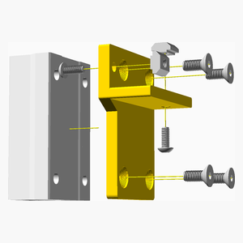

1. Bolt the SCS bearing block to the **Z_Carriage_Left**.
2. Add the bolts and t-nuts in preparation for connection to the printbed.

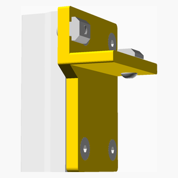

[Top](#TOP)

---

## Z_Carriage_Center assembly

### Vitamins

|Qty|Description|
|---:|:----------|
|4| Bolt M3 caphead x  8mm|
|4| Bolt M4 buttonhead x 10mm|
|1| Leadscrew nut 8 x 2|
|4| Nut M4 sliding T|

### 3D Printed parts

| 1 x Z_Carriage_Center.stl |
|---|
| 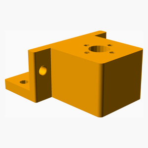 

### Assembly instructions

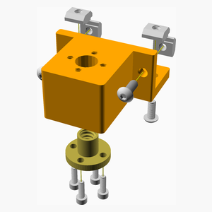

1. Bolt the leadscrew to the **Z_Carriage_Center**.
2. Add the bolts and t-nuts in preparation for later attachment to the printbed frame.

[Top](#TOP)

---

## Printbed_Frame assembly

### Vitamins

|Qty|Description|
|---:|:----------|
|2| Bolt M3 countersunk x 10mm|
|8| Bolt M5 buttonhead x 12mm|
|2| Extrusion E2020 x 260mm|
|2| Extrusion E2040 x 188mm|
|2| Nut M3 hammer|

### 3D Printed parts

| 1 x Printbed_Strain_Relief.stl |
|---|
| 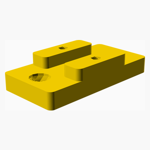 

### Sub-assemblies

| 1 x Z_Carriage_Center_assembly |
|---|
|  

### Assembly instructions

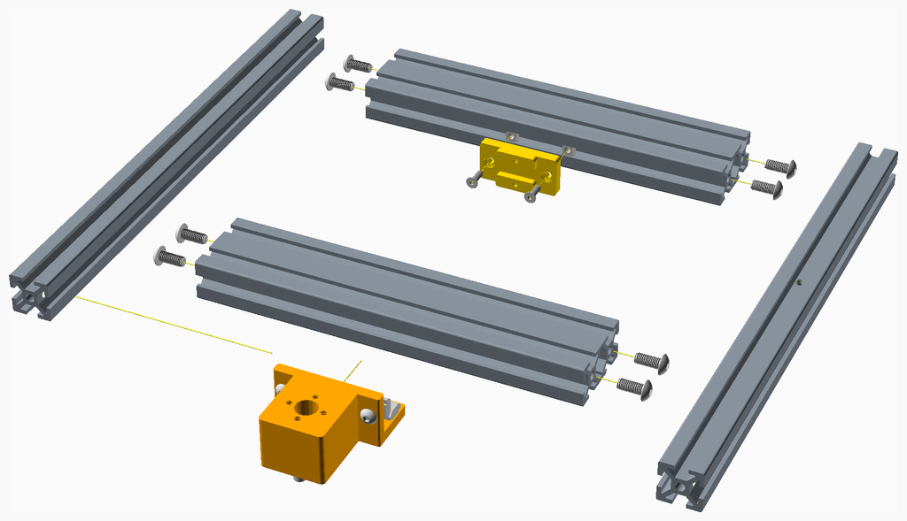

1. Slide the **Z_Carriage_Center_assembly** to the approximate center of the first 2040 extrusion and loosely tighten the bolts.
The bolts will be fully tightened when the Z_Carriage is aligned.
2. Bolt the **Printbed_Strain_Relief** to the second extrusion.
3. Slide the 2040 extrusion into the 2020 extrusions and loosely tighten the bolts. The bolts will be fully tightened after
the Z carriages are added.

[Top](#TOP)

---

## Printbed_Frame_with_Z_Carriages assembly

### Sub-assemblies

| 1 x Printbed_Frame_assembly | 1 x Z_Carriage_Left_assembly | 1 x Z_Carriage_Right_assembly |
|---|---|---|
| 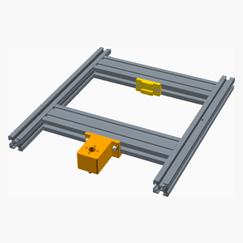 |  |  

### Assembly instructions

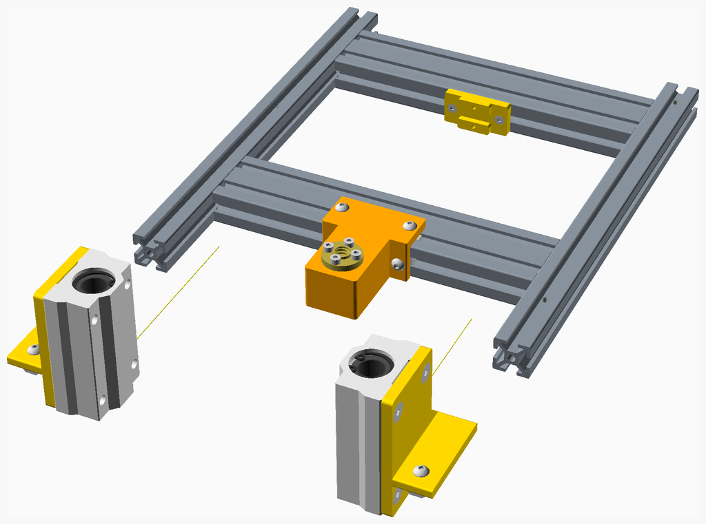

1. Lay the frame on a flat surface and  slide the Z carriages onto the frame as shown.
2. Ensure the Z carriages are square and aligned with the end of the frame and then tighten the bolts on Z_carriages.
3. Ensure the 2040 extrusion is pressed firmly against the Z_Carriages and tighten the hidden bolts in the frame.

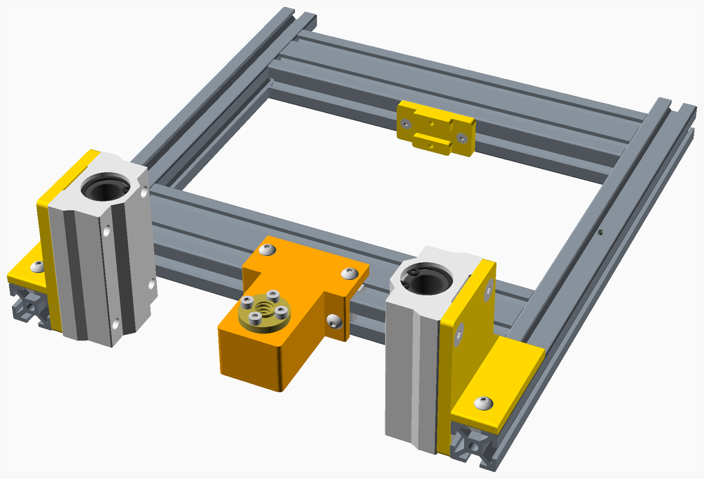

[Top](#TOP)

---

## Printbed assembly

### Vitamins

|Qty|Description|
|---:|:----------|
|2| Bolt M3 buttonhead x  8mm|
|3| Bolt M3 caphead x 20mm|
|1| Cork underlay 214mm x 214mm|
|1| Heated Bed 214mm x 214mm|
|3| Nut M3 sliding T|
|9| O-ring nitrile 3mm x 2mm|
|9| Washer  M3|
|6| Washer penny  M4|

### 3D Printed parts

| 1 x Printbed_Strain_Relief_Clamp.stl |
|---|
| 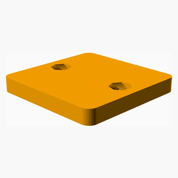 

### Sub-assemblies

| 1 x Printbed_Frame_with_Z_Carriages_assembly |
|---|
| 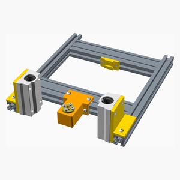 

### Assembly instructions

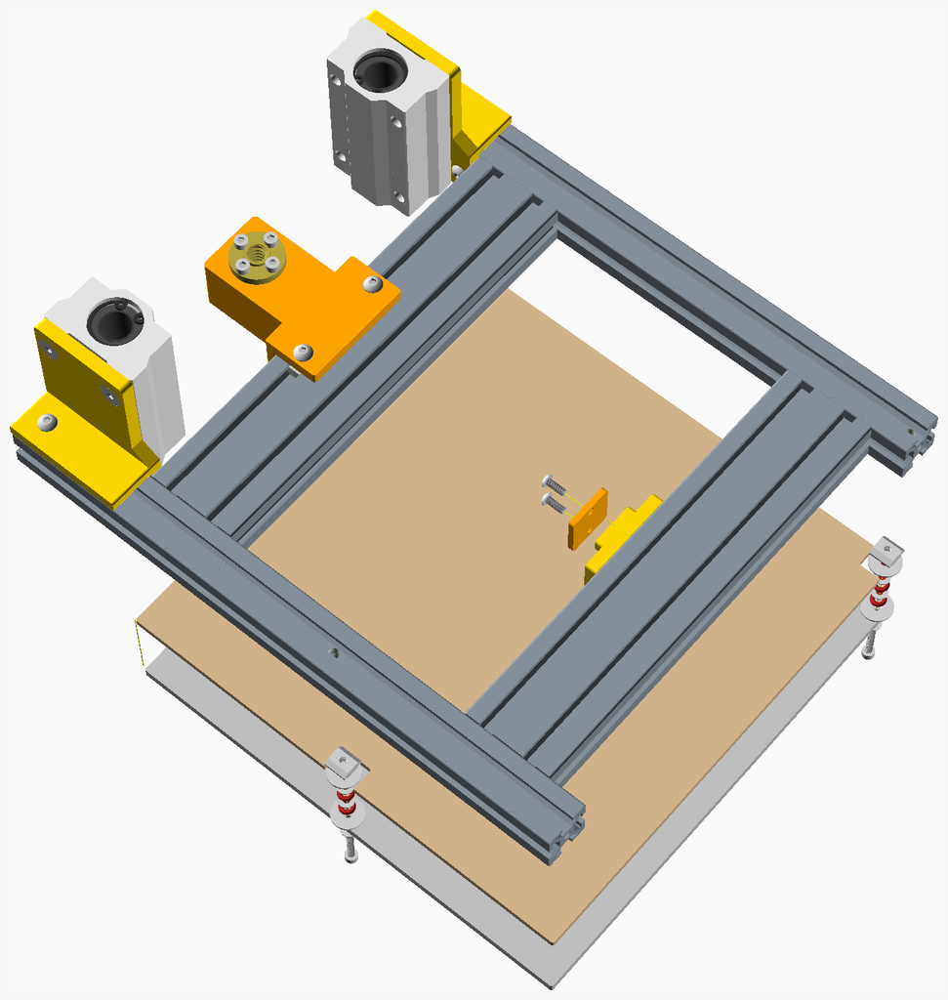

1. Attach the heated bed to the frame using the stacks of washers and o-rings as shown.
2. Spiral wrap the wires from the heated bed.
3. Use the **Printbed_Strain_Relief_Clamp** to clamp the wires to the frame.

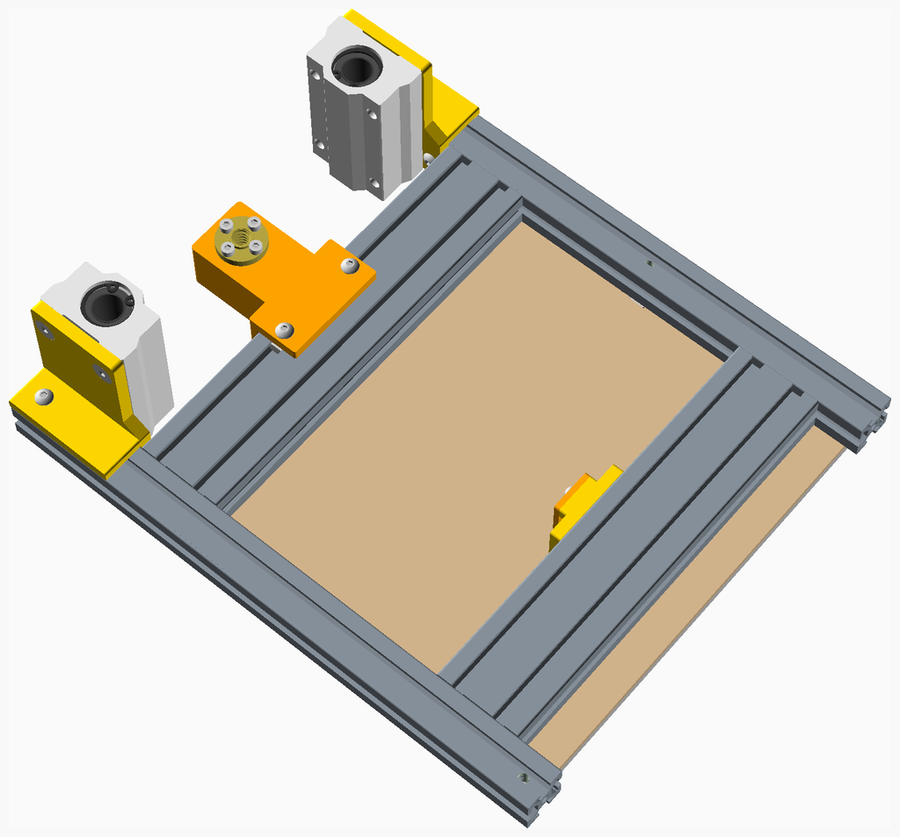

[Top](#TOP)

---

## Left_Side assembly

### Vitamins

|Qty|Description|
|---:|:----------|
|2| Bolt M4 buttonhead x 10mm|
|2| Bolt M4 buttonhead x 12mm|
|8| Bolt M4 countersunk x 10mm|
|8| Bolt M5 buttonhead x 12mm|
|2| Extrusion E2020 x 400mm|
|2| Extrusion E2040 x 300mm|
|12| Nut M4 sliding T|
|4| SK12 shaft support bracket|

### 3D Printed parts

| 1 x Z_Motor_Mount.stl | 1 x Z_Motor_MountGuide_19mm.stl | 2 x Z_RodMountGuide_50mm.stl |
|---|---|---|
| 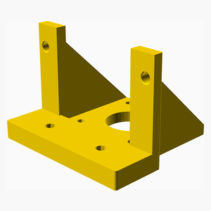 | 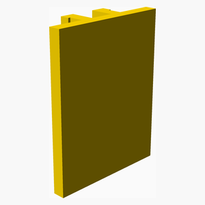 | 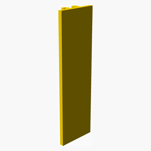 

### Assembly instructions

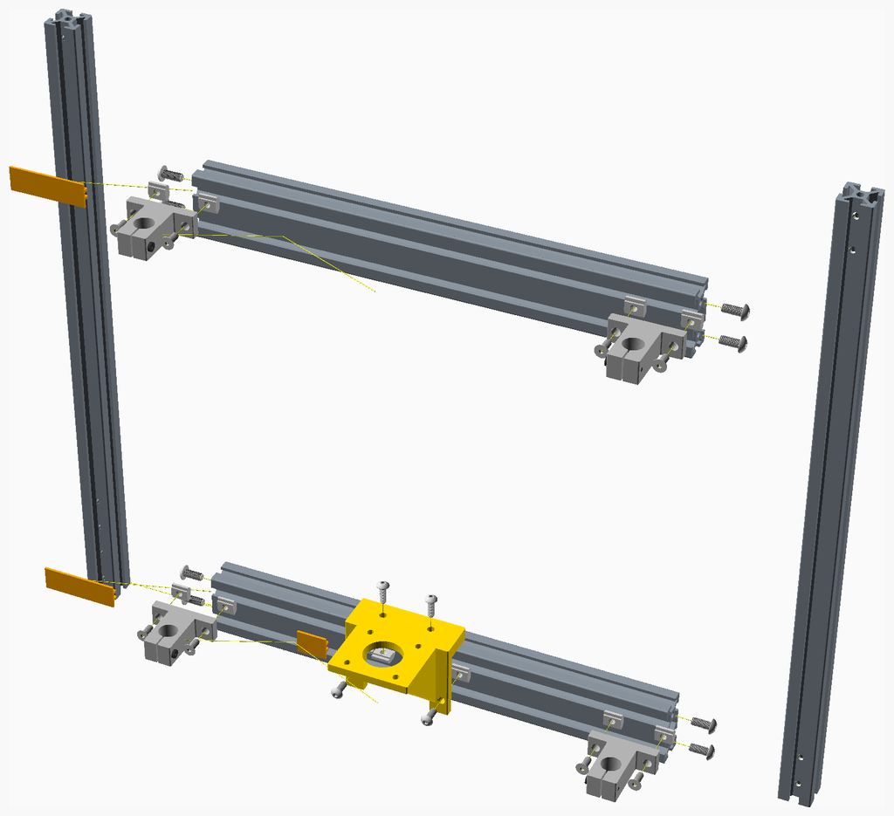

1. Attach the SK brackets to the upper extrusion, use the **Z_RodMountGuide** to align the left bracket.
2. Tighten the bolts for the left bracket. Leave the bolts to the right bracket loosely tightened for now.
3. Attach the SK brackets and the **Z_Motor_Mount** to the lower extrusion, use the **Z_RodMountGuide** to
align the left bracket and the **Z_Motor_MountGuide** to align the motor mount. The motor itself will be added at a later
stage of the assembly.
4. Tighten the bolts for the left bracket and the **Z_Motor_Mount&. Leave the bolts to the right bracket loosely tightened for now.
5. On a flat surface, bolt the upper and lower extrusions into the left and right uprights as shown. Tighten the bolts
continuously ensuring the frame is square.

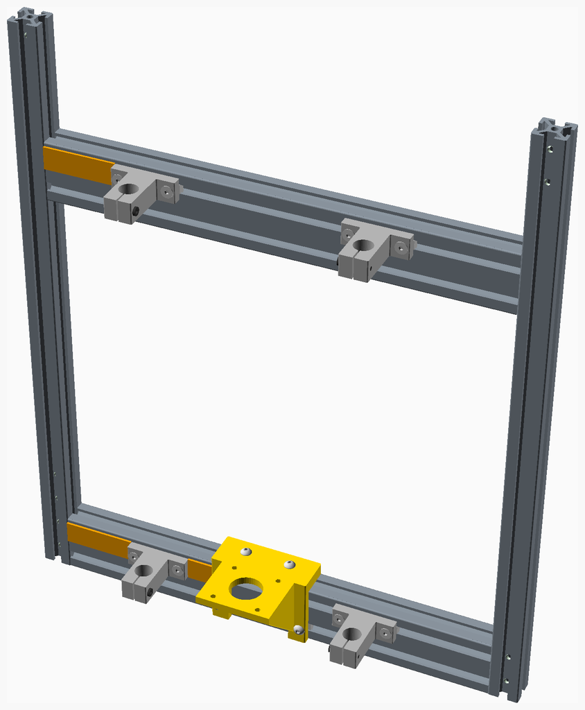

[Top](#TOP)

---

## Stage_1 assembly

### Vitamins

|Qty|Description|
|---:|:----------|
|4| Bolt M3 buttonhead x 12mm|
|1| Cork damper NEMA 17|
|2| Linear rod 12mm x 300mm|
|1| Stepper motor NEMA17 x 40mm, 280mm integrated leadscrew|
|1| Stepper motor cable, 750mm|

### 3D Printed parts

| 2 x E20_ChannelCover_50mm.stl |
|---|
|  

### Sub-assemblies

| 1 x Left_Side_assembly | 1 x Printbed_assembly |
|---|---|
| 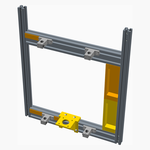 | 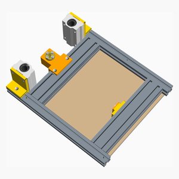 

### Assembly instructions

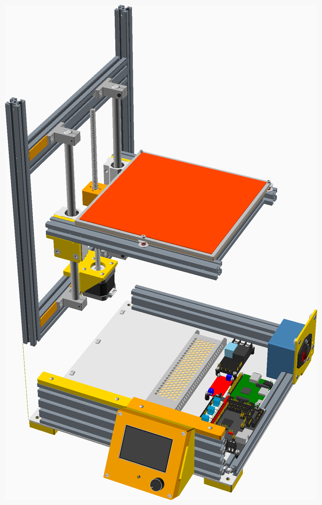

1. Face the left face on a flat surface.

2. Attach the print bed to the left face by sliding the linear rods through the Z_Carriages.

3. Tighten the grub screws on the rod brackets, but don't yet tighten the bolts holding the brackets to the frame.

4. Slide the print bed to the top of the rods, and tighten the bolts in the top right rod bracket.
(you will have tightened the bolts on the top left bracket in a previous step).

5. Slide the print bed to the bottom of the rods and tighten the bolts on the bottom right rod bracket
(you will have tightened the bolts on the bottom left bracket in a previous step).

6. Thread the motor's lead screw through the lead nut on the **Z_Carriage_Center** and bolt the motor to
the **Z_Motor_Mount**.

7. Route the motor wire through the lower extrusion channel and use the **E20_ChannelCover_50mm**s to hold it in place.

8. Ensure the **Z_Carriage_Center** is aligned with the lead screw and tighten the bolts on the **Z_Carriage_Center**.

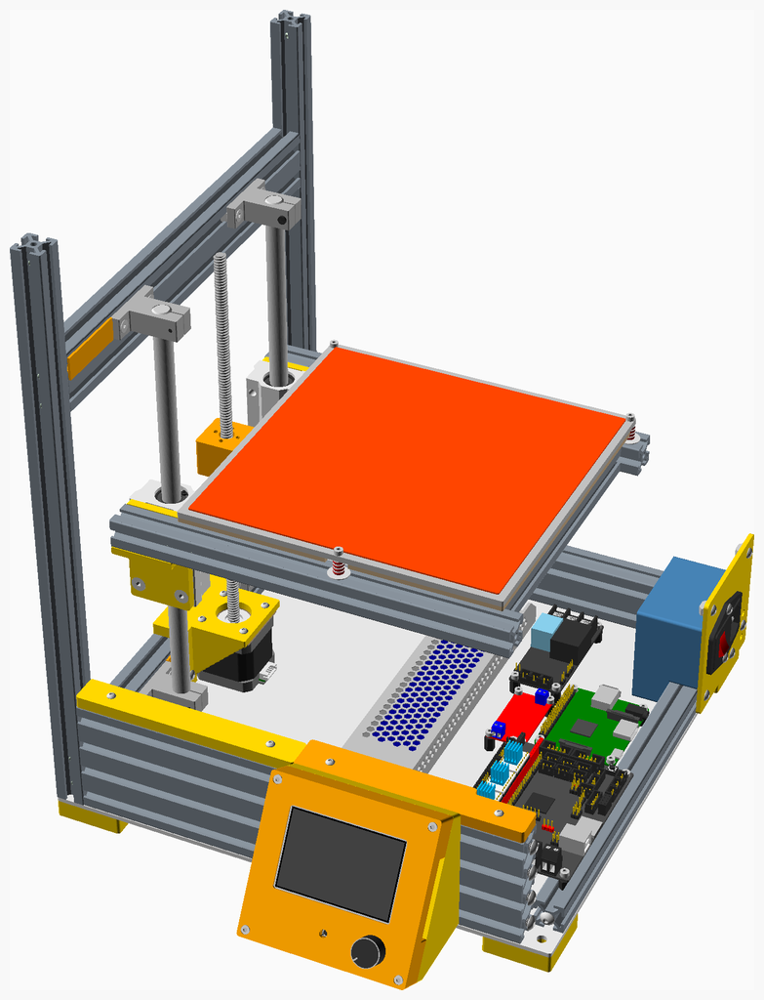

[Top](#TOP)

---

## Stage_2 assembly

### Sub-assemblies

| 1 x Base_Plate_assembly | 1 x Stage_1_assembly |
|---|---|
|  | 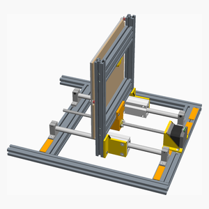 

### Assembly instructions

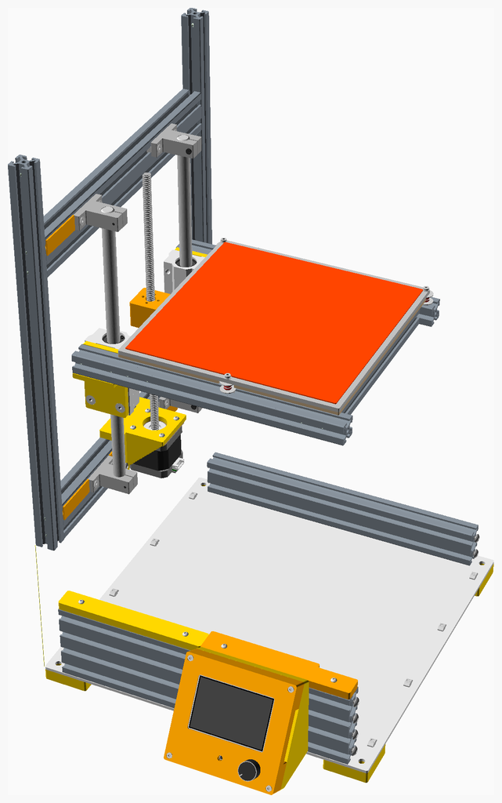

1. Slide the left face into the base plate assembly.
2. Ensuring the frame remains square, tighten the hidden bolts and the bolts under the baseplate.

[Top](#TOP)

---

## Stage_3 assembly

### 3D Printed parts

| 3 x E20_RibbonCover_50mm.stl |
|---|
| 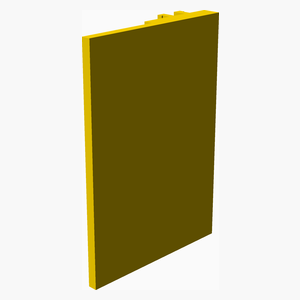 

### Sub-assemblies

| 1 x Right_Side_assembly | 1 x Stage_2_assembly |
|---|---|
| 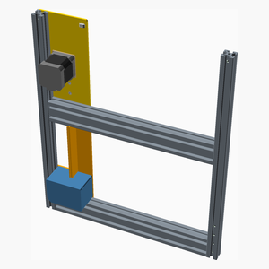 | 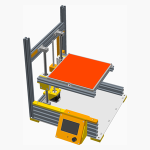 

### Assembly instructions

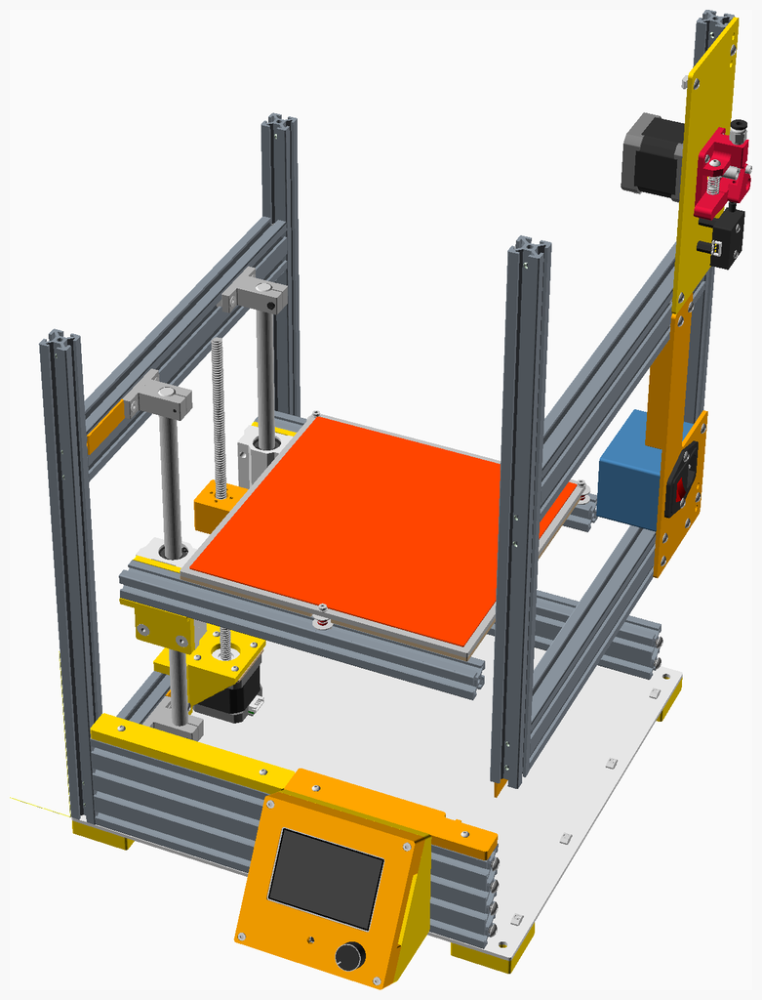

1. Slide the right face into the base plate assembly.
2. Ensuring the frame remains square, tighten the hidden bolts and the bolts under the baseplate.
3. Route the serial cable for the display in the top channel of the right side lower extrusion and route
the ribbon cable along the bottom of the extrusion and cover with the **E20_RibbonCover_50mm**s to keep
the cables in place.

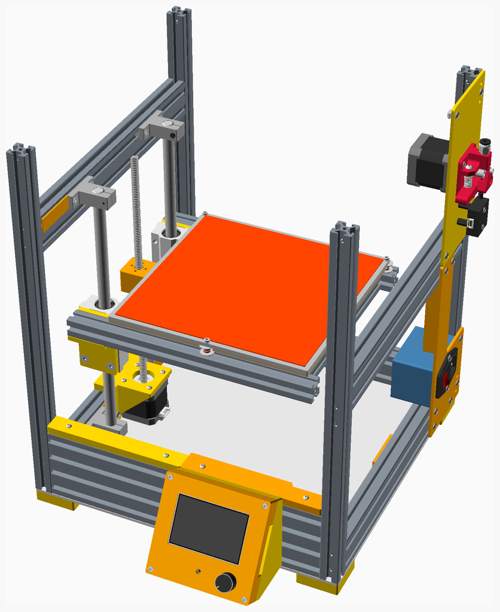

[Top](#TOP)

---

## Stage_4 assembly

### Sub-assemblies

| 1 x Back_Panel_assembly | 1 x Stage_3_assembly |
|---|---|
| 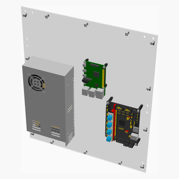 | 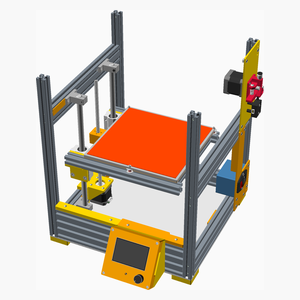 

### Assembly instructions

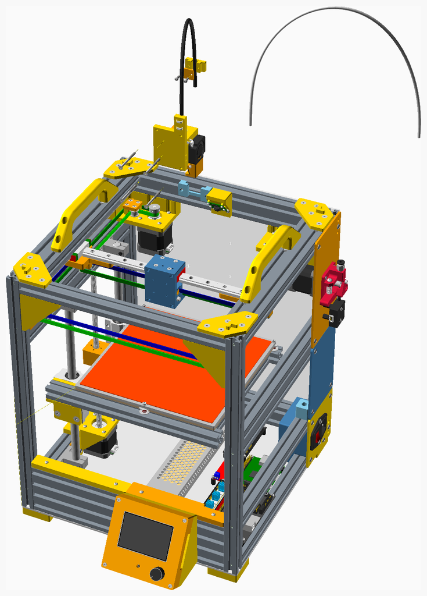

1. Attach the back face to the rest of the assembly.
2. Tighten the bolts on the back face.

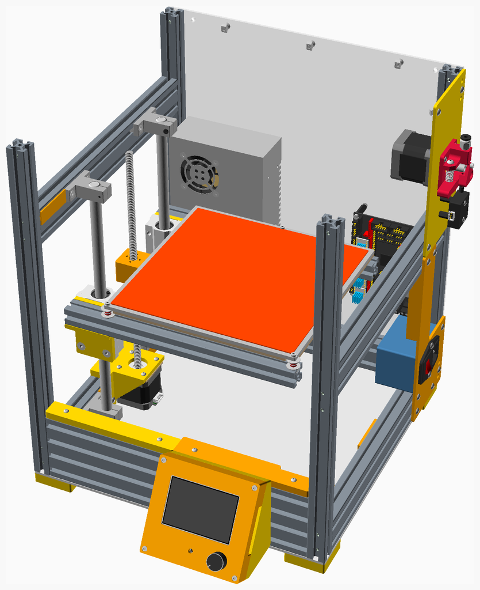

[Top](#TOP)

---

## Stage_5 assembly

### Vitamins

|Qty|Description|
|---:|:----------|
|2| Bolt M3 buttonhead x  8mm|
|2| Bolt M3 countersunk x 12mm|
|4| Bolt M3 countersunk x 30mm|
|1| PTFE Bowden tube, 500 mm|

### 3D Printed parts

| 1 x Wiring_Guide_Clamp.stl |
|---|
| 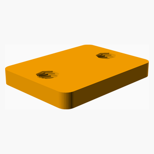 

### Sub-assemblies

| 1 x Face_Top_assembly | 1 x Printhead_E3DV6_MGN12H_assembly | 1 x Stage_4_assembly |
|---|---|---|
| 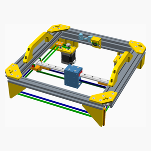 | 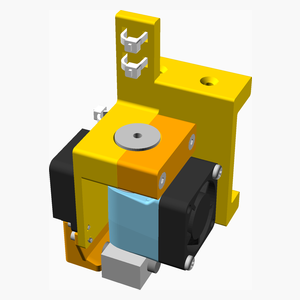 | 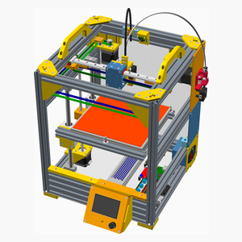 

### Assembly instructions

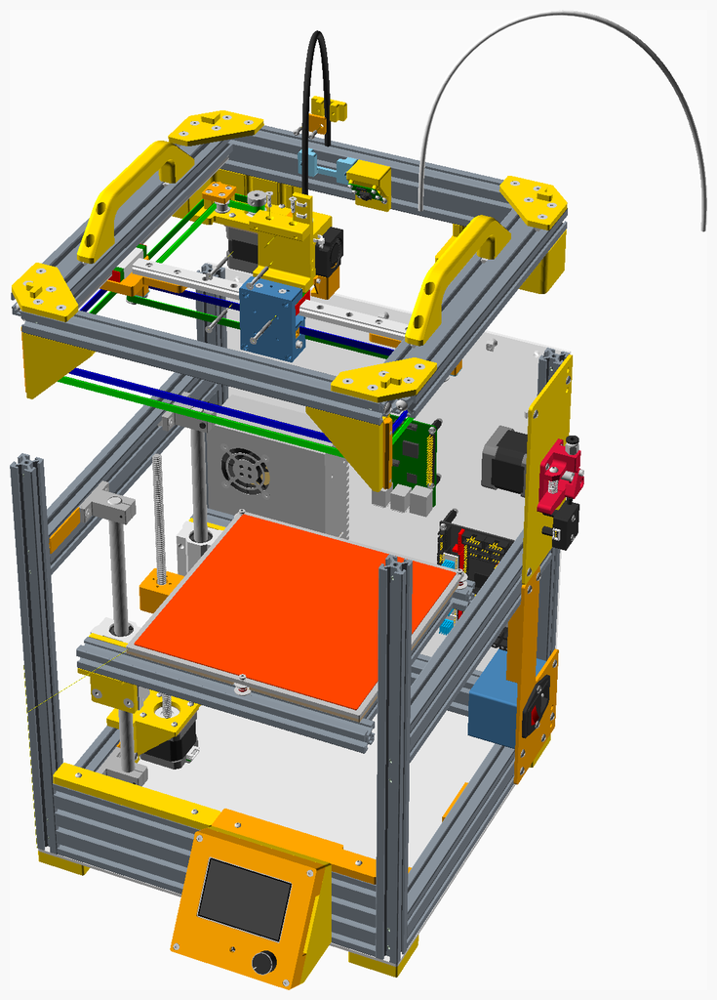

1. Slide the **Face_Top** assembly into the rest of the frame and tighten the hidden bolts.
2. Check that the print head slides freely on the Y-axis. If it doesn't, then re-rack the Y-axis,
see [Face_Top_Stage_2 assembly](#Face_Top_Stage_2_assembly).
4. Bolt the **Printhead_E3DV6_MGN12H_assembly** to MGN carriage.
5. Route the wiring from the print head to the mainboard and secure it with the **Wiring_Guide_Clamp**.
6. Adjust the belt tension.
7. Connect the Bowden tube between the extruder and the printhead.

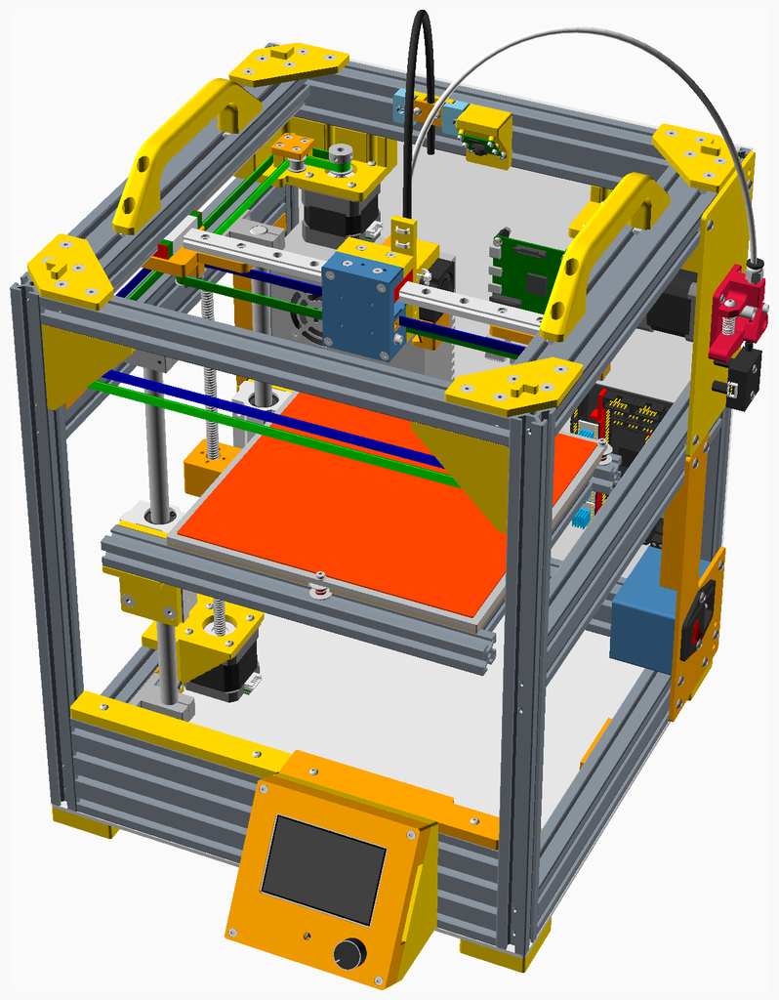

[Top](#TOP)

---

## main assembly

### Vitamins

|Qty|Description|
|---:|:----------|
|16| Bolt M4 buttonhead x  8mm|
|16| Nut M4 hammer|
|1| Sheet polycarbonate 340mm x 400mm x 3mm|

### 3D Printed parts

| 1 x Spool_Holder.stl |
|---|
| 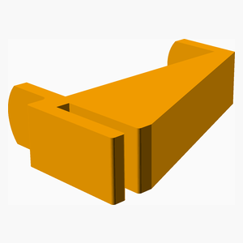 

### CNC Routed parts

| 1 x Left_Side_Panel.dxf |
|---|
|  

### Sub-assemblies

| 1 x Stage_5_assembly |
|---|
| 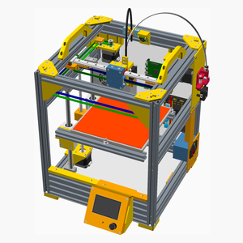 

### Assembly instructions

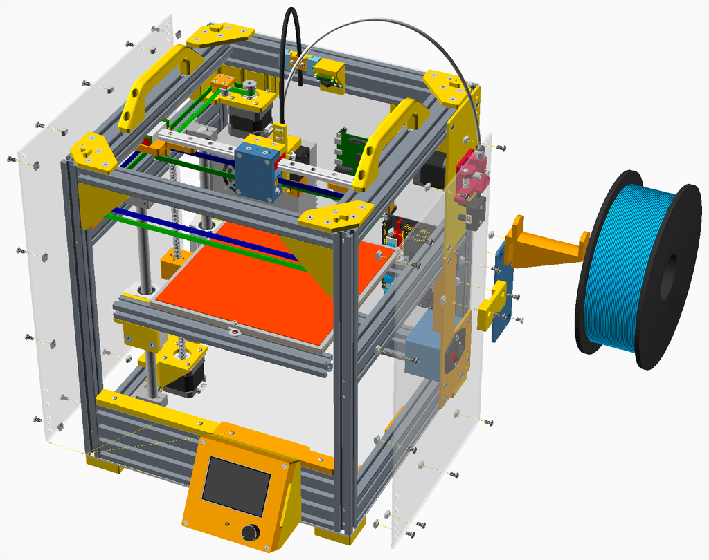

1. Bolt the polycarbonate sheet to the left face.
2. Attach the spoolholder and filament spool to the right face.
3. You are now ready to level the bed and  calibrate the printer.

[Top](#TOP)
