

# MaybeCube Assembly Instructions

These are the assembly instructions for the MaybeCube. These instructions are not fully comprehensive, that is they do
not show every small detail of the construction and in particular they do not show the wiring. However there is
sufficient detail that someone with a good understanding of 3D printers can build the MaybeCube.

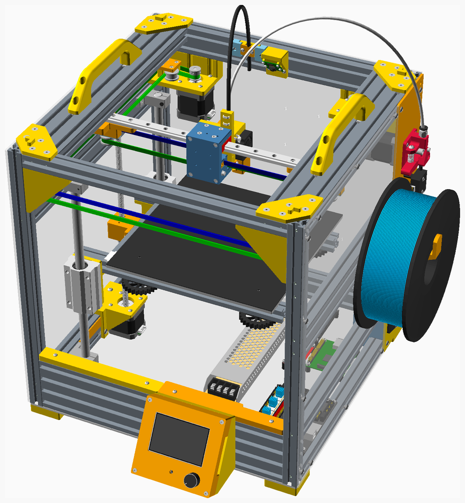

## Read this before you order parts

**Extrusion:** 2020, 2040 etc aluminium comes in variants with differing sized center holes - some are suitable for tapping for an
an M5 bolt and some are suitable for tapping for an M6 bolt. It doesn't really matter which you use, but ensure you
buy the bolts that correspond to your extrusion size. These build instructions assume M5 bolts, if your extrusion
requires M6 bolts then the 10mm and 12mm buttonhead M5 bolts should be replaced with M6 bolts.

**Z-motor and leadscrew:** The motor for the Z-axis has an integrated lead screw: in the *Parts List* the length specified is the length that
protrudes from the motor. Some suppliers specify the total length of the lead screw, that is including the part that
is inside the motor, so check how your supplier specifies the part before ordering. Another option is to order a motor
with a lead screw that is too long and cut to size, note however that lead screws are made from hardened steel and cannot
be cut with a hacksaw - an angle grinder is required to cut them.

**Build plate:** For the MC350 variant I have specified a Voron Trident build plate (this is an 250x250mm aluminium tooling plate drilled for a
3-point fixing) and a silicone heating pad.
A cheapr alternative would be an Ender-style 235x235mm print bed with 4 fixing bolts.

**Sliding T-nuts and hammer nuts:** Sliding T-nuts and hammer nuts are somewhat interchangeable. I find T-nuts easier to use: sometimes it can be
to get a hammer nut to "bite". Hammer nuts allow more flexibility: they can always be added or removed without disassembling the frame. Genenerally
hammer nuts can be replaced with sliding T-nuts, as long as it is done early enough in the assembly. Sliding T-nuts can always be replaced with hammer
nuts.

**Washers/shims:** Standard M4 washers are 1mm thick. Where "M4 x 9mm x 0.5mm" washers are specified, these may be ordered as "M4 shims".

**Side panels and base:** These are specified as "CNC routed parts" in the parts list, for the convenience of those with access to a CNC. CNC routing
is not required, the only "machining" required is to drill holes for attachment to the frame, which can easily be done with a hand drill.

This is a full build, some parts can be omitted to save cost, in particular:

* the Big Tree Tech relay module, if you don't want auto shut off
* I've specified a Big Tree Tech mainboard, you of course can use any mainboard you like
* the polycarbonate side and back panels, if you don't want to enclose your print volume for (say) printing ABS. Note
that these panels also add rigidity to the printer.

I've specified buttonhead bolts for the side and back panels. For a neater look you could countersink the holes and
use countersunk bolts.

## Printing the parts

A number of parts are in proximity with heat sources, namely the hotend, the heated bed and the motors. Ideally these
should be printed in ABS, but I have used PETG successfully. These parts are insulated from direct contact with the heat
sources, by cork underlay (for the heated bed) and by cork dampers (for the motors). These insulators should not be
omitted from the build.

---

## Table of Contents

1. [Parts list](#Parts_list)
1. [Printhead_OrbiterV3 assembly](#Printhead_OrbiterV3_assembly)
1. [X_Carriage_Beltside assembly](#X_Carriage_Beltside_assembly)
1. [XY_Motor_Mount_Right assembly](#XY_Motor_Mount_Right_assembly)
1. [XY_Motor_Mount_Left assembly](#XY_Motor_Mount_Left_assembly)
1. [XY_Idler_Right assembly](#XY_Idler_Right_assembly)
1. [XY_Idler_Left assembly](#XY_Idler_Left_assembly)
1. [Y_Carriage_Right assembly](#Y_Carriage_Right_assembly)
1. [Y_Carriage_Left assembly](#Y_Carriage_Left_assembly)
1. [X_Rail assembly](#X_Rail_assembly)
1. [Right_Side_Upper_Extrusion assembly](#Right_Side_Upper_Extrusion_assembly)
1. [Left_Side_Upper_Extrusion assembly](#Left_Side_Upper_Extrusion_assembly)
1. [Face_Top_Stage_1 assembly](#Face_Top_Stage_1_assembly)
1. [Face_Top_Stage_2 assembly](#Face_Top_Stage_2_assembly)
1. [Face_Top_Stage_3 assembly](#Face_Top_Stage_3_assembly)
1. [Face_Top_Stage_4 assembly](#Face_Top_Stage_4_assembly)
1. [Face_Top assembly](#Face_Top_assembly)
1. [Heated_Bed assembly](#Heated_Bed_assembly)
1. [Z_Carriage_Center assembly](#Z_Carriage_Center_assembly)
1. [Printbed_Frame assembly](#Printbed_Frame_assembly)
1. [Printbed_Frame_with_Z_Carriages assembly](#Printbed_Frame_with_Z_Carriages_assembly)
1. [Printbed assembly](#Printbed_assembly)
1. [Left_Side assembly](#Left_Side_assembly)
1. [Left_Side_with_Printbed assembly](#Left_Side_with_Printbed_assembly)
1. [Right_Side assembly](#Right_Side_assembly)
1. [IEC_Housing assembly](#IEC_Housing_assembly)
1. [Base_Plate_Stage_1 assembly](#Base_Plate_Stage_1_assembly)
1. [Base_Plate assembly](#Base_Plate_assembly)
1. [Stage_1 assembly](#Stage_1_assembly)
1. [Stage_2 assembly](#Stage_2_assembly)
1. [Stage_3 assembly](#Stage_3_assembly)
1. [Stage_4 assembly](#Stage_4_assembly)
1. [Main assembly](#main_assembly)

[Top](#TOP)

---

## Parts list

| Printhead OrbiterV3 | X Carriage Beltside | Face Top | Heated Bed | Printbed | Left Side | Right Side | Main | TOTALS |  |
|-----:|-----:|-----:|-----:|-----:|-----:|-----:|-----:|------:|:-------------|
|      |      |      |      |      |      |      |      |       | **Vitamins** |
|   .  |   .  |   .  |   .  |   .  |   .  |   .  |   1  |    1  |  Aluminium sheet 390mm x 390mm x 3mm |
|   .  |   .  |  24  |   .  |   .  |   .  |   .  |   .  |   24  |  Ball bearing F694ZZ 4mm x 11mm x 4mm |
|   .  |   .  |   1  |   .  |   .  |   .  |   .  |   .  |    1  |  Belt GT2 x 6mm x 1466mm |
|   .  |   .  |   1  |   .  |   .  |   .  |   .  |   .  |    1  |  Belt GT2 x 6mm x 1502mm |
|   .  |   .  |   .  |   .  |   .  |   .  |   .  |   1  |    1  |  BigTreeTech Manta 5MP v1.0 |
|   .  |   .  |   .  |   .  |   .  |   .  |   .  |   1  |    1  |  BigTreeTech Relay Module v1.2 |
|   1  |   .  |   .  |   .  |   .  |   .  |   .  |   .  |    1  |  Blower Runda RB5015 |
|   1  |   .  |   .  |   .  |   .  |   .  |   .  |   .  |    1  |  Bolt M2 caphead x 10mm |
|   .  |   .  |   .  |   .  |   .  |   .  |   .  |  18  |   18  |  Bolt M3 buttonhead x  8mm |
|   .  |   .  |   8  |   .  |   .  |   .  |   .  |  13  |   21  |  Bolt M3 buttonhead x 10mm |
|   .  |   .  |   .  |   .  |   .  |   .  |   .  |   8  |    8  |  Bolt M3 buttonhead x 16mm |
|   .  |   .  |   .  |   .  |   .  |   .  |   .  |   3  |    3  |  Bolt M3 caphead x  6mm |
|   .  |   .  |  18  |   2  |   .  |   .  |   .  |   .  |   20  |  Bolt M3 caphead x  8mm |
|   .  |   .  |  12  |   .  |   .  |   .  |   .  |   .  |   12  |  Bolt M3 caphead x 10mm |
|   .  |   .  |   .  |   .  |   .  |   .  |   .  |   5  |    5  |  Bolt M3 caphead x 12mm |
|   .  |   .  |   .  |   3  |   .  |   .  |   .  |   .  |    3  |  Bolt M3 caphead x 25mm |
|   .  |   .  |   .  |   .  |   2  |   .  |   .  |   .  |    2  |  Bolt M3 caphead x 30mm |
|   .  |   .  |   1  |   .  |   .  |   .  |   .  |   4  |    5  |  Bolt M3 caphead x 35mm |
|   .  |   2  |   1  |   .  |   .  |   .  |   .  |   .  |    3  |  Bolt M3 caphead x 40mm |
|   .  |   .  |   2  |   .  |   .  |   .  |   .  |   .  |    2  |  Bolt M3 caphead x 50mm |
|   2  |   .  |   .  |   .  |   .  |   .  |   .  |   .  |    2  |  Bolt M3 countersunk x  6mm |
|   .  |   .  |   .  |   .  |   2  |   .  |   .  |   2  |    4  |  Bolt M3 countersunk x  8mm |
|   4  |   .  |   2  |   .  |   .  |   .  |   .  |   .  |    6  |  Bolt M3 countersunk x 10mm |
|   .  |   .  |   4  |   .  |   .  |   .  |   .  |   .  |    4  |  Bolt M3 countersunk x 12mm |
|   2  |   .  |   .  |   .  |   .  |   .  |   .  |   .  |    2  |  Bolt M3 countersunk x 20mm |
|   .  |   .  |   2  |   .  |   .  |   .  |   .  |   .  |    2  |  Bolt M3 shoulder x 12mm |
|   .  |   .  |   3  |   .  |   .  |   .  |   .  |   .  |    3  |  Bolt M3 shoulder x 20mm |
|   .  |   .  |   4  |   .  |   .  |   .  |   .  |   .  |    4  |  Bolt M3 shoulder x 25mm |
|   .  |   .  |   1  |   .  |   .  |   .  |   .  |   .  |    1  |  Bolt M3 shoulder x 30mm |
|   .  |   .  |   .  |   .  |   .  |   .  |   .  |  68  |   68  |  Bolt M4 buttonhead x  8mm |
|   .  |   .  |   6  |   .  |   5  |   2  |   .  |   8  |   21  |  Bolt M4 buttonhead x 10mm |
|   .  |   .  |  12  |   .  |   .  |   2  |   .  |   4  |   18  |  Bolt M4 buttonhead x 12mm |
|   .  |   .  |  20  |   .  |   .  |   8  |   .  |   .  |   28  |  Bolt M4 countersunk x 10mm |
|   .  |   .  |   4  |   .  |   4  |   .  |   .  |   .  |    8  |  Bolt M5 buttonhead x 10mm |
|   .  |   .  |  14  |   .  |   8  |  10  |   8  |  14  |   54  |  Bolt M5 buttonhead x 12mm |
|   .  |   .  |   .  |   .  |   .  |   .  |   .  |   1  |    1  |  Cable wrap, 100mm |
|   1  |   .  |   .  |   .  |   .  |   .  |   .  |   .  |    1  |  Cable wrap, 110mm |
|   .  |   .  |   2  |   .  |   .  |   .  |   .  |   1  |    3  |  Cork damper NEMA 17 |
|   .  |   .  |   .  |   .  |   .  |   .  |   .  |   1  |    1  |  Drag chain, 390mm |
|   .  |   .  |   .  |   .  |   2  |   .  |   .  |   .  |    2  |  Extrusion E2020 x 300mm |
|   .  |   .  |   .  |   .  |   .  |   .  |   .  |   1  |    1  |  Extrusion E2020 x 350mm |
|   .  |   .  |   .  |   .  |   .  |   2  |   2  |   .  |    4  |  Extrusion E2020 x 450mm |
|   .  |   .  |   .  |   .  |   2  |   .  |   .  |   .  |    2  |  Extrusion E2040 x 185mm |
|   .  |   .  |   3  |   .  |   .  |   1  |   2  |   1  |    7  |  Extrusion E2040 x 350mm |
|   .  |   .  |   1  |   .  |   .  |   1  |   .  |   .  |    2  |  Extrusion E2060 x 350mm |
|   .  |   .  |   .  |   .  |   .  |   .  |   .  |   1  |    1  |  Extrusion E2080 x 350mm |
|   .  |   .  |   .  |   .  |   .  |   .  |   .  |   2  |    2  |  Fan 40mm x 11mm |
|   4  |   .  |   4  |   .  |   .  |   .  |   .  |   .  |    8  |  Heatfit insert M3 x 5.8mm |
|   .  |   .  |   .  |   .  |   .  |   .  |   .  |   1  |    1  |  IEC320 C14 switched fused inlet module |
|   .  |   .  |   .  |   .  |   1  |   .  |   .  |   .  |    1  |  Leadscrew nut 8 x 2 |
|   .  |   .  |   1  |   .  |   .  |   .  |   .  |   .  |    1  |  Linear rail MGN12 x 300mm |
|   .  |   .  |   2  |   .  |   .  |   .  |   .  |   .  |    2  |  Linear rail MGN12 x 350mm |
|   .  |   .  |   3  |   .  |   .  |   .  |   .  |   .  |    3  |  Linear rail carriage MGN12H |
|   .  |   .  |   .  |   .  |   .  |   .  |   .  |   2  |    2  |  Linear rod 12mm x 350mm |
|   .  |   .  |   2  |   .  |   .  |   .  |   .  |   6  |    8  |  Nut M3 hammer |
|   .  |   .  |  16  |   3  |   .  |   .  |   .  |   .  |   19  |  Nut M3 sliding T |
|   .  |   .  |   2  |   .  |   .  |   .  |   .  |   8  |   10  |  Nut M3 x 2.4mm  |
|   .  |   .  |   6  |   .  |   2  |   .  |   .  |  76  |   84  |  Nut M4 hammer |
|   .  |   .  |  40  |   .  |   3  |  12  |   .  |   .  |   55  |  Nut M4 sliding T |
|   .  |   .  |   .  |   .  |   .  |   .  |   .  |   1  |    1  |  PSU NIUGUY CB-500W-24V |
|   .  |   .  |   .  |   .  |   .  |   .  |   .  |   3  |    3  |  Pillar hex nylon F/F M3x25 |
|   .  |   .  |   .  |   .  |   .  |   .  |   .  |   1  |    1  |  Pillar hex nylon F/F M3x5 |
|   .  |   .  |   .  |   .  |   .  |   .  |   .  |   4  |    4  |  Pillar hex nylon F/F M3x6 |
|   .  |   .  |   2  |   .  |   .  |   .  |   .  |   .  |    2  |  Pulley GT2OB 20 teeth |
|   .  |   .  |   .  |   .  |   2  |   .  |   .  |   .  |    2  |  SCS12LUU bearing block |
|   .  |   .  |   .  |   .  |   .  |   4  |   .  |   .  |    4  |  SK12 shaft support bracket |
|   .  |   .  |   .  |   .  |   .  |   .  |   .  |   1  |    1  |  Sheet perspex 250mm x 370mm x 3mm |
|   .  |   .  |   .  |   .  |   .  |   .  |   .  |   1  |    1  |  Sheet polycarbonate 390mm x 360mm x 3mm |
|   .  |   .  |   .  |   .  |   .  |   .  |   .  |   2  |    2  |  Sheet polycarbonate 390mm x 450mm x 3mm |
|   .  |   .  |   .  |   1  |   .  |   .  |   .  |   .  |    1  |  Silicone Heater with thermistor - 200mm x 200mm |
|   .  |   .  |   .  |   3  |   .  |   .  |   .  |   .  |    3  |  Silicone Spacer 18mm x 16mm |
|   1  |   .  |   .  |   .  |   .  |   .  |   .  |   .  |    1  |  Smart Orbiter V3.0 |
|   .  |   .  |   .  |   .  |   .  |   .  |   .  |   1  |    1  |  Stepper motor NEMA17 x 40mm, 300mm integrated leadscrew |
|   .  |   .  |   2  |   .  |   .  |   .  |   .  |   .  |    2  |  Stepper motor NEMA17 x 47mm |
|   .  |   .  |   1  |   .  |   .  |   .  |   .  |   .  |    1  |  Stepper motor cable, 300mm |
|   .  |   .  |   1  |   .  |   .  |   .  |   .  |   .  |    1  |  Stepper motor cable, 500mm |
|   .  |   .  |   .  |   .  |   .  |   .  |   .  |   1  |    1  |  Stepper motor cable, 850mm |
|   .  |   .  |   .  |   1  |   .  |   .  |   .  |   .  |    1  |  Voron Trident Build Plate - 250x250 |
|   .  |   2  |   .  |   .  |   .  |   .  |   .  |   .  |    2  |  Washer M3 x 7mm x 0.5mm |
|   .  |   .  |  46  |   .  |   .  |   .  |   .  |   .  |   46  |  Washer M4 x 9mm x 0.5mm |
|   5  |   .  |   .  |   .  |   2  |   .  |   .  |   .  |    7  |  Ziptie 2.5mm x 100mm min length |
|  21  |   4  | 274  |  13  |  35  |  42  |  12  | 266  |  667  | Total vitamins count |
|      |      |      |      |      |      |      |      |       | **3D printed parts** |
|   .  |   .  |   .  |   .  |   .  |   .  |   .  |   1  |    1  | Base_Cover_Back_Support_250.stl |
|   .  |   .  |   .  |   .  |   .  |   .  |   .  |   1  |    1  | Base_Cover_Front_Support_242.stl |
|   .  |   .  |   .  |   .  |   .  |   .  |   .  |   1  |    1  | Base_Cover_Left_Side_Support_175A.stl |
|   .  |   .  |   .  |   .  |   .  |   .  |   .  |   1  |    1  | Base_Cover_Left_Side_Support_175B.stl |
|   .  |   .  |   .  |   .  |   .  |   .  |   .  |   1  |    1  | Base_Fan_Mount_120B.stl |
|   .  |   .  |   .  |   .  |   .  |   .  |   .  |   1  |    1  | Base_Fan_Mount_170A.stl |
|   .  |   .  |   .  |   .  |   1  |   .  |   .  |   .  |    1  | Cable_Chain_Bracket.stl |
|   .  |   .  |   .  |   .  |   .  |   .  |   .  |   4  |    4  | Foot_LShaped_12mm.stl |
|   .  |   .  |   2  |   .  |   .  |   .  |   .  |   .  |    2  | Handle.stl |
|   .  |   .  |   .  |   .  |   .  |   .  |   .  |   1  |    1  | IEC_Housing.stl |
|   .  |   .  |   .  |   .  |   .  |   .  |   .  |   1  |    1  | IEC_Housing_Mount.stl |
|   1  |   .  |   .  |   .  |   .  |   .  |   .  |   .  |    1  | Smart_Orbiter_V3_Duct.stl |
|   1  |   .  |   .  |   .  |   .  |   .  |   .  |   .  |    1  | Smart_Orbiter_V3_Fan_Bracket_5015.stl |
|   .  |   .  |   .  |   .  |   .  |   .  |   .  |   1  |    1  | Spool_Holder.stl |
|   .  |   .  |   .  |   .  |   .  |   .  |   .  |   1  |    1  | Spool_Holder_36.stl |
|   .  |   .  |   .  |   .  |   .  |   .  |   .  |   1  |    1  | Spool_Holder_Bracket.stl |
|   .  |   .  |   4  |   .  |   .  |   .  |   .  |   .  |    4  | Top_Corner_Piece.stl |
|   .  |   .  |   .  |   .  |   .  |   .  |   .  |   1  |    1  | Wiring_Guide.stl |
|   .  |   .  |   .  |   .  |   .  |   .  |   .  |   1  |    1  | Wiring_Guide_Clamp.stl |
|   .  |   .  |   1  |   .  |   .  |   .  |   .  |   .  |    1  | Wiring_Guide_Socket.stl |
|   .  |   .  |   1  |   .  |   .  |   .  |   .  |   .  |    1  | XY_Idler_Left_RB4.stl |
|   .  |   .  |   1  |   .  |   .  |   .  |   .  |   .  |    1  | XY_Idler_Right_RB4.stl |
|   .  |   .  |   1  |   .  |   .  |   .  |   .  |   .  |    1  | XY_Motor_Mount_Brace_Left_Lower_RB4.stl |
|   .  |   .  |   1  |   .  |   .  |   .  |   .  |   .  |    1  | XY_Motor_Mount_Brace_Left_Upper_RB4.stl |
|   .  |   .  |   1  |   .  |   .  |   .  |   .  |   .  |    1  | XY_Motor_Mount_Brace_Right_Lower_RB4.stl |
|   .  |   .  |   1  |   .  |   .  |   .  |   .  |   .  |    1  | XY_Motor_Mount_Brace_Right_Upper_RB4.stl |
|   .  |   .  |   1  |   .  |   .  |   .  |   .  |   .  |    1  | XY_Motor_Mount_Left_Base_RB4.stl |
|   .  |   .  |   2  |   .  |   .  |   .  |   .  |   .  |    2  | XY_Motor_Mount_Pulley_Spacer_M4.stl |
|   .  |   .  |   1  |   .  |   .  |   .  |   .  |   .  |    1  | XY_Motor_Mount_Right_Base_RB4.stl |
|   .  |   .  |   1  |   .  |   .  |   .  |   .  |   .  |    1  | X_Carriage_Belt_Clamp.stl |
|   .  |   2  |   .  |   .  |   .  |   .  |   .  |   .  |    2  | X_Carriage_Belt_Tensioner_RB.stl |
|   .  |   1  |   .  |   .  |   .  |   .  |   .  |   .  |    1  | X_Carriage_Beltside_RB.stl |
|   1  |   .  |   .  |   .  |   .  |   .  |   .  |   .  |    1  | X_Carriage_OrbiterV3.stl |
|   .  |   .  |   1  |   .  |   .  |   .  |   .  |   .  |    1  | Y_Carriage_Brace_Left_RB4.stl |
|   .  |   .  |   1  |   .  |   .  |   .  |   .  |   .  |    1  | Y_Carriage_Brace_Right_RB4.stl |
|   .  |   .  |   1  |   .  |   .  |   .  |   .  |   .  |    1  | Y_Carriage_Left_RB4.stl |
|   .  |   .  |   1  |   .  |   .  |   .  |   .  |   .  |    1  | Y_Carriage_Right_RB4.stl |
|   .  |   .  |   .  |   .  |   1  |   .  |   .  |   .  |    1  | Z_Carriage_Center.stl |
|   .  |   .  |   .  |   .  |   .  |   1  |   .  |   .  |    1  | Z_Motor_Mount.stl |
|   .  |   .  |   .  |   .  |   .  |   1  |   .  |   .  |    1  | Z_Motor_Mount_Guide_23mm.stl |
|   .  |   .  |   .  |   .  |   .  |   2  |   .  |   .  |    2  | Z_RodMountGuide_100mm.stl |
|   3  |   3  |  22  |   .  |   2  |   4  |   .  |  17  |   51  | Total 3D printed parts count |
|      |      |      |      |      |      |      |      |       | **CNC routed parts** |
|   .  |   .  |   .  |   .  |   .  |   .  |   .  |   1  |    1  | Back_Panel.dxf |
|   .  |   .  |   .  |   .  |   .  |   .  |   .  |   1  |    1  | BaseAL.dxf |
|   .  |   .  |   .  |   .  |   .  |   .  |   .  |   1  |    1  | Base_Cover_250.dxf |
|   .  |   .  |   .  |   .  |   .  |   .  |   .  |   1  |    1  | Left_Side_Panel.dxf |
|   .  |   .  |   .  |   .  |   .  |   .  |   .  |   1  |    1  | Right_Side_Panel.dxf |
|   .  |   .  |   .  |   .  |   .  |   .  |   .  |   5  |    5  | Total CNC routed parts count |

[Top](#TOP)

---

## Printhead_OrbiterV3 assembly

### Vitamins

| Qty | Description |
|----:|:------------|
|   1 | Blower Runda RB5015 |
|   1 | Bolt M2 caphead x 10mm |
|   2 | Bolt M3 countersunk x  6mm |
|   4 | Bolt M3 countersunk x 10mm |
|   2 | Bolt M3 countersunk x 20mm |
|   1 | Cable wrap, 110mm |
|   4 | Heatfit insert M3 x 5.8mm |
|   1 | Smart Orbiter V3.0 |
|   5 | Ziptie 2.5mm x 100mm min length |

### 3D Printed parts

| 1 x Smart_Orbiter_V3_Duct.stl | 1 x Smart_Orbiter_V3_Fan_Bracket_5015.stl | 1 x X_Carriage_OrbiterV3.stl |
|----------|----------|----------|
| 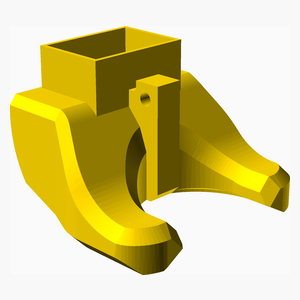 | 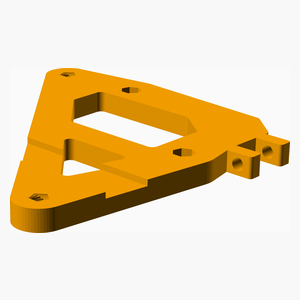 | 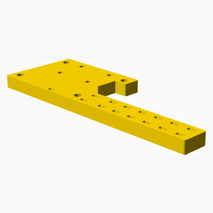 |

### Assembly instructions

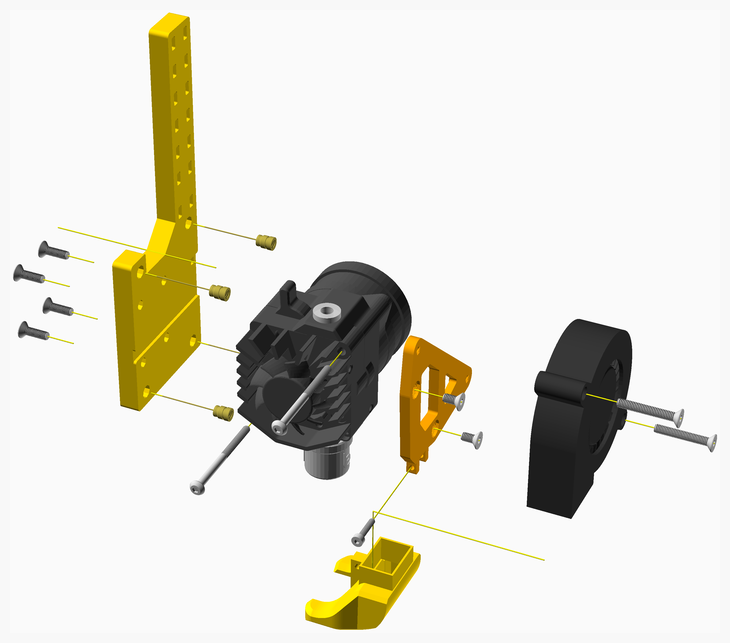

The **Smart_Orbiter_V3_Fan_Bracket** and the **Smart_Orbiter_V3_Duct** are based on the
[Smart Orbiter v3 - Detachable front 5015 fan](https://www.printables.com/es/model/700391-smart-orbiter-v3-detachable-front-5015-fan)
by [@PrintNC](https://www.printables.com/es/@PrintNC) and are used under the terms of their
[Creative Commons (4.0 International License) Attribution Recognition](https://creativecommons.org/licenses/by/4.0/) license.

1. Fit the heatfit M3 inserts into the  **X_Carriage_OrbiterV3**.
2. Bolt the Smart Orbiter V3 to the **X_Carriage_OrbiterV3**.
3. Bolt the **Smart_Orbiter_V3_Fan_Bracket** to the Smart Orbiter V3.
4. Bolt the RB5015 blower to the **Smart_Orbiter_V3_Fan_Bracket**.
5. Insert the  **Smart_Orbiter_V3_Duct** into the blower outlet and bolt it to the **Smart_Orbiter_V3_Fan_Bracket**.
6  Wrap the cables in cable wrap.
7. Secure the cables to the **X_Carriage_OrbiterV3** using zipties.

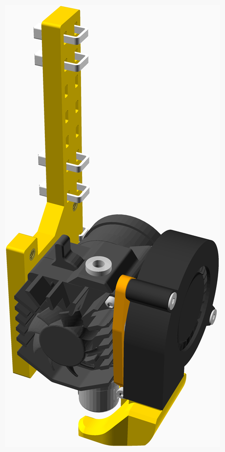

[Top](#TOP)

---

## X_Carriage_Beltside assembly

### Vitamins

| Qty | Description |
|----:|:------------|
|   2 | Bolt M3 caphead x 40mm |
|   2 | Washer M3 x 7mm x 0.5mm |

### 3D Printed parts

| 2 x X_Carriage_Belt_Tensioner_RB.stl | 1 x X_Carriage_Beltside_RB.stl |
|----------|----------|
| 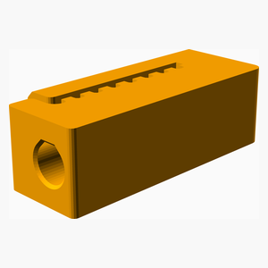 | 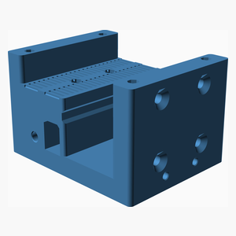 |

### Assembly instructions

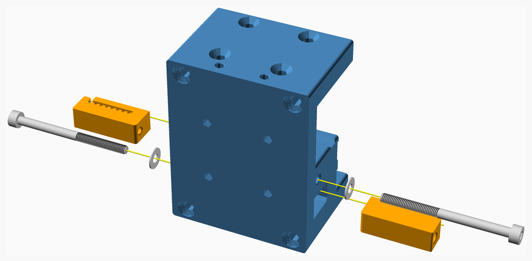

Insert the belts into the **X_Carriage_Belt_Tensioner**s and then bolt the tensioners into the
**X_Carriage_Beltside** part as shown. Note the belts are not shown in this diagram.

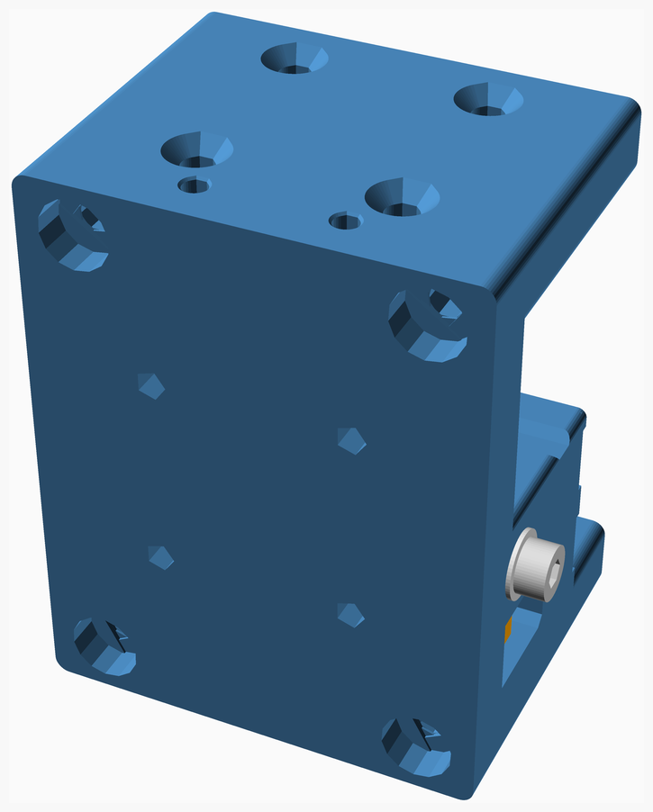

[Top](#TOP)

---

## XY_Motor_Mount_Right assembly

### Vitamins

| Qty | Description |
|----:|:------------|
|   6 | Ball bearing F694ZZ 4mm x 11mm x 4mm |
|   4 | Bolt M3 buttonhead x 10mm |
|   1 | Bolt M3 caphead x 40mm |
|   1 | Bolt M3 caphead x 50mm |
|   2 | Bolt M3 shoulder x 25mm |
|   2 | Bolt M4 buttonhead x 12mm |
|   1 | Cork damper NEMA 17 |
|   1 | Nut M3 hammer |
|   1 | Nut M3 x 2.4mm  |
|   2 | Nut M4 hammer |
|   1 | Pulley GT2OB 20 teeth |
|   1 | Stepper motor NEMA17 x 47mm |
|   1 | Stepper motor cable, 300mm |
|  11 | Washer M4 x 9mm x 0.5mm |

### 3D Printed parts

| 1 x XY_Motor_Mount_Brace_Right_Lower_RB4.stl | 1 x XY_Motor_Mount_Brace_Right_Upper_RB4.stl | 1 x XY_Motor_Mount_Pulley_Spacer_M4.stl |
|----------|----------|----------|
| 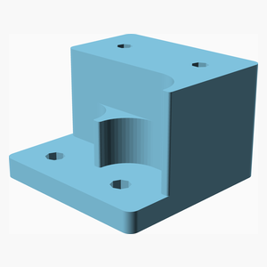 |  | 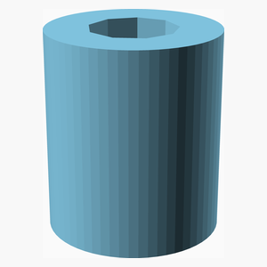 |

| 1 x XY_Motor_Mount_Right_Base_RB4.stl |
|----------|
| 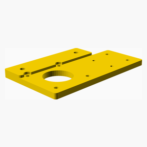 |

### Assembly instructions

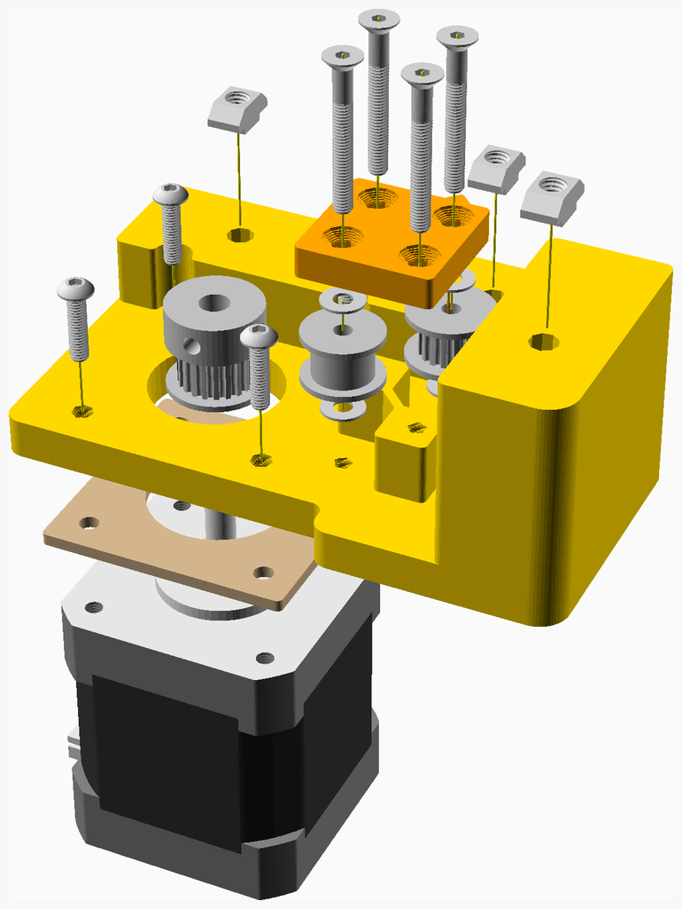

1. Bolt the idler pulleys, shims,  and the to XY_Motor_Mount braces to the **XY_Motor_Mount_Right** as show.
Tighten the shoulder bolts until the pulleys no longer turn freely, and then loosen the bolts by about 1/4 turn until the pulleys
turn freely again.
2. Bolt the motor and the cork damper to the motor mount. The cork damper thermally insulates the motor from the mount
and should not be omitted.
3. Align the drive pulley with the idler pulleys and bolt it to the motor shaft.
4. Add the bolts and t-nuts in preparation for later attachment to the frame.

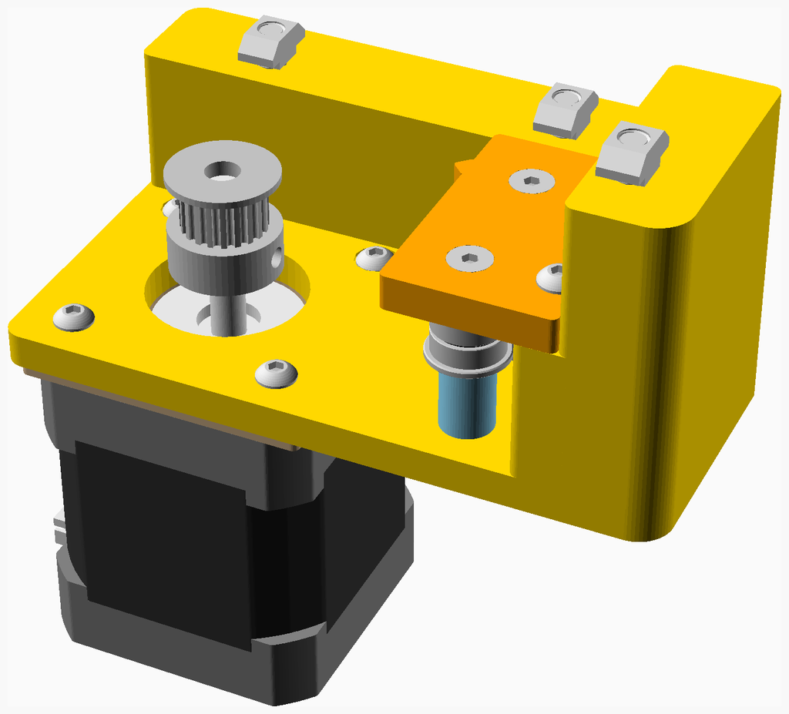

[Top](#TOP)

---

## XY_Motor_Mount_Left assembly

### Vitamins

| Qty | Description |
|----:|:------------|
|   6 | Ball bearing F694ZZ 4mm x 11mm x 4mm |
|   4 | Bolt M3 buttonhead x 10mm |
|   1 | Bolt M3 caphead x 35mm |
|   1 | Bolt M3 caphead x 50mm |
|   2 | Bolt M3 shoulder x 25mm |
|   2 | Bolt M4 buttonhead x 12mm |
|   1 | Cork damper NEMA 17 |
|   1 | Nut M3 hammer |
|   1 | Nut M3 x 2.4mm  |
|   2 | Nut M4 hammer |
|   1 | Pulley GT2OB 20 teeth |
|   1 | Stepper motor NEMA17 x 47mm |
|   1 | Stepper motor cable, 500mm |
|  11 | Washer M4 x 9mm x 0.5mm |

### 3D Printed parts

| 1 x XY_Motor_Mount_Brace_Left_Lower_RB4.stl | 1 x XY_Motor_Mount_Brace_Left_Upper_RB4.stl | 1 x XY_Motor_Mount_Left_Base_RB4.stl |
|----------|----------|----------|
| 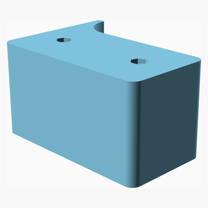 | 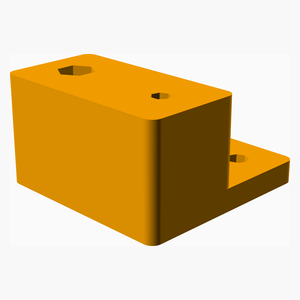 | 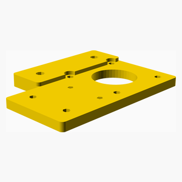 |

| 1 x XY_Motor_Mount_Pulley_Spacer_M4.stl |
|----------|
|  |

### Assembly instructions

1. Bolt the idler pulleys, shims,  and the to XY_Motor_Mount braces to the **XY_Motor_Mount_Left** as show.
Tighten the shoulder bolts until the pulleys no longer turn freely, and then loosen the bolts by about 1/4 turn until the pulleys
turn freely again.
2. Bolt the motor and the cork damper to the motor mount. The cork damper thermally insulates the motor from the mount
and should not be omitted.
3. Align the drive pulley with the idler pulleys and bolt it to the motor shaft.
4. Add the bolts and t-nuts in preparation for later attachment to the frame.

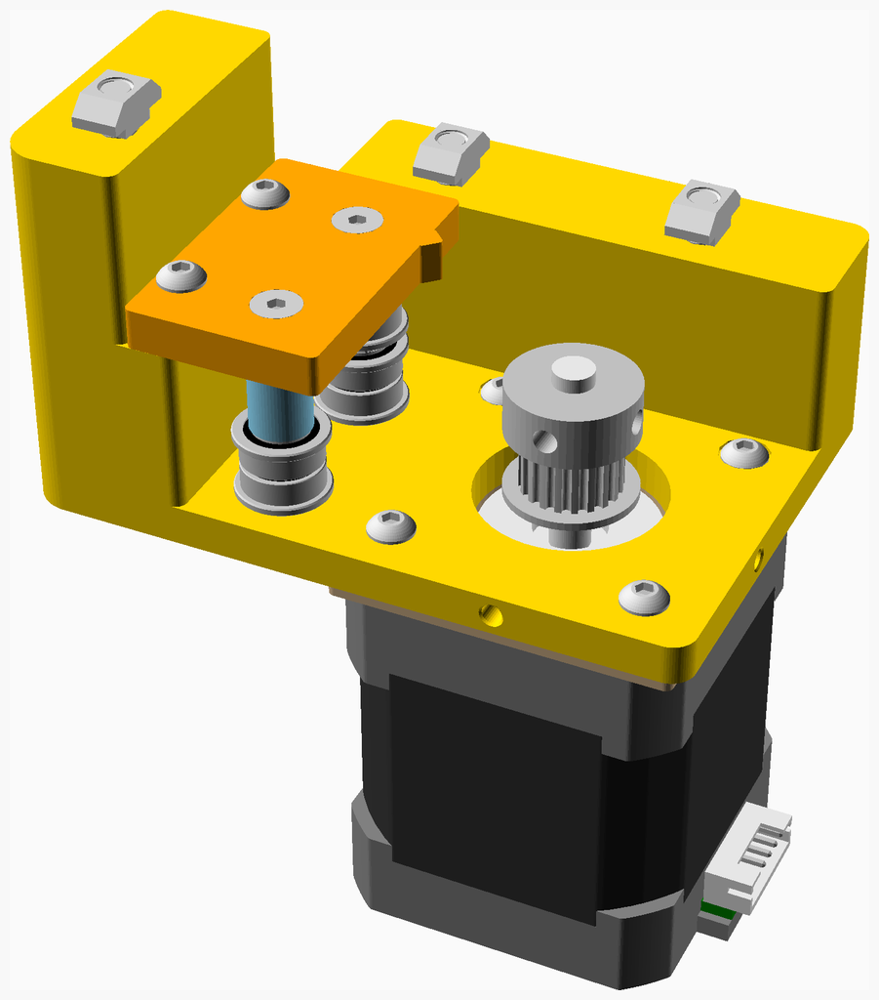

[Top](#TOP)

---

## XY_Idler_Right assembly

### Vitamins

| Qty | Description |
|----:|:------------|
|   2 | Ball bearing F694ZZ 4mm x 11mm x 4mm |
|   1 | Bolt M3 shoulder x 20mm |
|   2 | Bolt M4 buttonhead x 10mm |
|   1 | Nut M3 sliding T |
|   2 | Nut M4 sliding T |
|   3 | Washer M4 x 9mm x 0.5mm |

### 3D Printed parts

| 1 x XY_Idler_Right_RB4.stl |
|----------|
| 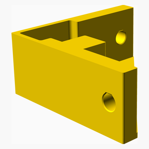 |

### Assembly instructions

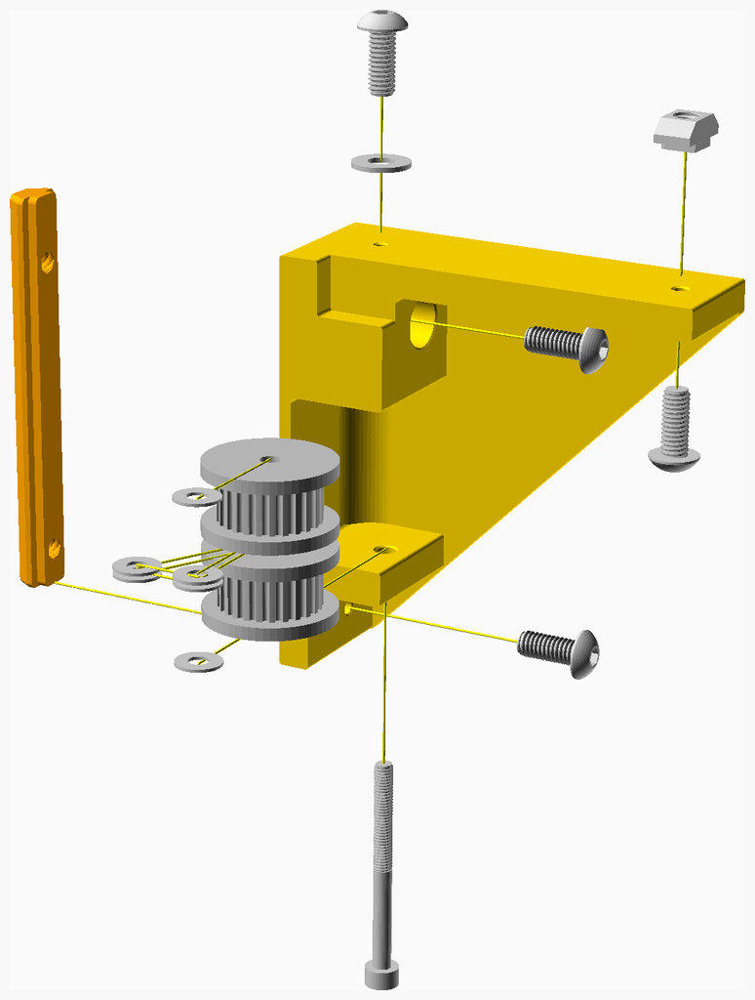

1. Bolt the pulley stack into the **XY_Idler_Right**. Note that there are 4 washers between the two pulleys and one
washer at the top and the bottom of the pulley stack.
2. Tighten the bolt until the pulleys no longer turn freely, and then loosen the bolt by about 1/4 turn to allow the pulleys
to turn freely again.
3. Add the bolts and t-nuts in preparation for later attachment to the frame.

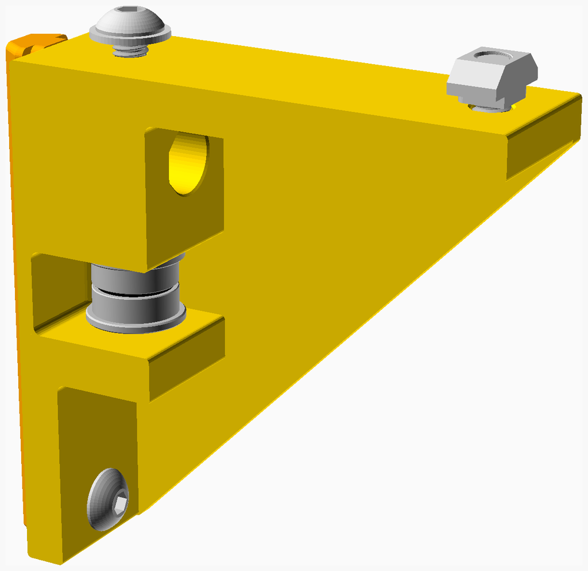

[Top](#TOP)

---

## XY_Idler_Left assembly

### Vitamins

| Qty | Description |
|----:|:------------|
|   2 | Ball bearing F694ZZ 4mm x 11mm x 4mm |
|   1 | Bolt M3 shoulder x 30mm |
|   2 | Bolt M4 buttonhead x 10mm |
|   1 | Nut M3 sliding T |
|   2 | Nut M4 sliding T |
|   3 | Washer M4 x 9mm x 0.5mm |

### 3D Printed parts

| 1 x XY_Idler_Left_RB4.stl |
|----------|
| 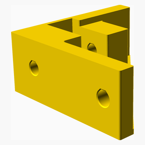 |

### Assembly instructions

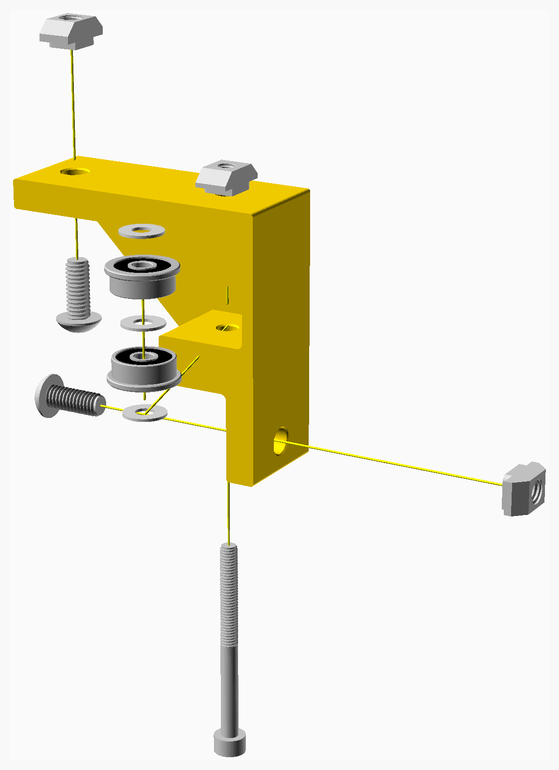

1. Bolt the pulley stack into the **XY_Idler_Left**. Note that there are 4 washers between the two pulleys and one
washer at the top and the bottom of the pulley stack.
2. Tighten the bolt until the pulleys no longer turn freely, and then loosen the bolt by about 1/4 turn to allow the pulleys
to turn freely again.
3. Add the bolts and t-nuts in preparation for later attachment to the frame.

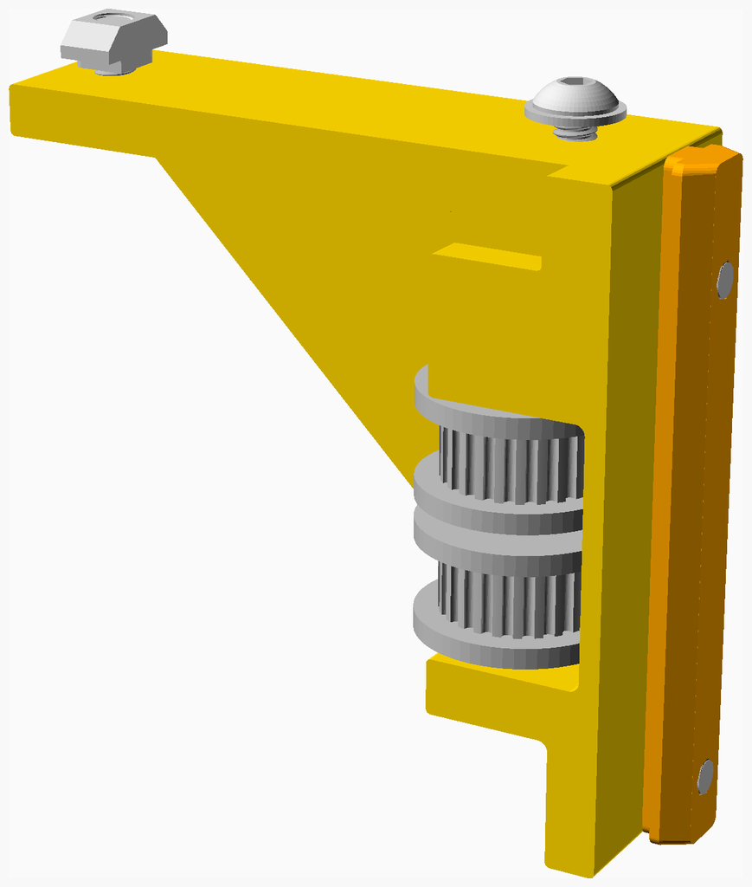

[Top](#TOP)

---

## Y_Carriage_Right assembly

### Vitamins

| Qty | Description |
|----:|:------------|
|   4 | Ball bearing F694ZZ 4mm x 11mm x 4mm |
|   2 | Bolt M3 caphead x  8mm |
|   1 | Bolt M3 shoulder x 12mm |
|   1 | Bolt M3 shoulder x 20mm |
|   2 | Heatfit insert M3 x 5.8mm |
|   9 | Washer M4 x 9mm x 0.5mm |

### 3D Printed parts

| 1 x Y_Carriage_Brace_Right_RB4.stl | 1 x Y_Carriage_Right_RB4.stl |
|----------|----------|
| 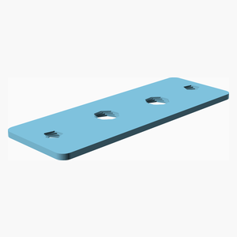 | 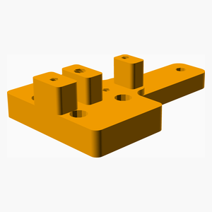 |

### Assembly instructions

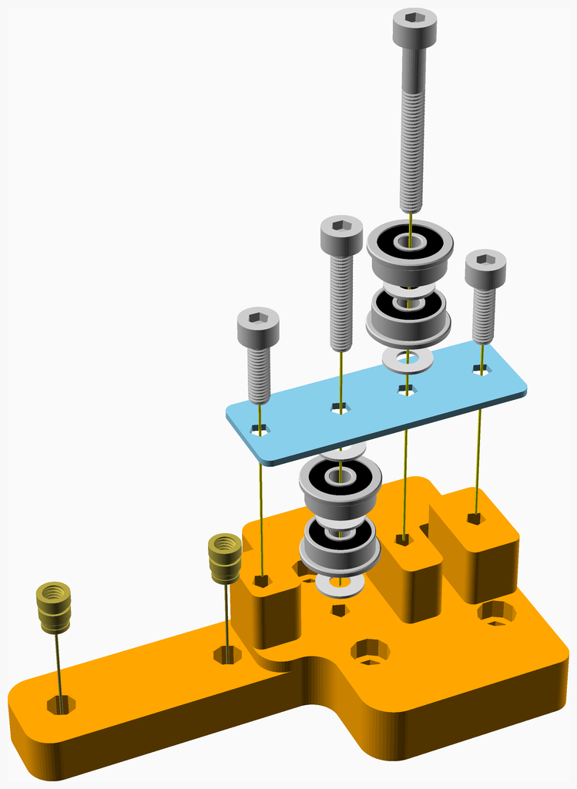

1. Insert the threaded inserts into the **Y_Carriage_Right** as shown.
2. Drive a long M3 bolt through the Y carriage from the insert side to self tap the part of the hole after the insert.
Once this hole is tapped, remove the bolt.
3. Bolt the **Y_Carriage_Brace_Right** and the pulleys to the **Y_Carriage_Right** as shown. Note the position of the washers.
4. Tighten the bolts until the pulleys no longer turn freely and then loosen by about 1/4 turn so the pulleys can again turn.

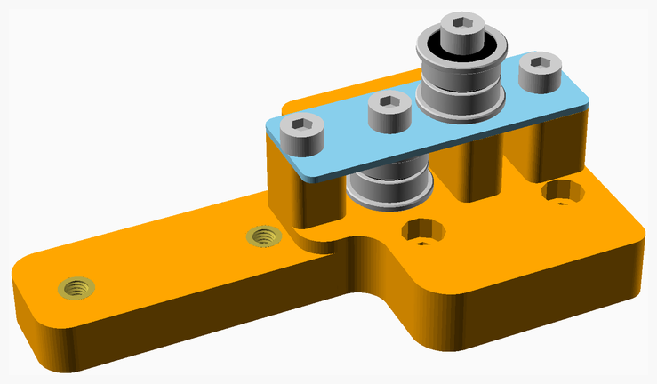

[Top](#TOP)

---

## Y_Carriage_Left assembly

### Vitamins

| Qty | Description |
|----:|:------------|
|   4 | Ball bearing F694ZZ 4mm x 11mm x 4mm |
|   2 | Bolt M3 caphead x  8mm |
|   1 | Bolt M3 shoulder x 12mm |
|   1 | Bolt M3 shoulder x 20mm |
|   2 | Heatfit insert M3 x 5.8mm |
|   9 | Washer M4 x 9mm x 0.5mm |

### 3D Printed parts

| 1 x Y_Carriage_Brace_Left_RB4.stl | 1 x Y_Carriage_Left_RB4.stl |
|----------|----------|
| 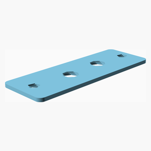 | 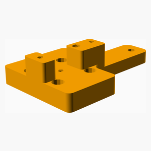 |

### Assembly instructions

1. Insert the threaded inserts into the **Y_Carriage_Left** as shown.
2. Drive a long M3 bolt through the Y carriage from the insert side to self tap the part of the hole after the insert.
Once this hole is tapped, remove the bolt.
3. Bolt the **Y_Carriage_Brace_Left** and the pulleys to the **Y_Carriage_Left** as shown. Note the position of the washers.
4. Tighten the bolts until the pulleys no longer turn freely and then loosen by about 1/4 turn so the pulleys can again turn.

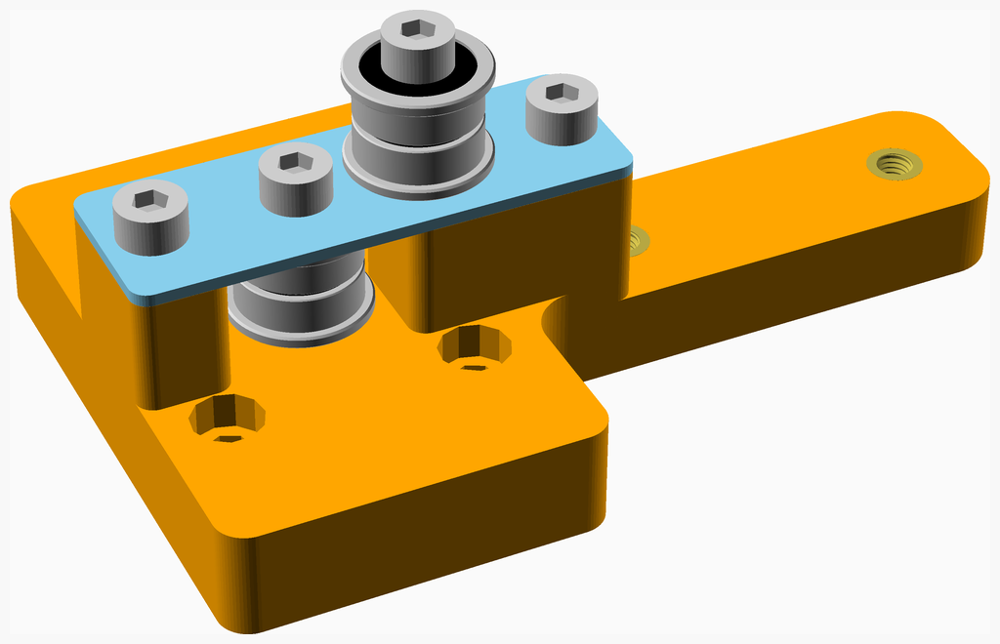

[Top](#TOP)

---

## X_Rail assembly

### Vitamins

| Qty | Description |
|----:|:------------|
|   4 | Bolt M3 caphead x 10mm |
|   1 | Linear rail MGN12 x 300mm |
|   1 | Linear rail carriage MGN12H |

### Sub-assemblies

| 1 x Y_Carriage_Left_assembly | 1 x Y_Carriage_Right_assembly |
|----------|----------|
| 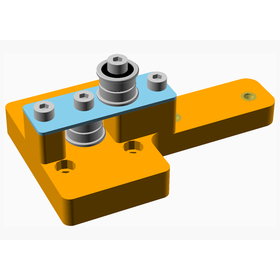 | 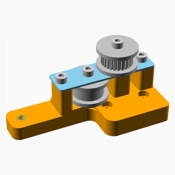 |

### Assembly instructions

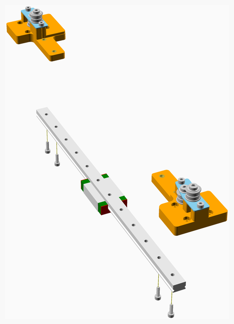

Bolt the Y_Carriages to the ends of the linear rail.

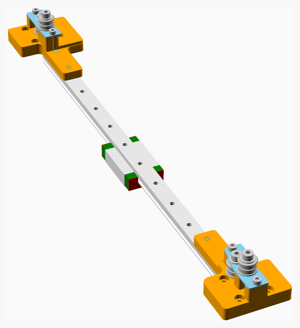

[Top](#TOP)

---

## Right_Side_Upper_Extrusion assembly

### Vitamins

| Qty | Description |
|----:|:------------|
|   7 | Bolt M3 caphead x  8mm |
|   4 | Bolt M5 buttonhead x 12mm |
|   1 | Extrusion E2040 x 350mm |
|   1 | Linear rail MGN12 x 350mm |
|   1 | Linear rail carriage MGN12H |
|   7 | Nut M3 sliding T |

### Assembly instructions

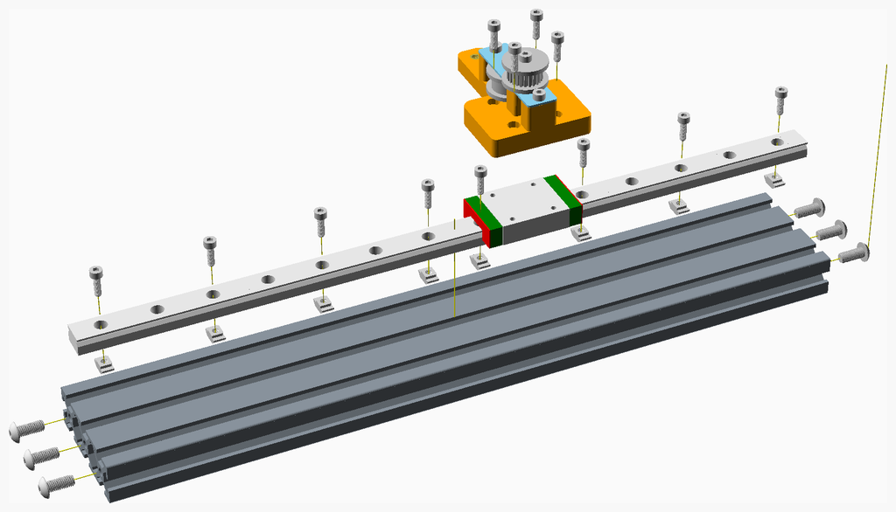

1. Bolt the MGN linear rail to the extrusion, using the **Rail_Centering_Jig** to align the rail. Do not fully tighten the
bolts at this stage - they will be fully tightened when the rail is racked at a later stage.
2. Bolt the **Y_Carriage_Right_assembly** to the MGN carriage.
3. Screw the bolts into ends of the extrusion in preparation for attachment to the rest of the top face.
4. Note that the last two holes of the rail are not used - the Y_Carriage cannot travel here since the motors are in the way.
Not using these holes shortens the constrained length of rail and so reduces the flex of the Y axes caused by bimetalic expansion
when the frame heats up during printing.

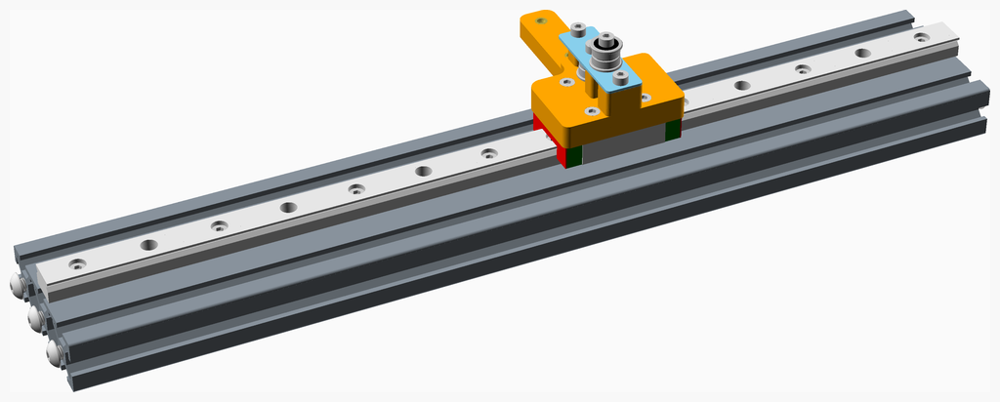

[Top](#TOP)

---

## Left_Side_Upper_Extrusion assembly

### Vitamins

| Qty | Description |
|----:|:------------|
|   7 | Bolt M3 caphead x  8mm |
|   4 | Bolt M5 buttonhead x 12mm |
|   1 | Extrusion E2040 x 350mm |
|   1 | Linear rail MGN12 x 350mm |
|   1 | Linear rail carriage MGN12H |
|   7 | Nut M3 sliding T |

### Assembly instructions

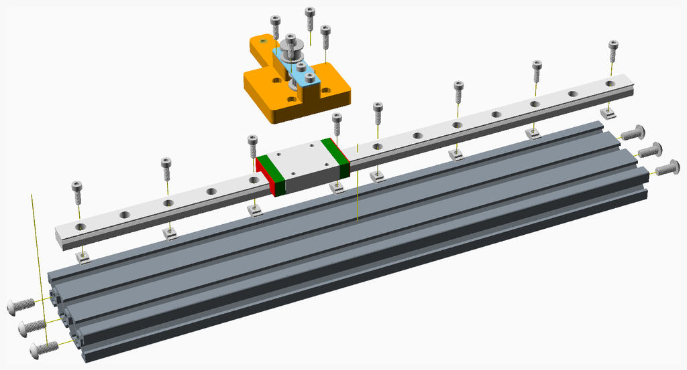

1. Bolt the MGN linear rail to the extrusion, using the **Rail_Centering_Jig** to align the rail. Fully tighten the
bolts - the left rail is the fixed rail and the right rail will be aligned to it.
2. Bolt the **Y_Carriage_Left_assembly** to the MGN carriage.
3. Screw the bolts into ends of the extrusion in preparation for attachment to the rest of the top face.

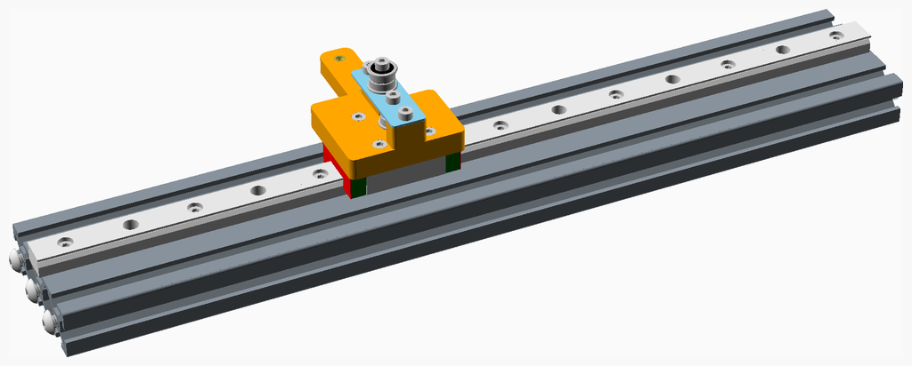

[Top](#TOP)

---

## Face_Top_Stage_1 assembly

### Vitamins

| Qty | Description |
|----:|:------------|
|   2 | Bolt M4 buttonhead x 10mm |
|  20 | Bolt M4 countersunk x 10mm |
|   4 | Bolt M5 buttonhead x 10mm |
|   6 | Bolt M5 buttonhead x 12mm |
|   1 | Extrusion E2040 x 350mm |
|   1 | Extrusion E2060 x 350mm |
|   2 | Nut M4 hammer |
|  28 | Nut M4 sliding T |

### 3D Printed parts

| 4 x Top_Corner_Piece.stl | 1 x Wiring_Guide_Socket.stl |
|----------|----------|
| 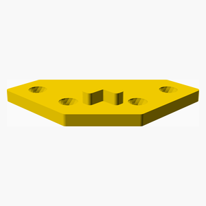 | 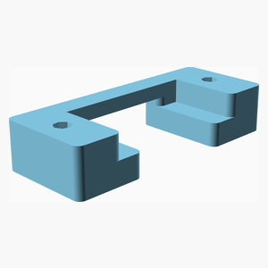 |

### Sub-assemblies

| 1 x Left_Side_Upper_Extrusion_assembly | 1 x Right_Side_Upper_Extrusion_assembly |
|----------|----------|
|  | 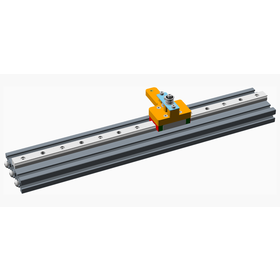 |

### Assembly instructions

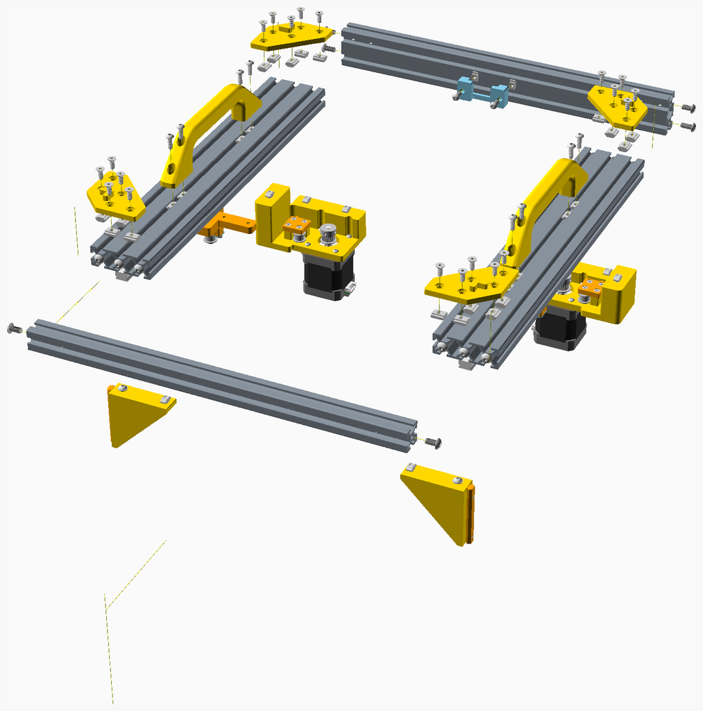

1. Bolt the **Wiring_Guide** to the rear extrusion.
2. Screw the bolts into the ends of the front and rear extrusions. Note that the top bolts on the front and rear extensions are shorter then the
other bolts, this is so they do not block access to the hidden bolts on the left and right extrusions during assembly.
3. Insert the t-nuts for the **Handle** into the extrusions.
4. Insert the t-nuts for the **Top_Corner_Piece**s into the extrusions.
5. Bolt the front and rear extrusions to the side extrusions, leaving the bolts slightly loose.
6. Bolt the **Top_Corner_Piece**s to the extrusions leaving the bolts slightly loose.
7. Turn the top face upside down and place on a flat surface. Ensure it is square and tighten the hidden bolts.
8. Turn the top face the right way up and tighten the bolts on the **Top_Corner_Piece**s.

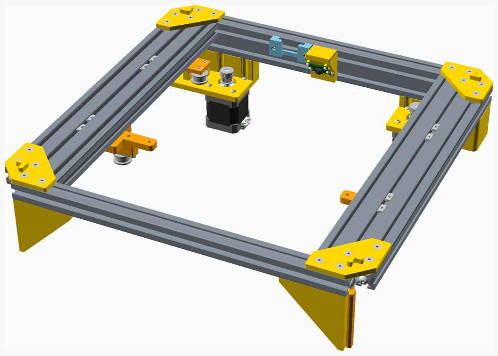

[Top](#TOP)

---

## Face_Top_Stage_2 assembly

### Vitamins

| Qty | Description |
|----:|:------------|
|   8 | Bolt M3 caphead x 10mm |

### Sub-assemblies

| 1 x Face_Top_Stage_1_assembly | 1 x X_Rail_assembly |
|----------|----------|
| 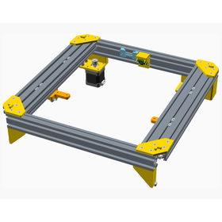 | 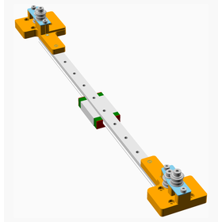 |

### Assembly instructions

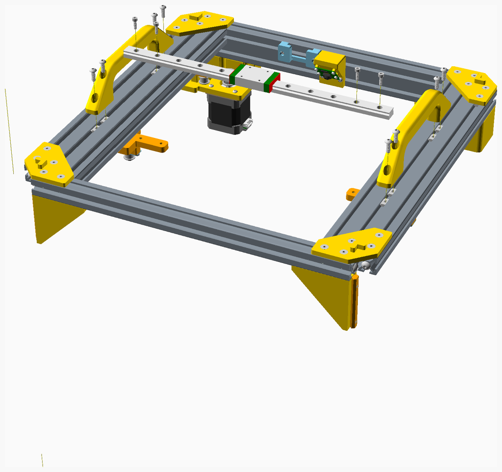

1. Turn the top face upside down and place on a flat surface.
2. Bolt the **X_Rail_assmebly** to MGN Y carriages.
3. Rack the right side linear rail - Kove the X-rail to one extreme of the frame and tighten the bolts
on that end of the Y-rail. Then move the X-rail to the other extreme and tighten the bolts on that end
of the Y-rail. Finally tighten the remaining bolts on the Y-rail.
4. Ensure the X-rail moves freely, if it doesn't loosen the bolts you have just tightened and repeat step 3.

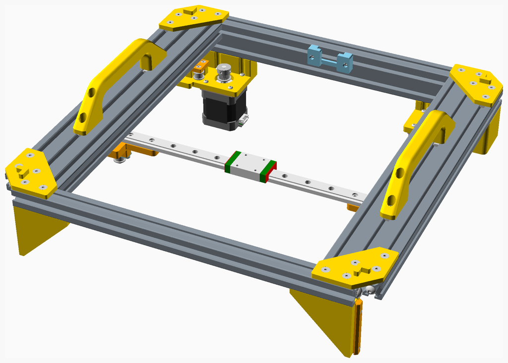

[Top](#TOP)

---

## Face_Top_Stage_3 assembly

### Sub-assemblies

| 1 x Face_Top_Stage_2_assembly | 1 x XY_Idler_Left_assembly | 1 x XY_Idler_Right_assembly |
|----------|----------|----------|
| 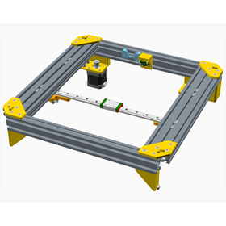 |  | 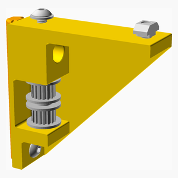 |

| 1 x XY_Motor_Mount_Left_assembly | 1 x XY_Motor_Mount_Right_assembly |
|----------|----------|
| 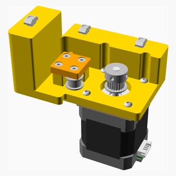 | 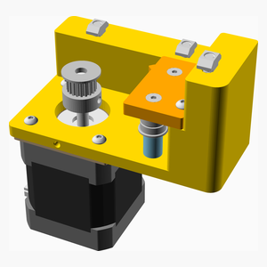 |

### Assembly instructions

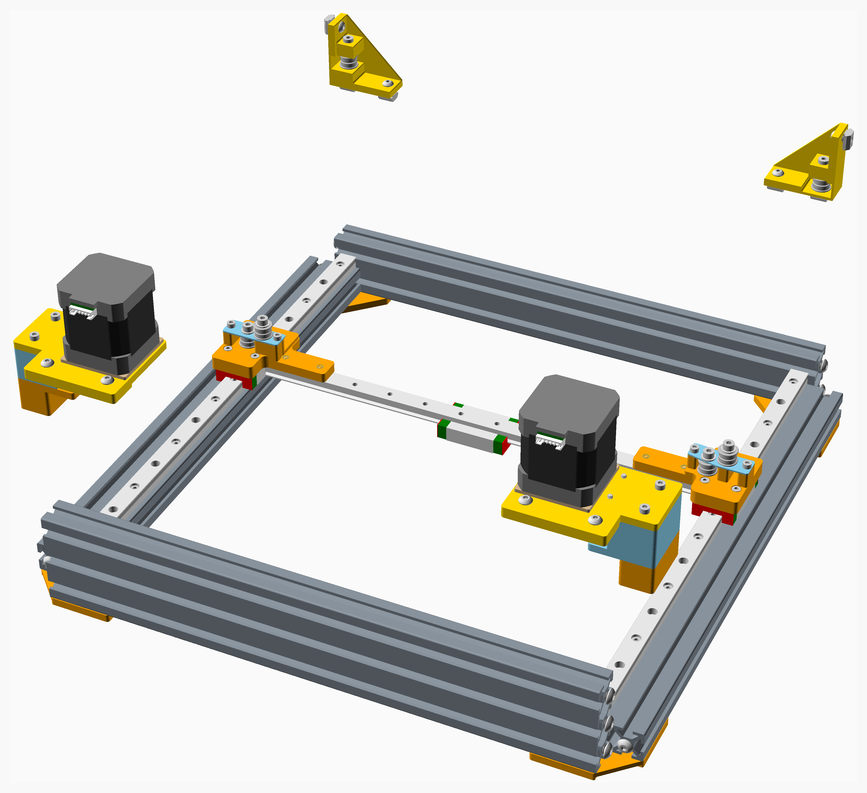

1. Bolt the XY_Idlers to the frame.
2. Bolt the XY_Motor mounts to the frame.

[Top](#TOP)

---

## Face_Top_Stage_4 assembly

### Vitamins

| Qty | Description |
|----:|:------------|
|   1 | Belt GT2 x 6mm x 1466mm |
|   1 | Belt GT2 x 6mm x 1502mm |
|   2 | Bolt M3 countersunk x 10mm |
|   4 | Bolt M3 countersunk x 12mm |

### 3D Printed parts

| 1 x X_Carriage_Belt_Clamp.stl |
|----------|
| 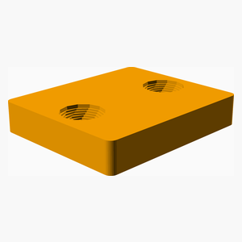 |

### Sub-assemblies

| 1 x Face_Top_Stage_3_assembly | 1 x X_Carriage_Beltside_assembly |
|----------|----------|
| 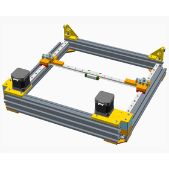 | 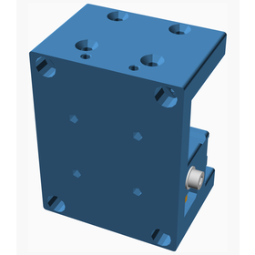 |

### Assembly instructions

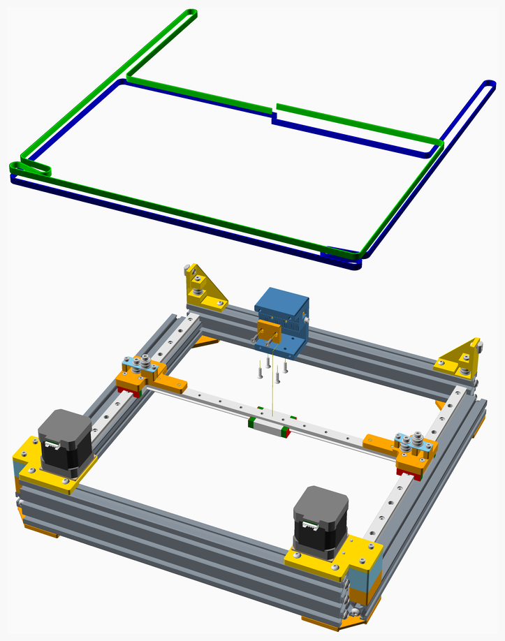

1. Bolt the **X_Carriage_Beltside_assembly** to the MGN carriage.
2. Thread the belts as shown and attach them to the **X_Carriage_Beltside_assembly**
using the **X_Carriage_Belt_Clamp**.
3. Leave the belts fairly loose - tensioning of the belts is done after the frame is assembled.

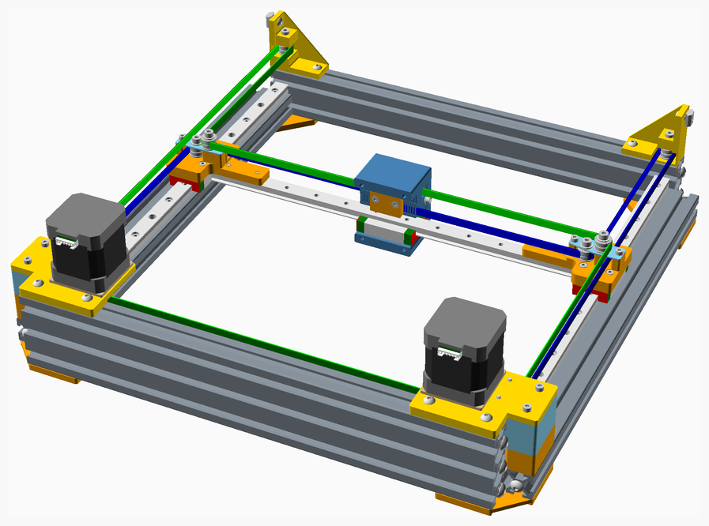

[Top](#TOP)

---

## Face_Top assembly

### Vitamins

| Qty | Description |
|----:|:------------|
|   8 | Bolt M4 buttonhead x 12mm |
|   8 | Nut M4 sliding T |

### 3D Printed parts

| 2 x Handle.stl |
|----------|
| 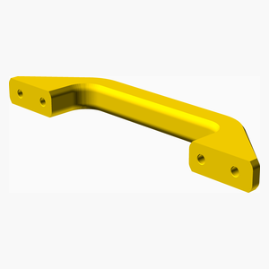 |

### Sub-assemblies

| 1 x Face_Top_Stage_4_assembly |
|----------|
|  |

### Assembly instructions

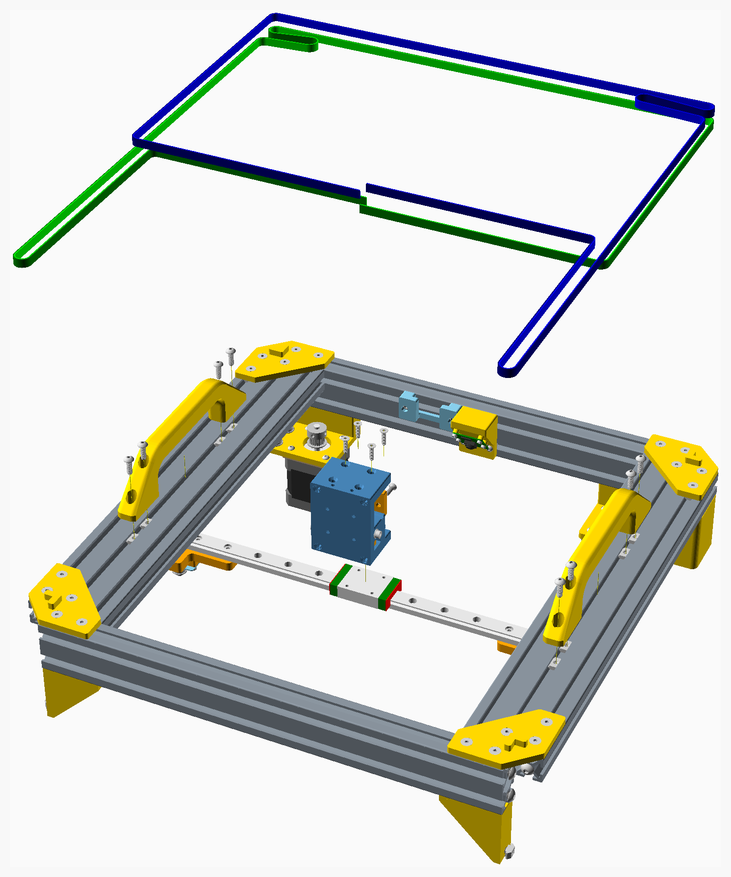

1. Turn the top face the correct way up.
2. Bolt the handles to the previously inserted t-nuts.

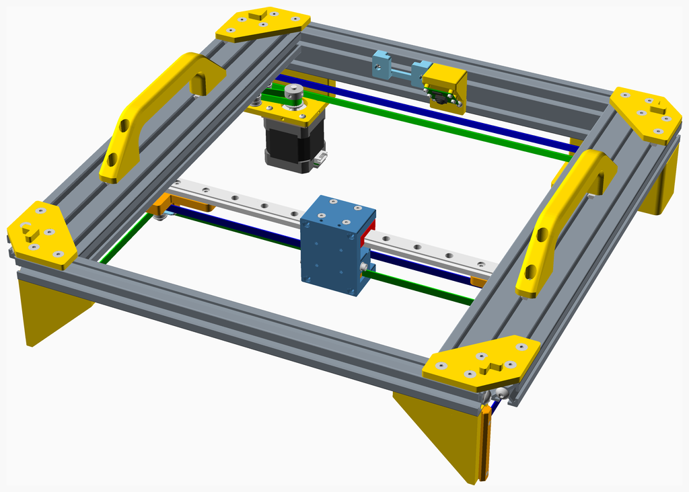

[Top](#TOP)

---

## Heated_Bed assembly

### Vitamins

| Qty | Description |
|----:|:------------|
|   2 | Bolt M3 caphead x  8mm |
|   3 | Bolt M3 caphead x 25mm |
|   3 | Nut M3 sliding T |
|   1 | Silicone Heater with thermistor - 200mm x 200mm |
|   3 | Silicone Spacer 18mm x 16mm |
|   1 | Voron Trident Build Plate - 250x250 |

### Assembly instructions

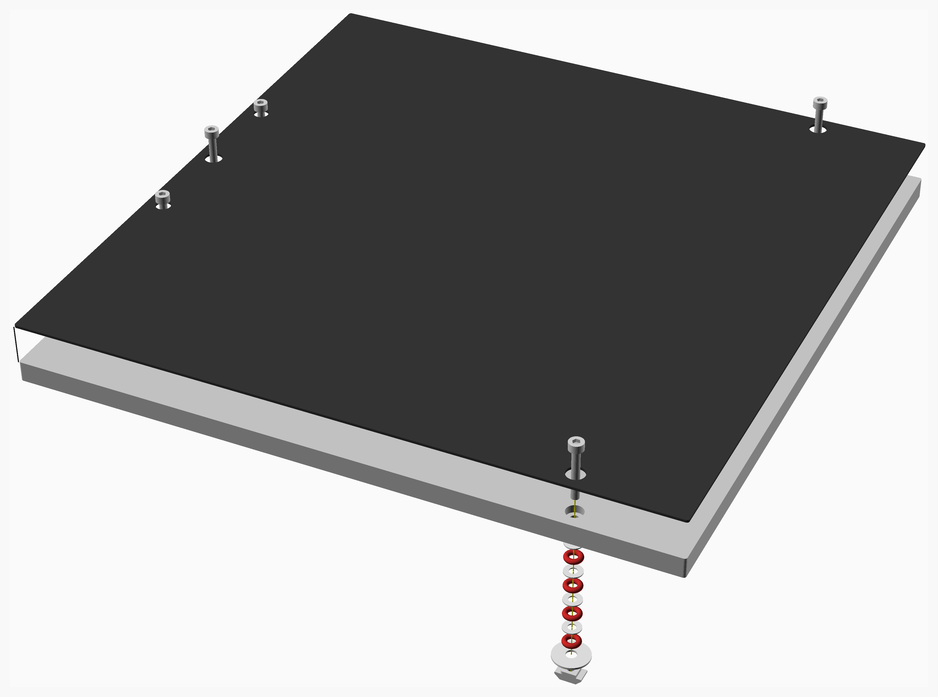

1. Attach the print surface to the heated bed.
2. Insert a bolt into each of the bolt holes in the heated bed and add a silicone spacer and a hammer nut as shown.

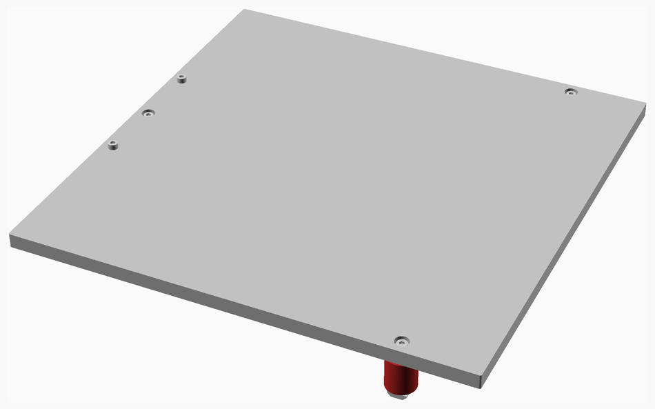

[Top](#TOP)

---

## Z_Carriage_Center assembly

### Vitamins

| Qty | Description |
|----:|:------------|
|   2 | Bolt M3 caphead x 30mm |
|   3 | Bolt M4 buttonhead x 10mm |
|   1 | Leadscrew nut 8 x 2 |
|   3 | Nut M4 sliding T |

### 3D Printed parts

| 1 x Z_Carriage_Center.stl |
|----------|
| 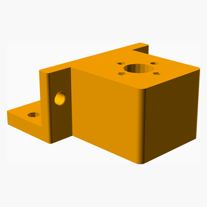 |

### Assembly instructions

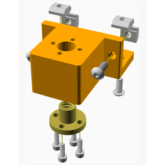

1. Bolt the leadscrew to the **Z_Carriage_Center**.
2. Add the bolts and t-nuts in preparation for later attachment to the printbed frame.

[Top](#TOP)

---

## Printbed_Frame assembly

### Vitamins

| Qty | Description |
|----:|:------------|
|   2 | Bolt M4 buttonhead x 10mm |
|   8 | Bolt M5 buttonhead x 12mm |
|   2 | Extrusion E2020 x 300mm |
|   2 | Extrusion E2040 x 185mm |
|   2 | Nut M4 hammer |

### 3D Printed parts

| 1 x Cable_Chain_Bracket.stl |
|----------|
| 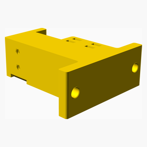 |

### Sub-assemblies

| 1 x Z_Carriage_Center_assembly |
|----------|
|  |

### Assembly instructions

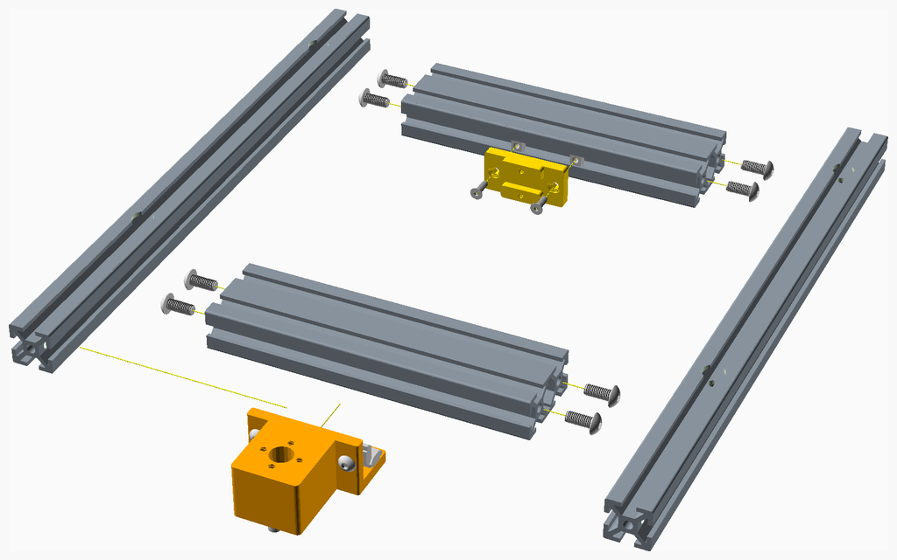

1. Slide the **Z_Carriage_Center_assembly** to the approximate center of the first 2040 extrusion and loosely tighten
the bolts. The bolts will be fully tightened when the Z_Carriage is aligned.
2. Slide the 2040 extrusion into the 2020 extrusions and loosely tighten the bolts. The bolts will be fully tightened after
the Z carriages are added.

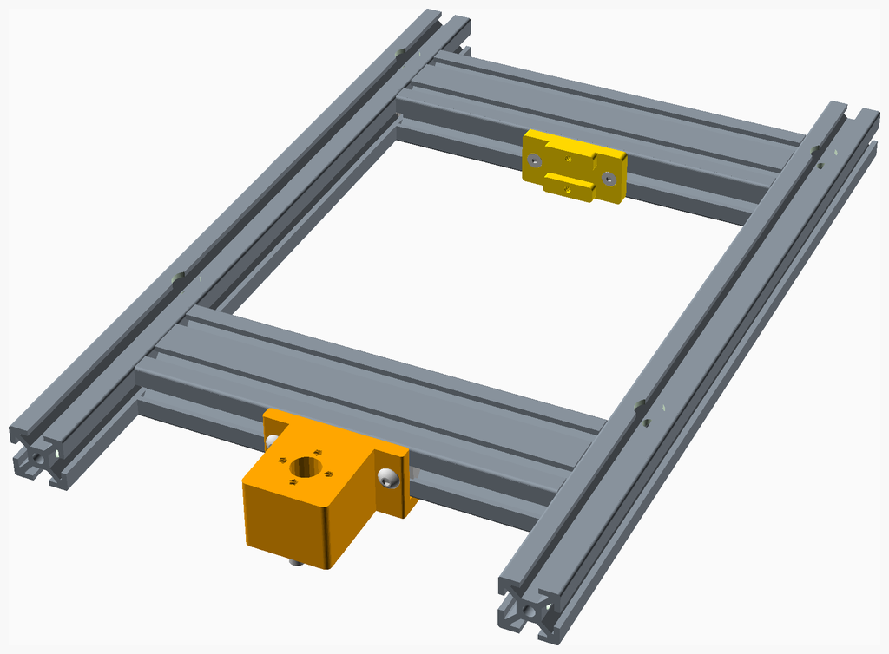

[Top](#TOP)

---

## Printbed_Frame_with_Z_Carriages assembly

### Vitamins

| Qty | Description |
|----:|:------------|
|   4 | Bolt M5 buttonhead x 10mm |
|   2 | SCS12LUU bearing block |

### Sub-assemblies

| 1 x Printbed_Frame_assembly |
|----------|
| 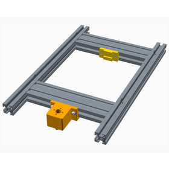 |

### Assembly instructions

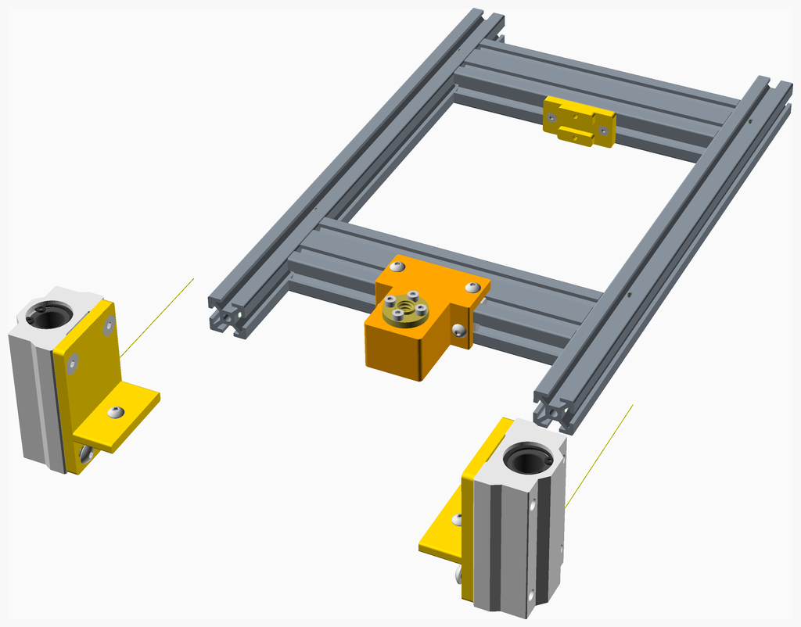

1. Lay the frame on a flat surface and  slide the Z carriages onto the frame as shown.
2. Ensure the Z carriages are square and aligned with the end of the frame and then tighten the bolts on Z_Carriages.
3. Ensure the 2040 extrusion is pressed firmly against the Z_Carriages and tighten the hidden bolts in the frame.

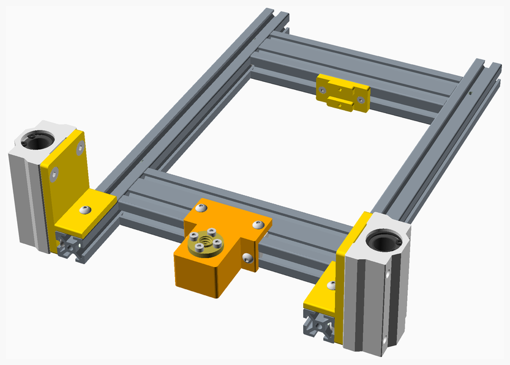

[Top](#TOP)

---

## Printbed assembly

### Vitamins

| Qty | Description |
|----:|:------------|
|   2 | Bolt M3 countersunk x  8mm |
|   2 | Ziptie 2.5mm x 100mm min length |

### Sub-assemblies

| 1 x Heated_Bed_assembly | 1 x Printbed_Frame_with_Z_Carriages_assembly |
|----------|----------|
| 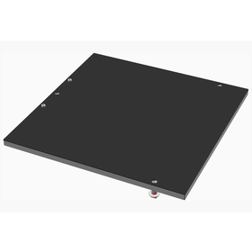 | 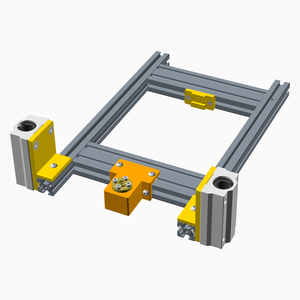 |

### Assembly instructions

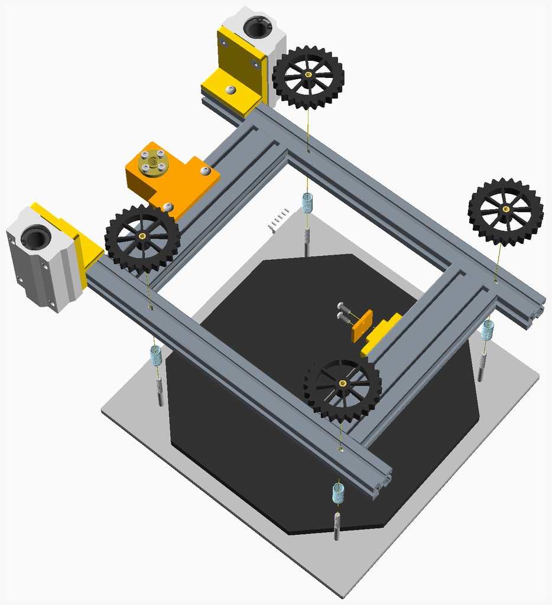

1. Attach the heated bed to the frame using the stacks of washers and O-rings as shown.
2. Spiral wrap the wires from the heated bed.

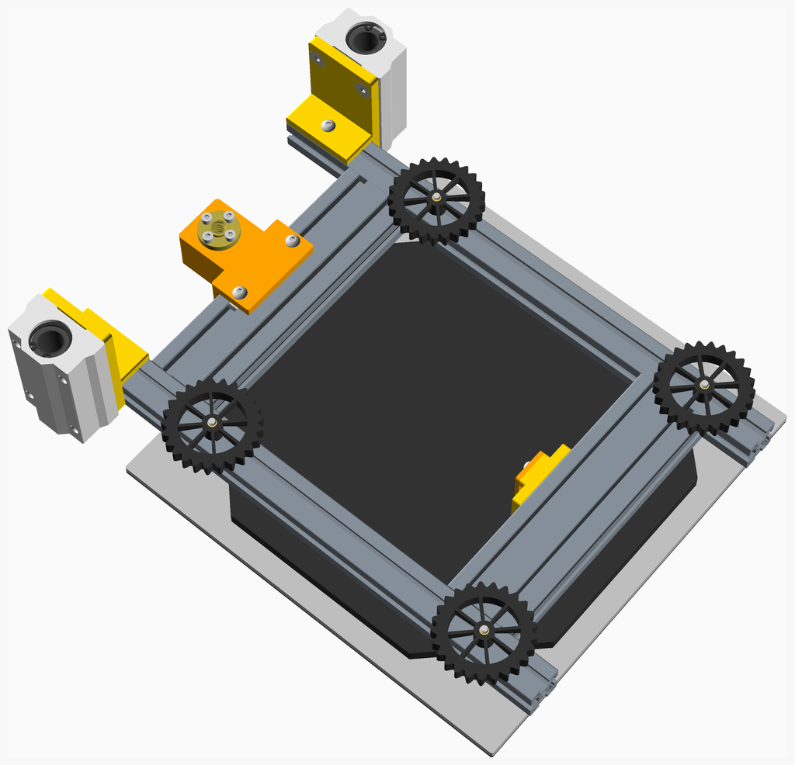

[Top](#TOP)

---

## Left_Side assembly

### Vitamins

| Qty | Description |
|----:|:------------|
|   2 | Bolt M4 buttonhead x 10mm |
|   2 | Bolt M4 buttonhead x 12mm |
|   8 | Bolt M4 countersunk x 10mm |
|  10 | Bolt M5 buttonhead x 12mm |
|   2 | Extrusion E2020 x 450mm |
|   1 | Extrusion E2040 x 350mm |
|   1 | Extrusion E2060 x 350mm |
|  12 | Nut M4 sliding T |
|   4 | SK12 shaft support bracket |

### 3D Printed parts

| 1 x Z_Motor_Mount.stl | 1 x Z_Motor_Mount_Guide_23mm.stl | 2 x Z_RodMountGuide_100mm.stl |
|----------|----------|----------|
| 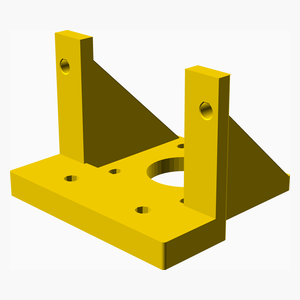 | 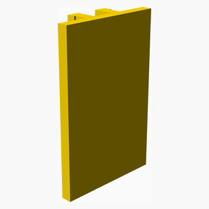 | 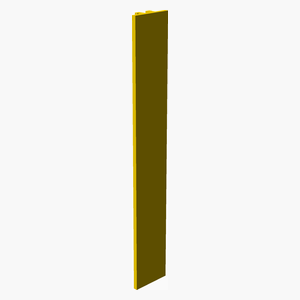 |

### Assembly instructions

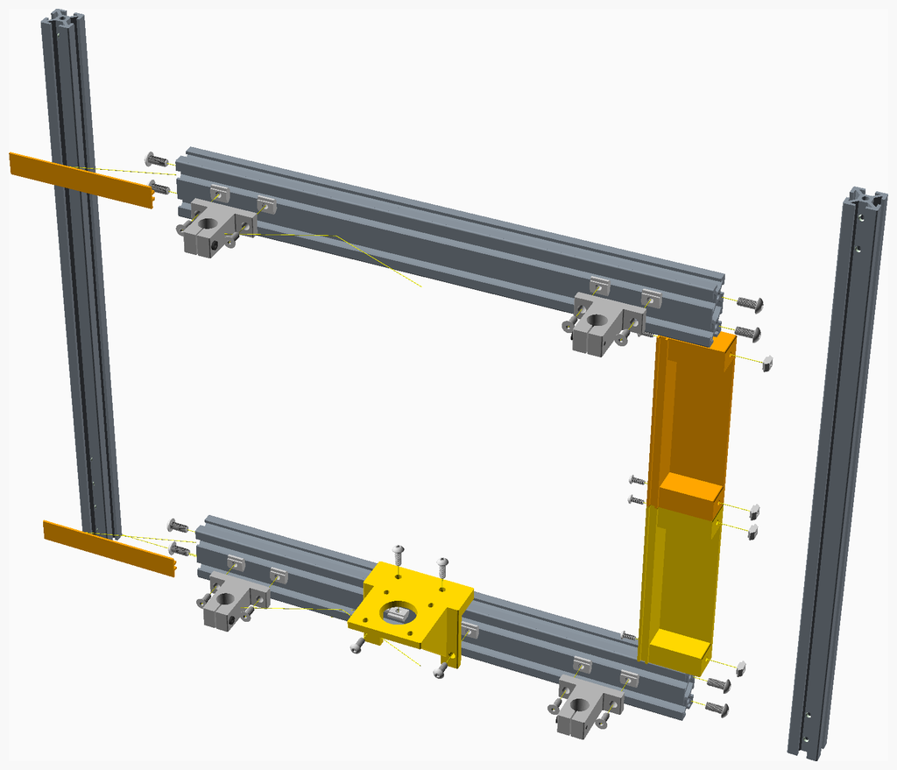

1. Attach the SK brackets to the upper extrusion, use the **Z_RodMountGuide** to align the left bracket.
2. Tighten the bolts for the left bracket. Leave the bolts to the right bracket loosely tightened for now.
3. Attach the SK brackets and the **Z_Motor_Mount** to the lower extrusion, use the **Z_RodMountGuide** to
align the left bracket and the **Z_Motor_MountGuide** to align the motor mount. The motor itself will be added at a later
stage of the assembly.
4. Tighten the bolts for the left bracket and the **Z_Motor_Mount**. Leave the bolts to the right bracket loosely
tightened for now.
5. On a flat surface, bolt the upper and lower extrusions into the left and right uprights as shown. Tighten the bolts
continuously ensuring the frame is square.

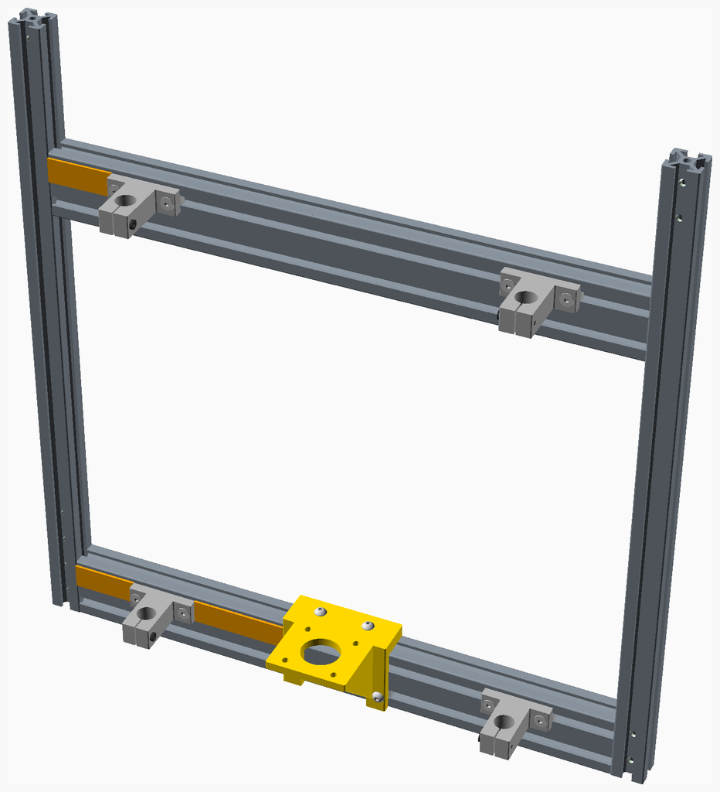

[Top](#TOP)

---

## Left_Side_with_Printbed assembly

### Vitamins

| Qty | Description |
|----:|:------------|
|   4 | Bolt M3 buttonhead x 10mm |
|   1 | Cork damper NEMA 17 |
|   2 | Linear rod 12mm x 350mm |
|   1 | Stepper motor NEMA17 x 40mm, 300mm integrated leadscrew |
|   1 | Stepper motor cable, 850mm |

### Sub-assemblies

| 1 x Left_Side_assembly | 1 x Printbed_assembly |
|----------|----------|
| 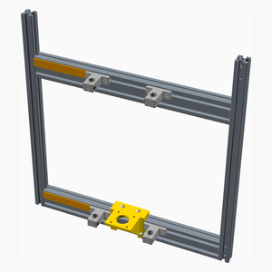 | 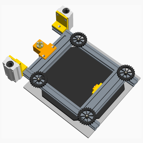 |

### Assembly instructions

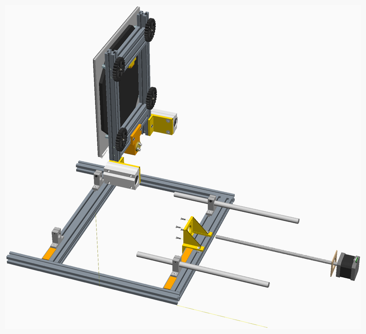

1. Place the left face on a flat surface.
2. Attach the print bed to the left face by sliding the linear rods through the Z_Carriages.
3. Tighten the grub screws on the rod brackets, but don't yet tighten the bolts holding the brackets to the frame.
4. Slide the print bed to the top of the rods, and tighten the bolts in the top right rod bracket.
(you will have tightened the bolts on the top left bracket in a previous step).
5. Slide the print bed to the bottom of the rods and tighten the bolts on the bottom right rod bracket
(you will have tightened the bolts on the bottom left bracket in a previous step).
6. Thread the motor's lead screw through the lead nut on the **Z_Carriage_Center** and loosely bolt the motor to
the **Z_Motor_Mount**.
7. Ensure the **Z_Carriage_Center** is aligned with the lead screw and tighten the bolts on the **Z_Carriage_Center**
and the **Z_Motor_Mount**. The bolt holes on the **Z_Motor_Mount** are oval to allow some adjustment.
8. Route the motor wire through the lower extrusion channel and use the **E20_ChannelCover_50mm**s to hold it in place.

[Top](#TOP)

---

## Right_Side assembly

### Vitamins

| Qty | Description |
|----:|:------------|
|   8 | Bolt M5 buttonhead x 12mm |
|   2 | Extrusion E2020 x 450mm |
|   2 | Extrusion E2040 x 350mm |

### Assembly instructions

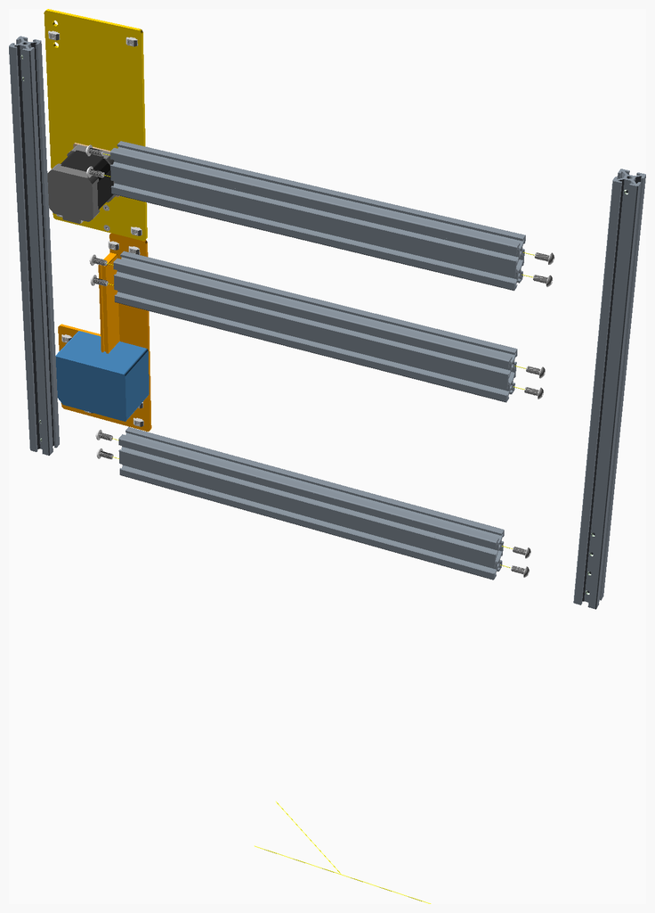

1. On a flat surface, bolt the upper and lower extrusions into the left and right uprights as shown.
2. If using a Bowden Extruder, bolt the **Extruder_Bracket_assembly** to the upper extrusion and upright.

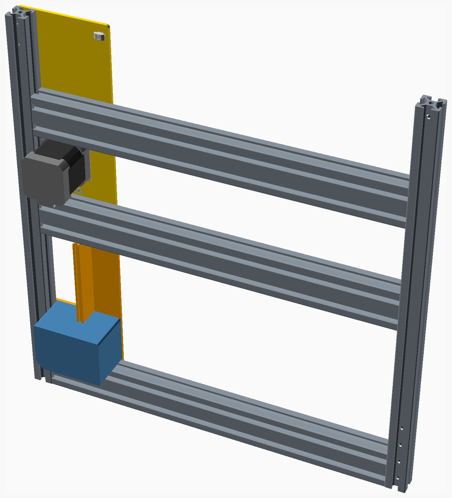

[Top](#TOP)

---

## IEC_Housing assembly

### Vitamins

| Qty | Description |
|----:|:------------|
|   5 | Bolt M4 buttonhead x  8mm |
|   2 | Bolt M4 buttonhead x 12mm |
|   1 | IEC320 C14 switched fused inlet module |
|   5 | Nut M4 hammer |

### 3D Printed parts

| 1 x IEC_Housing.stl | 1 x IEC_Housing_Mount.stl |
|----------|----------|
| 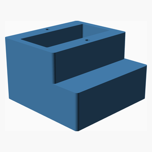 | 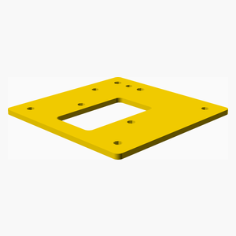 |

### Assembly instructions

1. Attach the power cables to the IEC connector.
2. Thread the power cables through the hole in the **IEC_Housing** and bolt the **IEC_Housing_Mount** to the **IEC_housing**.
3. Add the bolts and t-nuts in preparation for attachment to the frame.

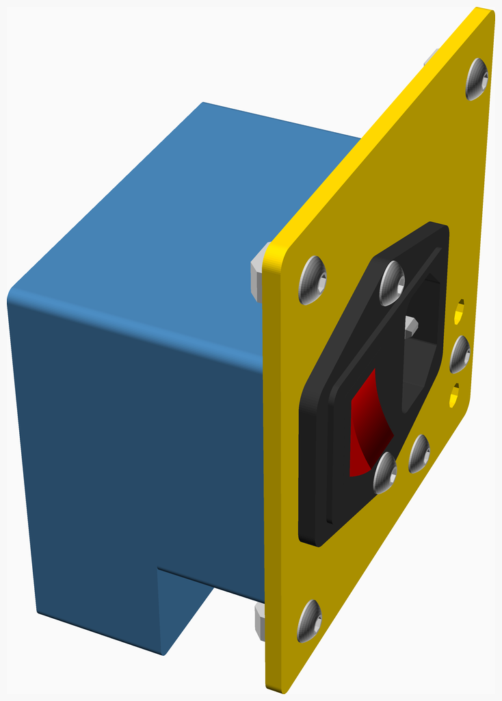

[Top](#TOP)

---

## Base_Plate_Stage_1 assembly

### Vitamins

| Qty | Description |
|----:|:------------|
|   1 | Aluminium sheet 390mm x 390mm x 3mm |
|   5 | Bolt M3 buttonhead x  8mm |
|   2 | Bolt M3 countersunk x  8mm |
|   8 | Bolt M4 buttonhead x  8mm |
|   8 | Bolt M4 buttonhead x 10mm |
|  14 | Bolt M5 buttonhead x 12mm |
|   1 | Extrusion E2020 x 350mm |
|   1 | Extrusion E2040 x 350mm |
|   1 | Extrusion E2080 x 350mm |
|   5 | Nut M3 hammer |
|  16 | Nut M4 hammer |

### 3D Printed parts

| 1 x Base_Cover_Back_Support_250.stl | 1 x Base_Cover_Front_Support_242.stl | 4 x Foot_LShaped_12mm.stl |
|----------|----------|----------|
| 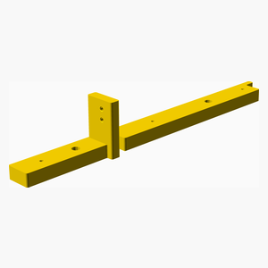 | 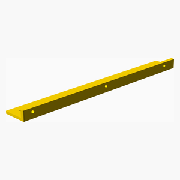 | 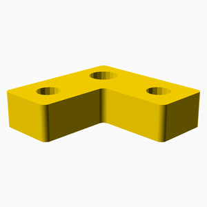 |

### CNC Routed parts

| 1 x BaseAL.dxf |
|----------|
|  

### Sub-assemblies

| 1 x IEC_Housing_assembly |
|----------|
| 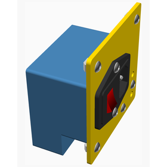 |

### Assembly instructions

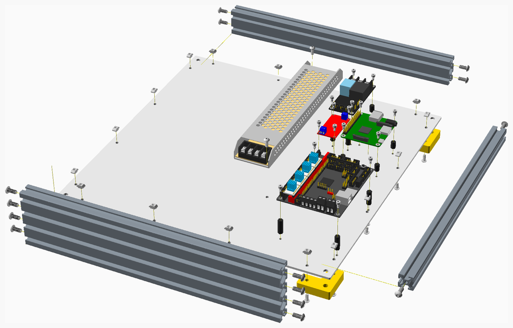

If you have access to a CNC, you can machine the base plate using **BaseAL.dxf**, if not you can use the **Panel_Jig**
as a template to drill the holes in the base plate.

1. Insert the bolts into the ends of the E2040 and E2080 extrusions in preparation for connection to the frame uprights.
2. Bolt the extrusions and the L-shaped feet to the baseplate as shown.
3. Attach the **IEC Housing assembly** to the left side extrusion.
4. Attach the **Base_Cover_Front_Support** and the **Base_Cover_Back_Support** to the front and rear extrusions.

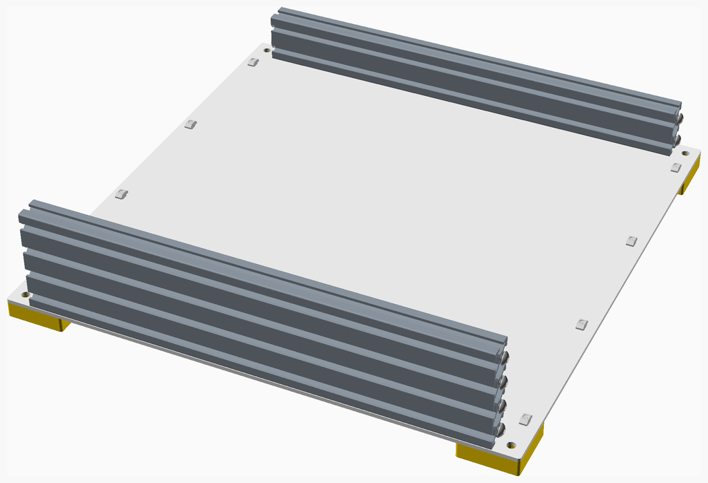

[Top](#TOP)

---

## Base_Plate assembly

### Vitamins

| Qty | Description |
|----:|:------------|
|   1 | BigTreeTech Manta 5MP v1.0 |
|   1 | BigTreeTech Relay Module v1.2 |
|   3 | Bolt M3 buttonhead x 10mm |
|   3 | Bolt M3 caphead x  6mm |
|   5 | Bolt M3 caphead x 12mm |
|   2 | Bolt M4 buttonhead x  8mm |
|   1 | Nut M3 hammer |
|   1 | PSU NIUGUY CB-500W-24V |
|   3 | Pillar hex nylon F/F M3x25 |
|   1 | Pillar hex nylon F/F M3x5 |
|   4 | Pillar hex nylon F/F M3x6 |

### Sub-assemblies

| 1 x Base_Plate_Stage_1_assembly |
|----------|
| 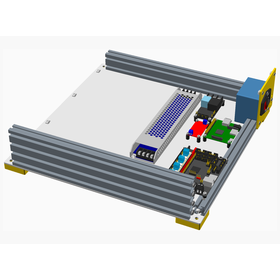 |

### Assembly instructions

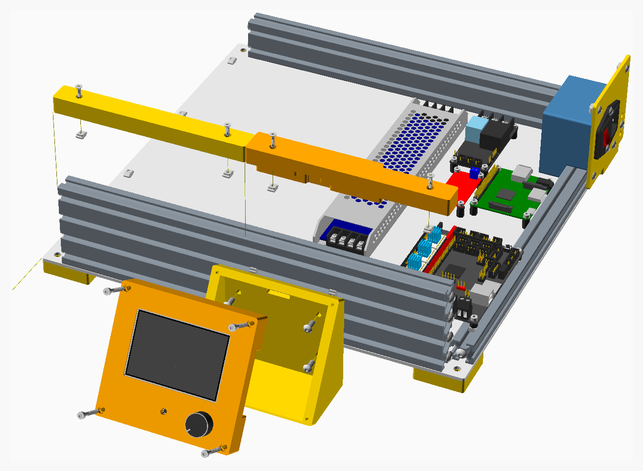

1. Bolt the PSU and the PCBs to the baseplate, using standoffs as appropriate.
2. Connect up the wiring, this is not shown in the illustrations.  

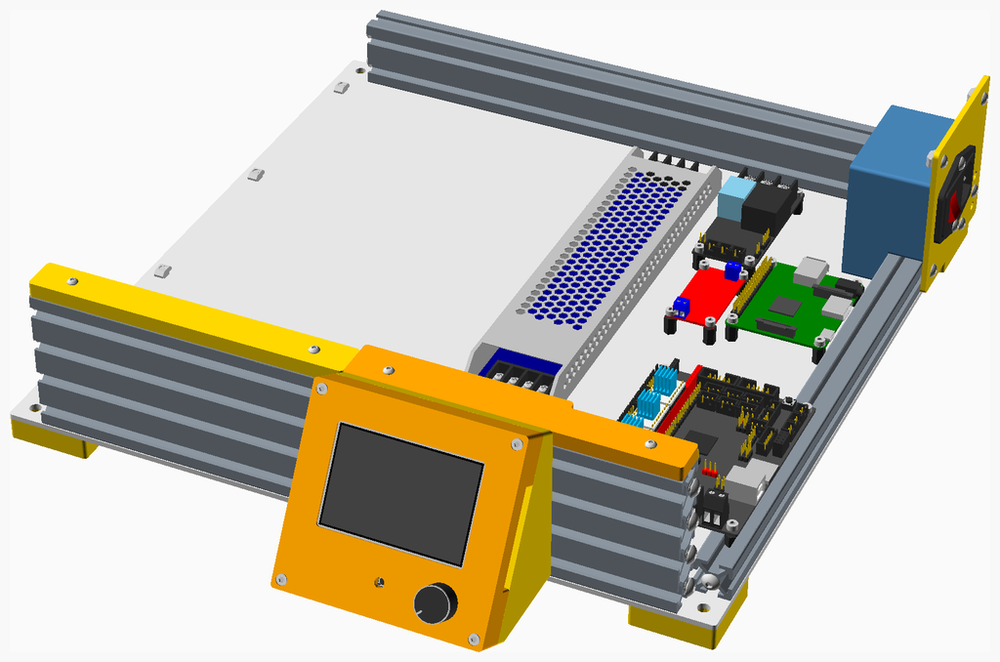

[Top](#TOP)

---

## Stage_1 assembly

### Vitamins

| Qty | Description |
|----:|:------------|
|   8 | Bolt M3 buttonhead x 16mm |
|   8 | Bolt M4 buttonhead x  8mm |
|   2 | Fan 40mm x 11mm |
|   8 | Nut M3 x 2.4mm  |
|   8 | Nut M4 hammer |

### 3D Printed parts

| 1 x Base_Fan_Mount_120B.stl | 1 x Base_Fan_Mount_170A.stl |
|----------|----------|
| 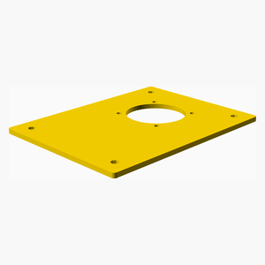 | 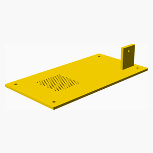 |

### Sub-assemblies

| 1 x Base_Plate_assembly | 1 x Right_Side_assembly |
|----------|----------|
| 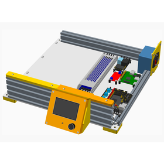 | 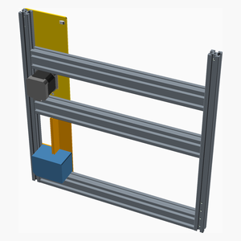 |

### Assembly instructions

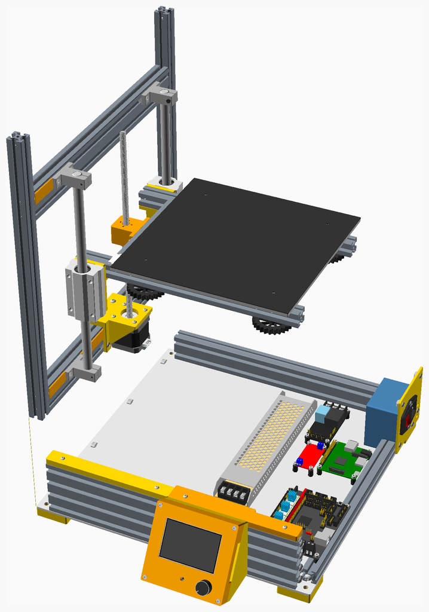

1. Slide the right face into the base plate assembly.
2. Ensuring the frame remains square, tighten the hidden bolts and the bolts under the baseplate.
3. Attach the fan mounts and fans to the right face.
4. Connect the fans to the mainboard.

[Top](#TOP)

---

## Stage_2 assembly

### Vitamins

| Qty | Description |
|----:|:------------|
|   2 | Bolt M3 buttonhead x  8mm |
|   4 | Bolt M3 buttonhead x 10mm |
|   1 | Cable wrap, 100mm |
|   1 | Drag chain, 390mm |

### 3D Printed parts

| 1 x Base_Cover_Left_Side_Support_175A.stl | 1 x Base_Cover_Left_Side_Support_175B.stl |
|----------|----------|
| 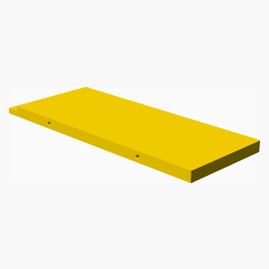 | 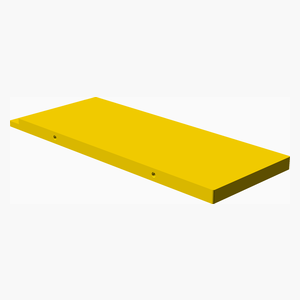 |

### Sub-assemblies

| 1 x Left_Side_with_Printbed_assembly | 1 x Stage_1_assembly |
|----------|----------|
| 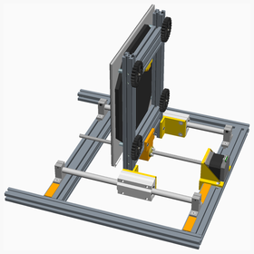 | 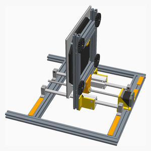 |

### Assembly instructions

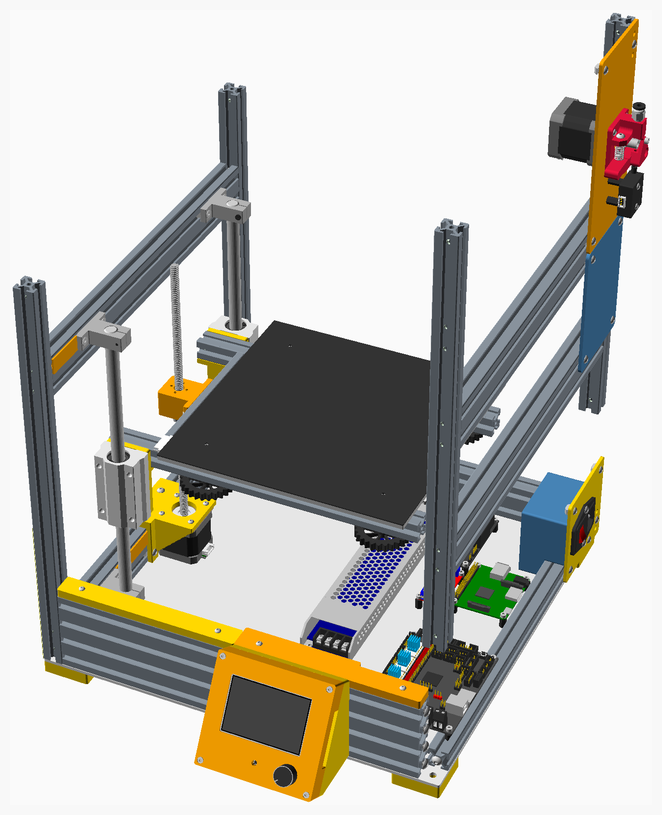

1. Bolt together the two **Base_Cover_Left_Side_Supports** and bolt them to the base.
1. Thread the heated bed cables through the cable chain and secure the cable chain to the print bed.
2. Wrap the remaining part of the heated bed cables in cable wrap.
3. Slide the left face into the base plate assembly.
4. Ensuring the frame remains square, tighten the hidden bolts and the bolts under the baseplate.
5. Attach the other end of the cable chain to the rear extrusion.
6. Connect the heated bed cables to the mainboard.

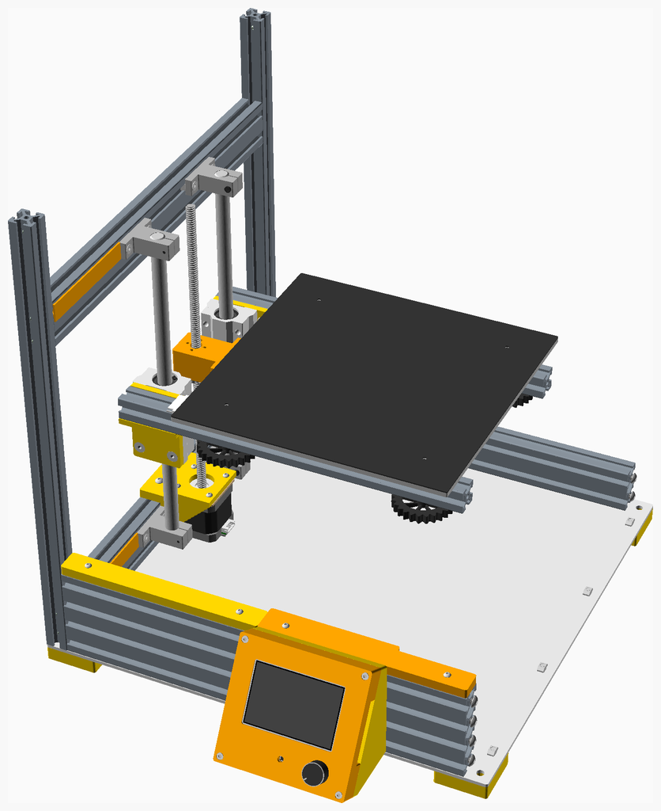

[Top](#TOP)

---

## Stage_3 assembly

### Vitamins

| Qty | Description |
|----:|:------------|
|  14 | Bolt M4 buttonhead x  8mm |
|  14 | Nut M4 hammer |
|   1 | Sheet polycarbonate 390mm x 450mm x 3mm |

### CNC Routed parts

| 1 x Back_Panel.dxf |
|----------|
|  

### Sub-assemblies

| 1 x Face_Top_assembly | 1 x Stage_2_assembly |
|----------|----------|
| 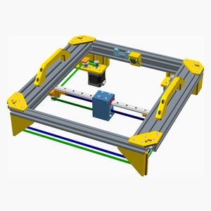 | 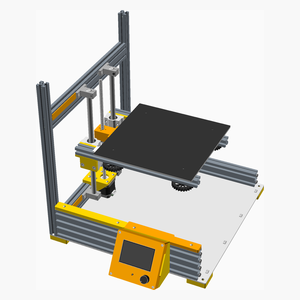 |

### Assembly instructions

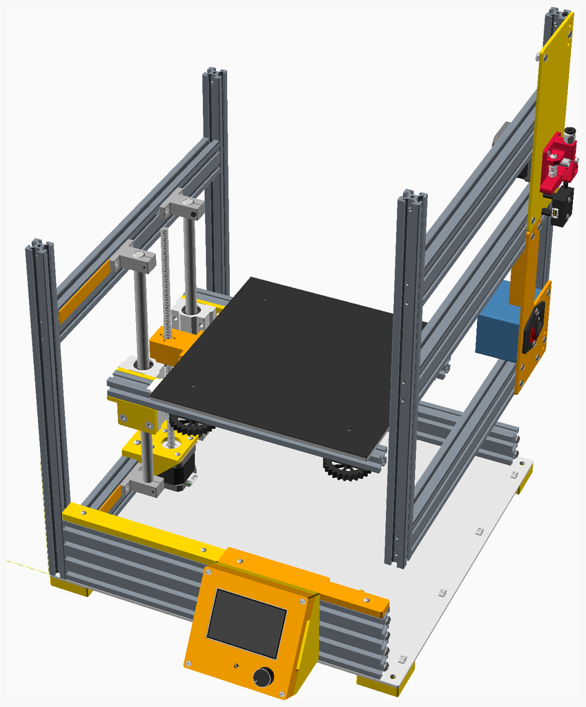

1. Slide the **Face_Top** assembly into the rest of the frame and tighten the hidden bolts.
2. Check that the print head slides freely on the Y-axis. If it doesn't, then re-rack the Y-axis,
see [Face_Top_Stage_2 assembly](#Face_Top_Stage_2_assembly).
3. Attach the back panel to the rest of the assembly.
4. Tighten the bolts on the back panel.

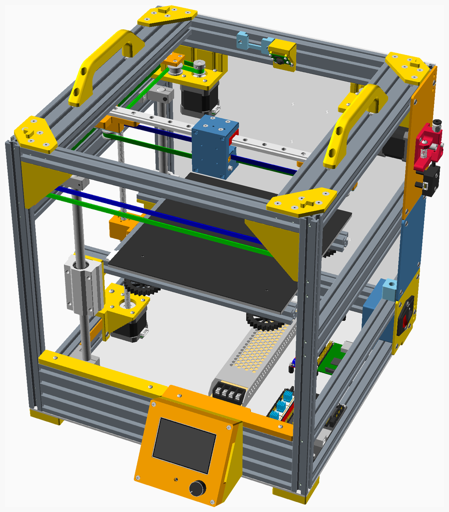

[Top](#TOP)

---

## Stage_4 assembly

### Vitamins

| Qty | Description |
|----:|:------------|
|   2 | Bolt M3 buttonhead x 10mm |
|   4 | Bolt M3 caphead x 35mm |

### 3D Printed parts

| 1 x Wiring_Guide.stl | 1 x Wiring_Guide_Clamp.stl |
|----------|----------|
| 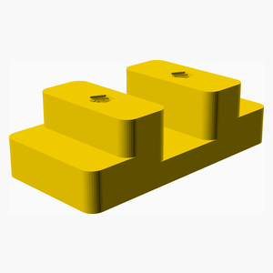 | 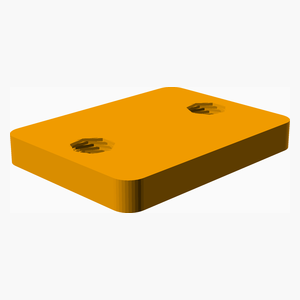 |

### Sub-assemblies

| 1 x Printhead_OrbiterV3_assembly | 1 x Stage_3_assembly |
|----------|----------|
| 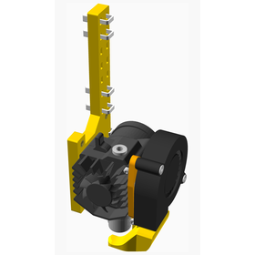 | 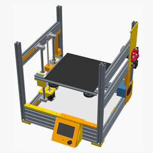 |

### Assembly instructions

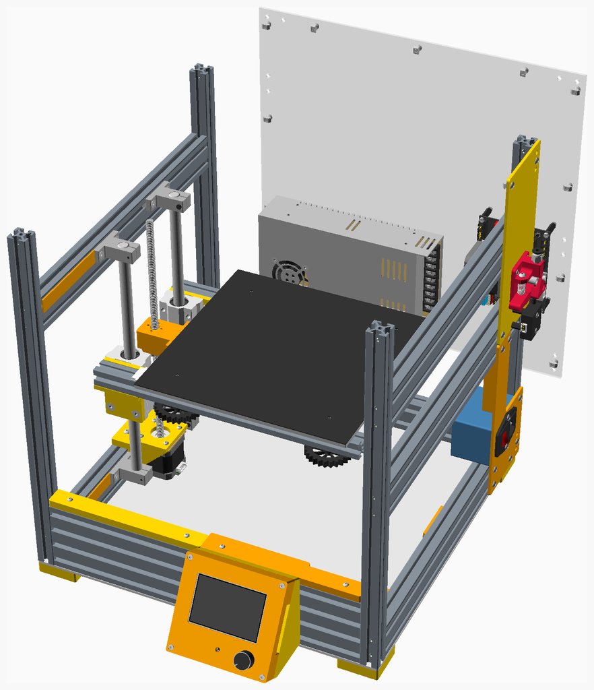

1. Bolt the **Printhead_OrbiterV3_assembly** to the  X_Carriage.
2. Route the wiring from the print head to the mainboard and secure it with the **Wiring_Guide_Clamp**.
3. Adjust the belt tension.
4. If using a Bowden Extruder, connect the Bowden tube between the extruder and the printhead.

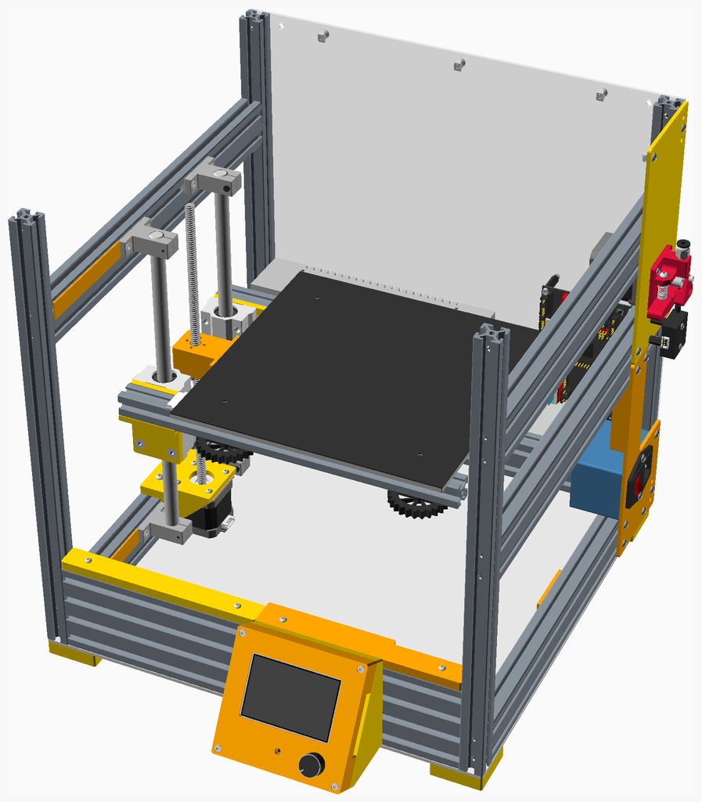

[Top](#TOP)

---

## main assembly

### Vitamins

| Qty | Description |
|----:|:------------|
|  11 | Bolt M3 buttonhead x  8mm |
|  31 | Bolt M4 buttonhead x  8mm |
|   2 | Bolt M4 buttonhead x 12mm |
|  33 | Nut M4 hammer |
|   1 | Sheet perspex 250mm x 370mm x 3mm |
|   1 | Sheet polycarbonate 390mm x 360mm x 3mm |
|   1 | Sheet polycarbonate 390mm x 450mm x 3mm |

### 3D Printed parts

| 1 x Spool_Holder.stl | 1 x Spool_Holder_36.stl | 1 x Spool_Holder_Bracket.stl |
|----------|----------|----------|
| 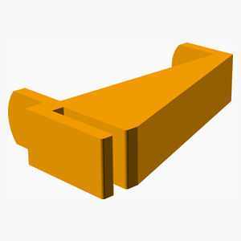 | 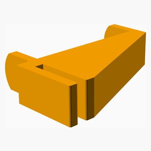 | 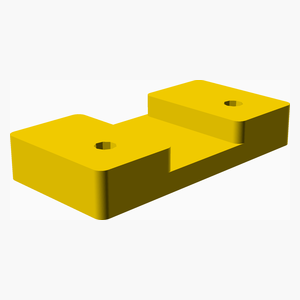 |

### CNC Routed parts

| 1 x Base_Cover_250.dxf | 1 x Left_Side_Panel.dxf | 1 x Right_Side_Panel.dxf |
|----------|----------|----------|
|  |  |  

### Sub-assemblies

| 1 x Stage_4_assembly |
|----------|
| 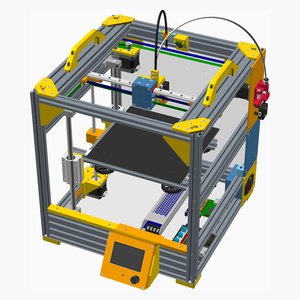 |

### Assembly instructions

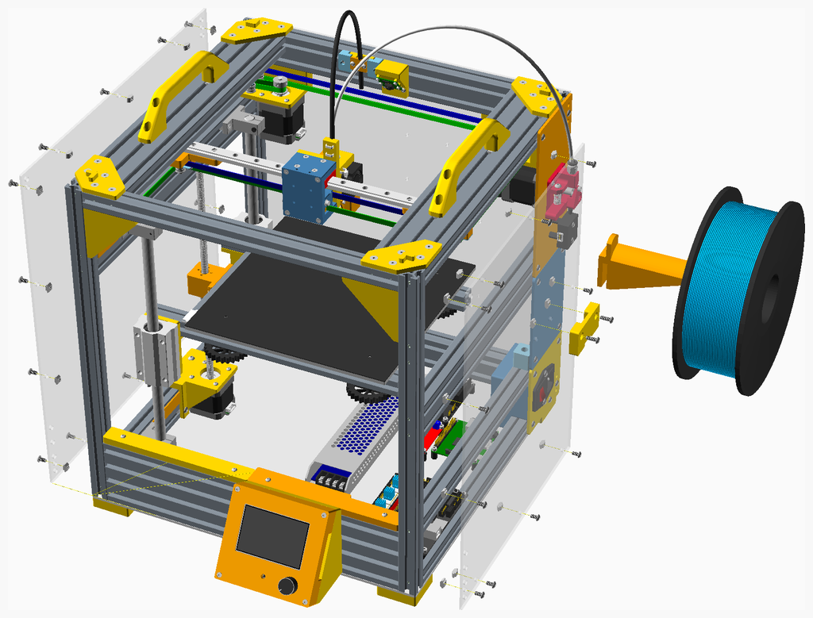

1. Bolt the polycarbonate sheet to the left face.
2. Attach the spoolholder and filament spool to the right face.
3. You are now ready to level the bed and calibrate the printer.

[Top](#TOP)
