

# MaybeCube Assembly Instructions

These are the assembly instructions for the MaybeCube. These instructions are not fully comprehensive, that is they do
not show every small detail of the construction and in particular they do not show the wiring. However there is sufficient
detail that someone with a good understanding of 3D printers can build the MaybeCube.

## Part substitutions - read this before you order parts

1. Most M3 button head bolts can be replaced with M3 cap head bolts.
2. The M3 hammer t-nuts and sliding t-nuts are mostly interchangeable. The exception being that hammer nuts are required for the
  thumbscrews on the extruder and spool holder. I find sliding t-nuts make for easier assembly, since they always "bite", and
  hammer nuts are better for parts that may be removed, like the side panels and baseplate.
3. The y-axis linear rails are specified to be 50mm shorter than the y-axis extrusions - eg 300mm linear rails are used with
  350mm extrusions. However the y-axis linear rails can be the same length as the extrusions, so 350mm linear rails could be
  used with 350mm extrusions. There is no such flexibility in the x-axis, however.

---

## Table of Contents

1. [Parts list](#Parts_list)

1. [Left_Side_Panel assembly](#Left_Side_Panel_assembly)
1. [Extruder_Bracket assembly](#Extruder_Bracket_assembly)
1. [IEC_Housing_Mount assembly](#IEC_Housing_Mount_assembly)
1. [Right_Side_Panel assembly](#Right_Side_Panel_assembly)
1. [X_Carriage assembly](#X_Carriage_assembly)
1. [Printhead assembly](#Printhead_assembly)
1. [X_Carriage_Front assembly](#X_Carriage_Front_assembly)
1. [Top_Corner_Piece assembly](#Top_Corner_Piece_assembly)
1. [Wiring_Guide assembly](#Wiring_Guide_assembly)
1. [XY_Motor_Mount_Right assembly](#XY_Motor_Mount_Right_assembly)
1. [XY_Idler_Right assembly](#XY_Idler_Right_assembly)
1. [XY_Motor_Mount_Left assembly](#XY_Motor_Mount_Left_assembly)
1. [XY_Idler_Left assembly](#XY_Idler_Left_assembly)
1. [Y_Carriage_Right assembly](#Y_Carriage_Right_assembly)
1. [Right_Side_Upper_Extrusion assembly](#Right_Side_Upper_Extrusion_assembly)
1. [Y_Carriage_Left assembly](#Y_Carriage_Left_assembly)
1. [Left_Side_Upper_Extrusion assembly](#Left_Side_Upper_Extrusion_assembly)
1. [Face_Top_Stage_1 assembly](#Face_Top_Stage_1_assembly)
1. [Face_Top assembly](#Face_Top_assembly)
1. [Partition assembly](#Partition_assembly)
1. [PCB_Mounting_Plate assembly](#PCB_Mounting_Plate_assembly)
1. [PSU_Right_Mount assembly](#PSU_Right_Mount_assembly)
1. [PSU_Left_Mount assembly](#PSU_Left_Mount_assembly)
1. [Back_Panel assembly](#Back_Panel_assembly)
1. [Right_Side assembly](#Right_Side_assembly)
1. [Display_Cover_TFT35_E3 assembly](#Display_Cover_TFT35_E3_assembly)
1. [Display_Housing_TFT35_E3 assembly](#Display_Housing_TFT35_E3_assembly)
1. [Base_Plate assembly](#Base_Plate_assembly)
1. [Printbed_Strain_Relief assembly](#Printbed_Strain_Relief_assembly)
1. [Z_Carriage_Center assembly](#Z_Carriage_Center_assembly)
1. [Z_Carriage_Right assembly](#Z_Carriage_Right_assembly)
1. [Z_Carriage_Left assembly](#Z_Carriage_Left_assembly)
1. [Printbed_Frame assembly](#Printbed_Frame_assembly)
1. [Printbed_Frame_with_Z_Carriages assembly](#Printbed_Frame_with_Z_Carriages_assembly)
1. [Printbed assembly](#Printbed_assembly)
1. [Z_Motor_Mount assembly](#Z_Motor_Mount_assembly)
1. [Left_Side assembly](#Left_Side_assembly)
1. [Main assembly](#main_assembly)

[Top](#TOP)

---

## Parts list

| IEC Housing Mount | Printhead | X Carriage Front | Wiring Guide | Face Top | Partition | PCB Mounting Plate | PSU Right Mount | PSU Left Mount | Back Panel | Right Side | Display Housing TFT35 E3 | Printbed Strain Relief | Printbed | Left Side | Main | TOTALS |  |
|-----:|-----:|-----:|-----:|-----:|-----:|-----:|-----:|-----:|-----:|-----:|-----:|-----:|-----:|-----:|-----:|------:|:---|
|      |      |      |      |      |      |      |      |      |      |      |      |      |      |      |      |       | **Vitamins** |
|   .  |   .  |   .  |   .  |   .  |   .  |   .  |   .  |   .  |   .  |   .  |   .  |   .  |   .  |   .  |   1  |    1  |  Aluminium sheet 390mm x 390mm x 3mm |
|   .  |   .  |   .  |   .  |   1  |   .  |   .  |   .  |   .  |   .  |   .  |   .  |   .  |   .  |   .  |   .  |    1  |  Belt GT2 x 6mm x nanmm |
|   .  |   .  |   .  |   .  |   1  |   .  |   .  |   .  |   .  |   .  |   .  |   .  |   .  |   .  |   .  |   .  |    1  |  Belt GT2 x 6mm x nanmm |
|   .  |   .  |   .  |   .  |   .  |   .  |   .  |   .  |   .  |   1  |   .  |   .  |   .  |   .  |   .  |   .  |    1  |  BigTreeTech SKR E3 Turbo |
|   .  |   .  |   .  |   .  |   .  |   .  |   .  |   .  |   .  |   .  |   .  |   1  |   .  |   .  |   .  |   .  |    1  |  BigTreeTech TFT35 E3 v3.0 |
|   .  |   4  |   .  |   .  |   .  |   .  |   .  |   .  |   .  |   .  |   .  |   .  |   .  |   .  |   .  |   .  |    4  |  Bolt M2 caphead x  6mm |
|   .  |   .  |   .  |   .  |   .  |   .  |   .  |   .  |   .  |   .  |   .  |   .  |   .  |   .  |   .  |   4  |    4  |  Bolt M3 buttonhead x  8mm |
|   .  |   4  |   6  |   .  |   2  |   .  |   .  |   .  |   .  |   5  |   .  |   .  |   .  |   .  |   .  |   .  |   17  |  Bolt M3 buttonhead x 10mm |
|   .  |   2  |   .  |   .  |  14  |   .  |   .  |   .  |   .  |   .  |   .  |   .  |   .  |   .  |   4  |   .  |   20  |  Bolt M3 buttonhead x 12mm |
|   .  |   .  |   .  |   .  |   .  |   .  |   .  |   .  |   .  |   .  |   .  |   .  |   .  |   .  |   .  |   4  |    4  |  Bolt M3 buttonhead x 16mm |
|   .  |   2  |   .  |   .  |   .  |   .  |   .  |   .  |   .  |   .  |   .  |   .  |   .  |   .  |   .  |   .  |    2  |  Bolt M3 buttonhead x 25mm |
|   .  |   .  |   .  |   .  |   .  |   .  |   .  |   .  |   .  |   5  |   .  |   4  |   .  |   .  |   .  |   .  |    9  |  Bolt M3 caphead x  6mm |
|   .  |   .  |   .  |   .  |   .  |   .  |   .  |   .  |   .  |   .  |   .  |   .  |   .  |   4  |   .  |   .  |    4  |  Bolt M3 caphead x  8mm |
|   .  |   .  |   .  |   .  |  28  |   .  |   .  |   .  |   .  |   .  |   .  |   .  |   .  |   .  |   .  |   .  |   28  |  Bolt M3 caphead x 10mm |
|   .  |   .  |   .  |   .  |  10  |   .  |   .  |   .  |   .  |   .  |   .  |   .  |   .  |   .  |   .  |   .  |   10  |  Bolt M3 caphead x 16mm |
|   .  |   .  |   2  |   .  |   .  |   .  |   .  |   .  |   .  |   .  |   .  |   .  |   .  |   .  |   .  |   .  |    2  |  Bolt M3 caphead x 20mm |
|   .  |   .  |   .  |   .  |   2  |   .  |   .  |   .  |   .  |   .  |   .  |   4  |   .  |   .  |   .  |   .  |    6  |  Bolt M3 caphead x 25mm |
|   .  |   .  |   .  |   .  |   2  |   .  |   .  |   .  |   .  |   .  |   .  |   .  |   .  |   .  |   .  |   .  |    2  |  Bolt M3 caphead x 30mm |
|   .  |   .  |   .  |   .  |   .  |   .  |   .  |   .  |   .  |   .  |   .  |   .  |   .  |   .  |   .  |  40  |   40  |  Bolt M4 buttonhead x  8mm |
|   .  |   .  |   .  |   .  |  14  |   .  |   .  |   .  |   .  |   .  |   .  |   .  |   .  |  10  |   2  |   8  |   34  |  Bolt M4 buttonhead x 10mm |
|   .  |   .  |   .  |   .  |   .  |   .  |   .  |   .  |   .  |   .  |   .  |   .  |   .  |   .  |   8  |   .  |    8  |  Bolt M4 buttonhead x 10mm - not shown |
|   .  |   .  |   .  |   .  |   .  |   .  |   .  |   .  |   .  |   .  |   .  |   .  |   .  |   .  |   2  |   4  |    6  |  Bolt M4 buttonhead x 12mm |
|   .  |   .  |   .  |   .  |   .  |   .  |   .  |   .  |   .  |  20  |   .  |   .  |   .  |   .  |   .  |   .  |   20  |  Bolt M4 countersunk x  8mm |
|   .  |   .  |   .  |   .  |  20  |   .  |   .  |   .  |   .  |   .  |   .  |   .  |   .  |   .  |   8  |   .  |   28  |  Bolt M4 countersunk x 10mm |
|   .  |   .  |   .  |   .  |   .  |   .  |   .  |   .  |   .  |   .  |   .  |   .  |   .  |   4  |   .  |   .  |    4  |  Bolt M4 countersunk x 45mm |
|   .  |   .  |   .  |   .  |   4  |   .  |   .  |   .  |   .  |   .  |   .  |   .  |   .  |   .  |   .  |   .  |    4  |  Bolt M5 buttonhead x 10mm |
|   .  |   .  |   .  |   .  |  10  |   .  |   .  |   .  |   .  |   .  |   8  |   .  |   .  |   .  |   8  |  12  |   38  |  Bolt M5 buttonhead x 12mm |
|   .  |   .  |   .  |   .  |   .  |   .  |   .  |   .  |   .  |   .  |   .  |   .  |   .  |   8  |   .  |   .  |    8  |  Bolt M5 countersunk x 12mm |
|   .  |   .  |   .  |   .  |   2  |   .  |   .  |   .  |   .  |   .  |   .  |   .  |   .  |   .  |   1  |   2  |    5  |  Cork damper NEMA 17 |
|   .  |   1  |   .  |   .  |   .  |   .  |   .  |   .  |   .  |   .  |   .  |   .  |   .  |   .  |   .  |   .  |    1  |  E3D V6 Fan Duct |
|   .  |   .  |   .  |   .  |   .  |   .  |   .  |   .  |   .  |   .  |   .  |   .  |   .  |   2  |   .  |   .  |    2  |  Extrusion E2020 x 275mm |
|   .  |   .  |   .  |   .  |   1  |   .  |   .  |   .  |   .  |   .  |   .  |   .  |   .  |   .  |   .  |   .  |    1  |  Extrusion E2020 x 350mm |
|   .  |   .  |   .  |   .  |   .  |   .  |   .  |   .  |   .  |   .  |   2  |   .  |   .  |   .  |   2  |   .  |    4  |  Extrusion E2020 x 400mm |
|   .  |   .  |   .  |   .  |   .  |   .  |   .  |   .  |   .  |   .  |   .  |   .  |   .  |   1  |   .  |   .  |    1  |  Extrusion E2040 x 150mm |
|   .  |   .  |   .  |   .  |   3  |   .  |   .  |   .  |   .  |   .  |   2  |   .  |   .  |   .  |   2  |   1  |    8  |  Extrusion E2040 x 350mm |
|   .  |   .  |   .  |   .  |   .  |   .  |   .  |   .  |   .  |   .  |   .  |   .  |   .  |   .  |   .  |   1  |    1  |  Extrusion E2080 x 350mm |
|   .  |   .  |   .  |   .  |   .  |   .  |   .  |   .  |   .  |   .  |   .  |   .  |   .  |   4  |   .  |   .  |    4  |  Extrusion inner corner bracket 4.5 |
|   .  |   1  |   .  |   .  |   .  |   .  |   .  |   .  |   .  |   .  |   .  |   .  |   .  |   .  |   .  |   .  |    1  |  Fan 30mm x 10mm |
|   .  |   .  |   .  |   .  |   .  |   .  |   .  |   .  |   .  |   .  |   .  |   .  |   .  |   1  |   .  |   .  |    1  |  Heated Bed 235mm x 235mm |
|   .  |   .  |   .  |   .  |   .  |   .  |   .  |   .  |   .  |   .  |   .  |   .  |   .  |   4  |   .  |   .  |    4  |  Heated bed leveling knob |
|   .  |   1  |   .  |   .  |   .  |   .  |   .  |   .  |   .  |   .  |   .  |   .  |   .  |   .  |   .  |   .  |    1  |  Hot end E3D V6 direct 1.75mm |
|   .  |   .  |   .  |   .  |   .  |   .  |   .  |   .  |   .  |   .  |   .  |   .  |   .  |   .  |   .  |   2  |    2  |  IEC320 C14 switched fused inlet module |
|   .  |   .  |   .  |   .  |   .  |   .  |   .  |   .  |   .  |   1  |   .  |   .  |   .  |   .  |   .  |   .  |    1  |  LED Switching Power Supply 24V 15A 360W |
|   .  |   .  |   .  |   .  |   .  |   .  |   .  |   .  |   .  |   .  |   .  |   .  |   .  |   .  |   1  |   .  |    1  |  Leadscrew 8mm x 280mm |
|   .  |   .  |   .  |   .  |   .  |   .  |   .  |   .  |   .  |   .  |   .  |   .  |   .  |   1  |   .  |   .  |    1  |  Leadscrew nut 8 x 2 |
|   .  |   .  |   .  |   .  |   1  |   .  |   .  |   .  |   .  |   .  |   .  |   .  |   .  |   .  |   .  |   .  |    1  |  Linear rail MGN12 x 300mm |
|   .  |   .  |   .  |   .  |   2  |   .  |   .  |   .  |   .  |   .  |   .  |   .  |   .  |   .  |   .  |   .  |    2  |  Linear rail MGN12 x 350mm |
|   .  |   .  |   .  |   .  |   3  |   .  |   .  |   .  |   .  |   .  |   .  |   .  |   .  |   .  |   .  |   .  |    3  |  Linear rail carriage MGN12H |
|   .  |   .  |   .  |   .  |   .  |   .  |   .  |   .  |   .  |   .  |   .  |   .  |   .  |   .  |   .  |   2  |    2  |  Linear rod 12mm x 300mm |
|   .  |   2  |   .  |   .  |   .  |   .  |   .  |   .  |   .  |   .  |   .  |   .  |   .  |   .  |   .  |   .  |    2  |  M3 self tapping screw x 16mm |
|   .  |   .  |   .  |   .  |   .  |   .  |   .  |   .  |   .  |   .  |   .  |   .  |   .  |   .  |   .  |   2  |    2  |  MK10 Dual Pulley Extruder |
|   .  |   .  |   .  |   .  |  16  |   .  |   .  |   .  |   .  |   .  |   .  |   .  |   .  |   .  |   .  |   .  |   16  |  Nut M3 hammer |
|   .  |   .  |   .  |   .  |  12  |   .  |   .  |   .  |   .  |  16  |   .  |   .  |   .  |   .  |   .  |  48  |   76  |  Nut M4 hammer |
|   .  |   .  |   .  |   .  |   .  |   .  |   .  |   .  |   .  |   .  |   .  |   .  |   .  |   .  |   8  |   .  |    8  |  Nut M4 hammer - not shown |
|   .  |   .  |   .  |   .  |  20  |   .  |   .  |   .  |   .  |   .  |   .  |   .  |   .  |   8  |  12  |   .  |   40  |  Nut M4 sliding T |
|   .  |   .  |   .  |   .  |   .  |   .  |   .  |   .  |   .  |   .  |   .  |   .  |   .  |   .  |   .  |   1  |    1  |  PTFE tube 488 mm |
|   .  |   .  |   .  |   .  |   .  |   .  |   .  |   .  |   .  |   .  |   .  |   .  |   .  |   .  |   .  |   4  |    4  |  Pillar hex nylon F/F M3x14 |
|   .  |   .  |   .  |   .  |   .  |   .  |   .  |   .  |   .  |   5  |   .  |   .  |   .  |   .  |   .  |   .  |    5  |  Pillar hex nylon F/F M3x20 |
|   .  |   .  |   .  |   .  |   8  |   .  |   .  |   .  |   .  |   .  |   .  |   .  |   .  |   .  |   .  |   .  |    8  |  Pulley GT2 idler 16 teeth |
|   .  |   .  |   .  |   .  |   4  |   .  |   .  |   .  |   .  |   .  |   .  |   .  |   .  |   .  |   .  |   .  |    4  |  Pulley GT2 idler smooth 9.63mm |
|   .  |   .  |   .  |   .  |   2  |   .  |   .  |   .  |   .  |   .  |   .  |   .  |   .  |   .  |   .  |   .  |    2  |  Pulley GT2OB 20 teeth |
|   .  |   .  |   .  |   .  |   .  |   .  |   .  |   .  |   .  |   .  |   .  |   .  |   .  |   2  |   .  |   .  |    2  |  SCS12LUU bearing block |
|   .  |   .  |   .  |   .  |   .  |   .  |   .  |   .  |   .  |   .  |   .  |   .  |   .  |   .  |   4  |   .  |    4  |  SK12 shaft support bracket |
|   .  |   .  |   .  |   .  |   .  |   1  |   .  |   .  |   .  |   .  |   .  |   .  |   .  |   .  |   .  |   .  |    1  |  Sheet polycarbonate 390mm x 349mm x 3mm |
|   .  |   .  |   .  |   .  |   .  |   .  |   .  |   .  |   .  |   1  |   .  |   .  |   .  |   .  |   .  |   2  |    3  |  Sheet polycarbonate 390mm x 400mm x 3mm |
|   .  |   .  |   .  |   .  |   .  |   .  |   .  |   .  |   .  |   .  |   .  |   .  |   .  |   4  |   .  |   .  |    4  |  Spring 8mm OD, 0.9mm gauge x 20mm long, closed end |
|   .  |   1  |   .  |   .  |   .  |   .  |   .  |   .  |   .  |   .  |   .  |   .  |   .  |   .  |   .  |   .  |    1  |  Square radial fan 3010 |
|   .  |   .  |   .  |   .  |   .  |   .  |   .  |   .  |   .  |   .  |   .  |   .  |   .  |   .  |   1  |   .  |    1  |  Stepper motor NEMA17 x 40mm |
|   .  |   .  |   .  |   .  |   2  |   .  |   .  |   .  |   .  |   .  |   .  |   .  |   .  |   .  |   .  |   2  |    4  |  Stepper motor NEMA17 x 47mm |
|   .  |   .  |   .  |   .  |   2  |   .  |   .  |   .  |   .  |   .  |   .  |   .  |   .  |   .  |   .  |   .  |    2  |  Stepper motor cable, 1125mm |
|   .  |   .  |   .  |   .  |   .  |   .  |   .  |   .  |   .  |   .  |   .  |   .  |   .  |   .  |   1  |   .  |    1  |  Stepper motor cable, 850mm |
|   .  |   .  |   .  |   .  |   .  |   .  |   .  |   .  |   .  |   .  |   .  |   .  |   .  |   .  |   .  |   2  |    2  |  Stepper motor cable, 950mm |
|   .  |   .  |   .  |   .  |  22  |   .  |   .  |   .  |   .  |   .  |   .  |   .  |   .  |   .  |   .  |   .  |   22  |  Washer  M3 |
|   .  |   .  |   .  |   .  |   2  |   .  |   .  |   .  |   .  |   .  |   .  |   .  |   .  |   .  |   .  |   .  |    2  |  Washer  M4 |
|   .  |   1  |   .  |   .  |   .  |   .  |   .  |   .  |   .  |   .  |   .  |   .  |   .  |   .  |   .  |   .  |    1  |  Ziptie 2.5mm x 100mm min length |
|   .  |   .  |   .  |   .  |   .  |   .  |   .  |   .  |   .  |   .  |   .  |   .  |   .  |   .  |   .  |   2  |    2  |  filament sensor |
|   .  |  19  |   8  |   .  | 210  |   1  |   .  |   .  |   .  |  54  |  12  |   9  |   .  |  53  |  64  | 144  |  574  | Total vitamins count |
|      |      |      |      |      |      |      |      |      |      |      |      |      |      |      |      |       | **3D printed parts** |
|   .  |   2  |   2  |   .  |   .  |   .  |   .  |   .  |   .  |   .  |   .  |   .  |   .  |   .  |   .  |   .  |    4  | Belt_Clamp.stl |
|   .  |   .  |   2  |   .  |   .  |   .  |   .  |   .  |   .  |   .  |   .  |   .  |   .  |   .  |   .  |   .  |    2  | Belt_Tensioner.stl |
|   .  |   .  |   1  |   .  |   .  |   .  |   .  |   .  |   .  |   .  |   .  |   .  |   .  |   .  |   .  |   .  |    1  | Belt_Tidy.stl |
|   .  |   .  |   .  |   .  |   .  |   .  |   .  |   .  |   .  |   .  |   .  |   1  |   .  |   .  |   .  |   .  |    1  | Display_Housing_Bracket_TFT35_E3.stl |
|   .  |   .  |   .  |   .  |   .  |   .  |   .  |   .  |   .  |   .  |   .  |   1  |   .  |   .  |   .  |   .  |    1  | Display_Housing_TFT35_E3.stl |
|   .  |   .  |   .  |   .  |   .  |   .  |   .  |   .  |   .  |   .  |   .  |   .  |   .  |   .  |   .  |   1  |    1  | Extruder_Bracket.stl |
|   .  |   .  |   .  |   .  |   .  |   .  |   .  |   .  |   .  |   .  |   .  |   .  |   .  |   .  |   1  |   .  |    1  | Extrusion_Drill_Jig_120_2.stl |
|   .  |   .  |   .  |   .  |   .  |   .  |   .  |   .  |   .  |   .  |   .  |   .  |   .  |   .  |   1  |   .  |    1  | Extrusion_Drill_Jig_120_4.stl |
|   .  |   1  |   .  |   .  |   .  |   .  |   .  |   .  |   .  |   .  |   .  |   .  |   .  |   .  |   .  |   .  |    1  | Fan_Duct_Right.stl |
|   .  |   .  |   .  |   .  |   .  |   .  |   .  |   .  |   .  |   .  |   .  |   .  |   .  |   .  |   .  |   4  |    4  | Foot_LShaped_12mm.stl |
|   .  |   1  |   .  |   .  |   .  |   .  |   .  |   .  |   .  |   .  |   .  |   .  |   .  |   .  |   .  |   .  |    1  | Hotend_Clamp.stl |
|   .  |   1  |   .  |   .  |   .  |   .  |   .  |   .  |   .  |   .  |   .  |   .  |   .  |   .  |   .  |   .  |    1  | Hotend_Strain_Relief_Clamp.stl |
|   .  |   .  |   .  |   .  |   .  |   .  |   .  |   .  |   .  |   .  |   .  |   .  |   .  |   .  |   .  |   2  |    2  | IEC_Housing.stl |
|   1  |   .  |   .  |   .  |   .  |   .  |   .  |   .  |   .  |   .  |   .  |   .  |   .  |   .  |   .  |   .  |    1  | IEC_Housing_Mount.stl |
|   .  |   .  |   .  |   .  |   .  |   .  |   1  |   .  |   .  |   1  |   .  |   .  |   .  |   .  |   .  |   .  |    2  | PCB_Mount.stl |
|   .  |   .  |   .  |   .  |   .  |   .  |   .  |   .  |   1  |   1  |   .  |   .  |   .  |   .  |   .  |   .  |    2  | PSU_Left_Mount.stl |
|   .  |   .  |   .  |   .  |   .  |   .  |   .  |   1  |   .  |   .  |   .  |   .  |   .  |   .  |   .  |   .  |    1  | PSU_Right_Mount.stl |
|   .  |   .  |   .  |   .  |   .  |   .  |   .  |   .  |   .  |   1  |   .  |   .  |   .  |   .  |   .  |   .  |    1  | PSU_Upper_Mount.stl |
|   .  |   .  |   .  |   .  |   .  |   .  |   .  |   .  |   .  |   .  |   .  |   .  |   1  |   .  |   .  |   .  |    1  | Printbed_Strain_Relief.stl |
|   .  |   .  |   .  |   .  |   .  |   .  |   .  |   .  |   .  |   .  |   .  |   .  |   1  |   .  |   .  |   .  |    1  | Printbed_Strain_Relief_Clamp.stl |
|   .  |   .  |   .  |   .  |   .  |   .  |   .  |   .  |   .  |   .  |   .  |   .  |   .  |   .  |   .  |   1  |    1  | Spool_Holder.stl |
|   .  |   .  |   .  |   .  |   4  |   .  |   .  |   .  |   .  |   .  |   .  |   .  |   .  |   .  |   .  |   .  |    4  | Top_Corner_Piece.stl |
|   .  |   .  |   .  |   1  |   .  |   .  |   .  |   .  |   .  |   .  |   .  |   .  |   .  |   .  |   .  |   .  |    1  | Wiring_Guide.stl |
|   .  |   .  |   .  |   1  |   .  |   .  |   .  |   .  |   .  |   .  |   .  |   .  |   .  |   .  |   .  |   .  |    1  | Wiring_Guide_Clamp.stl |
|   .  |   .  |   .  |   .  |   1  |   .  |   .  |   .  |   .  |   .  |   .  |   .  |   .  |   .  |   .  |   .  |    1  | XY_Idler_Left.stl |
|   .  |   .  |   .  |   .  |   1  |   .  |   .  |   .  |   .  |   .  |   .  |   .  |   .  |   .  |   .  |   .  |    1  | XY_Idler_Right.stl |
|   .  |   .  |   .  |   .  |   1  |   .  |   .  |   .  |   .  |   .  |   .  |   .  |   .  |   .  |   .  |   .  |    1  | XY_Motor_Mount_Left.stl |
|   .  |   .  |   .  |   .  |   1  |   .  |   .  |   .  |   .  |   .  |   .  |   .  |   .  |   .  |   .  |   .  |    1  | XY_Motor_Mount_Right.stl |
|   .  |   1  |   .  |   .  |   .  |   .  |   .  |   .  |   .  |   .  |   .  |   .  |   .  |   .  |   .  |   .  |    1  | X_Carriage.stl |
|   .  |   .  |   1  |   .  |   .  |   .  |   .  |   .  |   .  |   .  |   .  |   .  |   .  |   .  |   .  |   .  |    1  | X_Carriage_Front.stl |
|   .  |   .  |   .  |   .  |   1  |   .  |   .  |   .  |   .  |   .  |   .  |   .  |   .  |   .  |   .  |   .  |    1  | Y_Carriage_Brace_Left.stl |
|   .  |   .  |   .  |   .  |   1  |   .  |   .  |   .  |   .  |   .  |   .  |   .  |   .  |   .  |   .  |   .  |    1  | Y_Carriage_Brace_Right.stl |
|   .  |   .  |   .  |   .  |   1  |   .  |   .  |   .  |   .  |   .  |   .  |   .  |   .  |   .  |   .  |   .  |    1  | Y_Carriage_Left.stl |
|   .  |   .  |   .  |   .  |   1  |   .  |   .  |   .  |   .  |   .  |   .  |   .  |   .  |   .  |   .  |   .  |    1  | Y_Carriage_Right.stl |
|   .  |   .  |   .  |   .  |   .  |   .  |   .  |   .  |   .  |   .  |   .  |   .  |   .  |   1  |   .  |   .  |    1  | Z_Carriage_Center.stl |
|   .  |   .  |   .  |   .  |   .  |   .  |   .  |   .  |   .  |   .  |   .  |   .  |   .  |   1  |   .  |   .  |    1  | Z_Carriage_Left.stl |
|   .  |   .  |   .  |   .  |   .  |   .  |   .  |   .  |   .  |   .  |   .  |   .  |   .  |   1  |   .  |   .  |    1  | Z_Carriage_Right.stl |
|   .  |   .  |   .  |   .  |   .  |   .  |   .  |   .  |   .  |   .  |   .  |   .  |   .  |   .  |   1  |   .  |    1  | Z_Motor_Mount.stl |
|   .  |   .  |   .  |   .  |   .  |   .  |   .  |   .  |   .  |   .  |   .  |   .  |   .  |   .  |   2  |   .  |    2  | Z_RodMountGuide_105mm.stl |
|   1  |   6  |   6  |   2  |  12  |   .  |   1  |   1  |   1  |   3  |   .  |   2  |   2  |   3  |   5  |   8  |   53  | Total 3D printed parts count |
|      |      |      |      |      |      |      |      |      |      |      |      |      |      |      |      |       | **CNC routed parts** |
|   .  |   .  |   .  |   .  |   .  |   .  |   .  |   .  |   .  |   1  |   .  |   .  |   .  |   .  |   .  |   .  |    1  | Back_Panel.dxf |
|   .  |   .  |   .  |   .  |   .  |   .  |   .  |   .  |   .  |   .  |   .  |   .  |   .  |   .  |   .  |   1  |    1  | BaseAL.dxf |
|   .  |   .  |   .  |   .  |   .  |   .  |   .  |   .  |   .  |   .  |   .  |   .  |   .  |   .  |   .  |   1  |    1  | Left_Side_Panel.dxf |
|   .  |   .  |   .  |   .  |   .  |   1  |   .  |   .  |   .  |   .  |   .  |   .  |   .  |   .  |   .  |   .  |    1  | Partition.dxf |
|   .  |   .  |   .  |   .  |   .  |   .  |   .  |   .  |   .  |   .  |   .  |   .  |   .  |   .  |   .  |   1  |    1  | Right_Side_Panel.dxf |
|   .  |   .  |   .  |   .  |   .  |   1  |   .  |   .  |   .  |   1  |   .  |   .  |   .  |   .  |   .  |   3  |    5  | Total CNC routed parts count |

[Top](#TOP)

---

## Left_Side_Panel assembly

### Vitamins

|Qty|Description|
|---:|:----------|
|16| Bolt M4 buttonhead x  8mm|
|16| Nut M4 hammer|
|1| Sheet polycarbonate 390mm x 400mm x 3mm|

### CNC Routed parts

| 1 x Left_Side_Panel.dxf |
|---|
|  

### Assembly instructions

[Top](#TOP)

---

## Extruder_Bracket assembly

### Vitamins

|Qty|Description|
|---:|:----------|
|2| Bolt M3 buttonhead x  8mm|
|2| Bolt M3 buttonhead x 16mm|
|1| Cork damper NEMA 17|
|1| MK10 Dual Pulley Extruder|
|2| Pillar hex nylon F/F M3x14|
|1| Stepper motor NEMA17 x 47mm|
|1| Stepper motor cable, 950mm|
|1| filament sensor|

### 3D Printed parts

| 1 x Extruder_Bracket.stl |
|---|
| 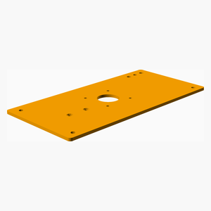 

### Assembly instructions

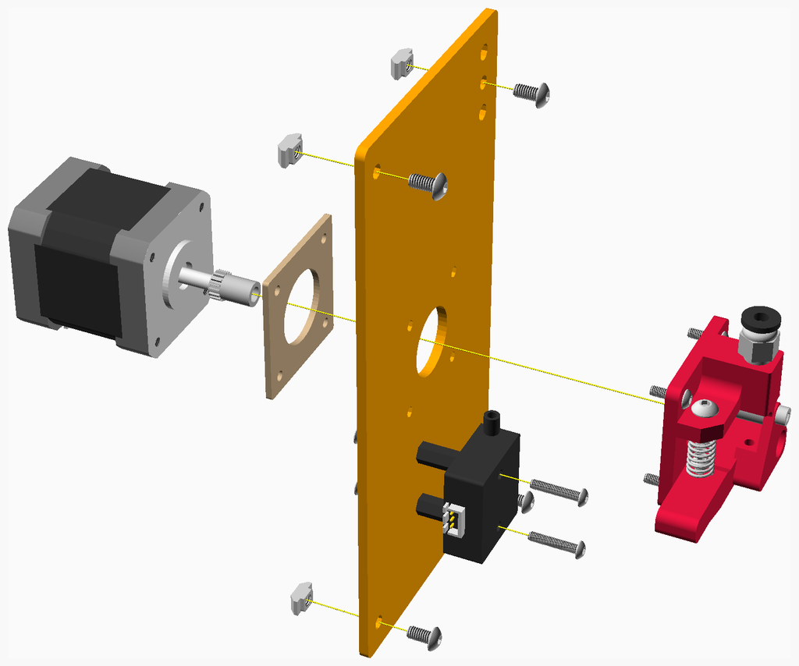

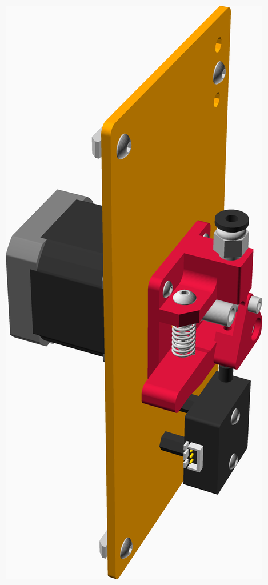

[Top](#TOP)

---

## IEC_Housing_Mount assembly

### 3D Printed parts

| 1 x IEC_Housing_Mount.stl |
|---|
|  

### Assembly instructions

[Top](#TOP)

---

## Right_Side_Panel assembly

### Vitamins

|Qty|Description|
|---:|:----------|
|2| Bolt M3 buttonhead x  8mm|
|2| Bolt M3 buttonhead x 16mm|
|16| Bolt M4 buttonhead x  8mm|
|2| Bolt M4 buttonhead x 12mm|
|1| Cork damper NEMA 17|
|1| IEC320 C14 switched fused inlet module|
|1| MK10 Dual Pulley Extruder|
|16| Nut M4 hammer|
|2| Pillar hex nylon F/F M3x14|
|1| Sheet polycarbonate 390mm x 400mm x 3mm|
|1| Stepper motor NEMA17 x 47mm|
|1| Stepper motor cable, 950mm|
|1| filament sensor|

### 3D Printed parts

| 1 x IEC_Housing.stl |
|---|
|  

### CNC Routed parts

| 1 x Right_Side_Panel.dxf |
|---|
|  

### Assembly instructions

[Top](#TOP)

---

## X_Carriage assembly

### Vitamins

|Qty|Description|
|---:|:----------|
|4| Bolt M2 caphead x  6mm|
|4| Bolt M3 buttonhead x 10mm|
|1| Square radial fan 3010|
|1| Ziptie 2.5mm x 100mm min length|

### 3D Printed parts

| 2 x Belt_Clamp.stl | 1 x Fan_Duct_Right.stl | 1 x X_Carriage.stl |
|---|---|---|
|  |  |  

### Assembly instructions

1. Bolt the belt clamps to the sides of the X_Carriage. Leave the clamps loose to allow later insertion of the belts.
2. Bolt the fan onto the side of the X_Carriage, secure the fan wire with a ziptie.
3. Ensure a good fit between the fan and the fan duct and bolt the fan duct to the X_Carriage.

[Top](#TOP)

---

## Printhead assembly

### Vitamins

|Qty|Description|
|---:|:----------|
|2| Bolt M3 buttonhead x 12mm|
|2| Bolt M3 buttonhead x 25mm|
|1| E3D V6 Fan Duct|
|1| Fan 30mm x 10mm|
|1| Hot end E3D V6 direct 1.75mm|
|2| M3 self tapping screw x 16mm|

### 3D Printed parts

| 1 x Hotend_Clamp.stl | 1 x Hotend_Strain_Relief_Clamp.stl |
|---|---|
| 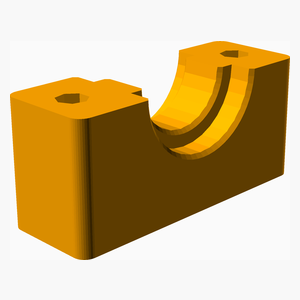 |  

### Sub-assemblies

| 1 x X_Carriage_assembly |
|---|
|  

### Assembly instructions

1. Assemble the E3D hotend, including fan, thermistor cartridge and heater cartridge.
2. Use the Hotend_Clamp to attach the hotend to the X_Carriage.
3. Collect the wires together and attach to the X_Carriage using the Hotend_Strain_Relief_Clamp.

[Top](#TOP)

---

## X_Carriage_Front assembly

### Vitamins

|Qty|Description|
|---:|:----------|
|6| Bolt M3 buttonhead x 10mm|
|2| Bolt M3 caphead x 20mm|

### 3D Printed parts

| 2 x Belt_Clamp.stl | 2 x Belt_Tensioner.stl | 1 x Belt_Tidy.stl |
|---|---|---|
|  |  |  

| 1 x X_Carriage_Front.stl |
|---|
|  

### Assembly instructions

1. Bolt the Belt_Clamps to the X_Carriage_Front, leaving them loose for later insertion of the belts.
2. Insert the Belt_tensioners into the X_Carriage_Front, and use the 20mm bolts to secure them in place.

[Top](#TOP)

---

## 4 x Top_Corner_Piece assembly

### Vitamins

|Qty|Description|
|---:|:----------|
|20| Bolt M4 countersunk x 10mm|
|20| Nut M4 sliding T|

### 3D Printed parts

| 4 x Top_Corner_Piece.stl |
|---|
|  

### Assembly instructions

[Top](#TOP)

---

## Wiring_Guide assembly

### 3D Printed parts

| 1 x Wiring_Guide.stl | 1 x Wiring_Guide_Clamp.stl |
|---|---|
|  |  

### Assembly instructions

[Top](#TOP)

---

## XY_Motor_Mount_Right assembly

### Vitamins

|Qty|Description|
|---:|:----------|
|4| Bolt M3 buttonhead x 12mm|
|2| Bolt M3 caphead x 16mm|
|3| Bolt M4 buttonhead x 10mm|
|1| Cork damper NEMA 17|
|3| Nut M4 hammer|
|1| Pulley GT2 idler 16 teeth|
|1| Pulley GT2 idler smooth 9.63mm|
|1| Pulley GT2OB 20 teeth|
|1| Stepper motor NEMA17 x 47mm|
|1| Stepper motor cable, 1125mm|
|2| Washer  M3|

### 3D Printed parts

| 1 x XY_Motor_Mount_Right.stl |
|---|
|  

### Assembly instructions

[Top](#TOP)

---

## XY_Idler_Right assembly

### Vitamins

|Qty|Description|
|---:|:----------|
|1| Bolt M3 caphead x 30mm|
|4| Bolt M4 buttonhead x 10mm|
|3| Nut M4 hammer|
|2| Pulley GT2 idler 16 teeth|
|6| Washer  M3|
|1| Washer  M4|

### 3D Printed parts

| 1 x XY_Idler_Right.stl |
|---|
| 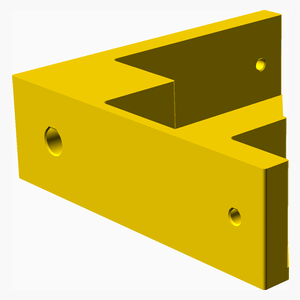 

### Assembly instructions

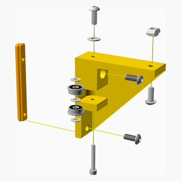

[Top](#TOP)

---

## XY_Motor_Mount_Left assembly

### Vitamins

|Qty|Description|
|---:|:----------|
|4| Bolt M3 buttonhead x 12mm|
|2| Bolt M3 caphead x 16mm|
|3| Bolt M4 buttonhead x 10mm|
|1| Cork damper NEMA 17|
|3| Nut M4 hammer|
|1| Pulley GT2 idler 16 teeth|
|1| Pulley GT2 idler smooth 9.63mm|
|1| Pulley GT2OB 20 teeth|
|1| Stepper motor NEMA17 x 47mm|
|1| Stepper motor cable, 1125mm|
|2| Washer  M3|

### 3D Printed parts

| 1 x XY_Motor_Mount_Left.stl |
|---|
| 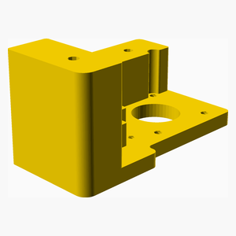 

### Assembly instructions

[Top](#TOP)

---

## XY_Idler_Left assembly

### Vitamins

|Qty|Description|
|---:|:----------|
|1| Bolt M3 caphead x 30mm|
|4| Bolt M4 buttonhead x 10mm|
|3| Nut M4 hammer|
|2| Pulley GT2 idler 16 teeth|
|6| Washer  M3|
|1| Washer  M4|

### 3D Printed parts

| 1 x XY_Idler_Left.stl |
|---|
| 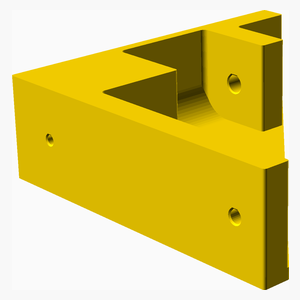 

### Assembly instructions

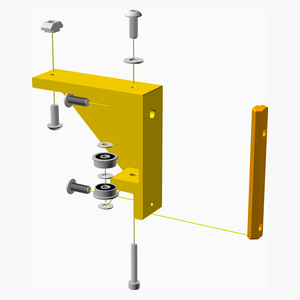

[Top](#TOP)

---

## Y_Carriage_Right assembly

### Vitamins

|Qty|Description|
|---:|:----------|
|4| Bolt M3 caphead x 10mm|
|3| Bolt M3 caphead x 16mm|
|1| Bolt M3 caphead x 25mm|
|1| Pulley GT2 idler 16 teeth|
|1| Pulley GT2 idler smooth 9.63mm|
|3| Washer  M3|

### 3D Printed parts

| 1 x Y_Carriage_Brace_Right.stl | 1 x Y_Carriage_Right.stl |
|---|---|
| 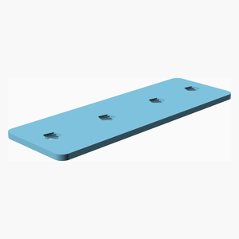 | 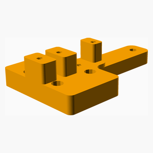 

### Assembly instructions

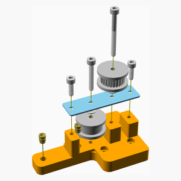

[Top](#TOP)

---

## Right_Side_Upper_Extrusion assembly

### Vitamins

|Qty|Description|
|---:|:----------|
|8| Bolt M3 caphead x 10mm|
|4| Bolt M5 buttonhead x 12mm|
|1| Extrusion E2040 x 350mm|
|1| Linear rail MGN12 x 350mm|
|1| Linear rail carriage MGN12H|
|8| Nut M3 hammer|

### Sub-assemblies

| 1 x Y_Carriage_Right_assembly |
|---|
|  

### Assembly instructions

[Top](#TOP)

---

## Y_Carriage_Left assembly

### Vitamins

|Qty|Description|
|---:|:----------|
|4| Bolt M3 caphead x 10mm|
|3| Bolt M3 caphead x 16mm|
|1| Bolt M3 caphead x 25mm|
|1| Pulley GT2 idler 16 teeth|
|1| Pulley GT2 idler smooth 9.63mm|
|3| Washer  M3|

### 3D Printed parts

| 1 x Y_Carriage_Brace_Left.stl | 1 x Y_Carriage_Left.stl |
|---|---|
| 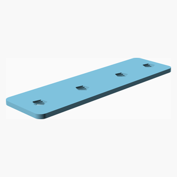 | 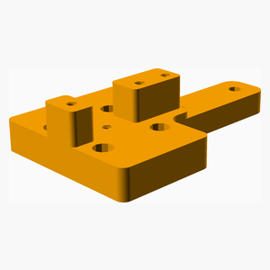 

### Assembly instructions

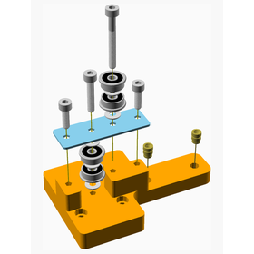

[Top](#TOP)

---

## Left_Side_Upper_Extrusion assembly

### Vitamins

|Qty|Description|
|---:|:----------|
|8| Bolt M3 caphead x 10mm|
|4| Bolt M5 buttonhead x 12mm|
|1| Extrusion E2040 x 350mm|
|1| Linear rail MGN12 x 350mm|
|1| Linear rail carriage MGN12H|
|8| Nut M3 hammer|

### Sub-assemblies

| 1 x Y_Carriage_Left_assembly |
|---|
|  

### Assembly instructions

[Top](#TOP)

---

## Face_Top_Stage_1 assembly

### Vitamins

|Qty|Description|
|---:|:----------|
|4| Bolt M5 buttonhead x 10mm|
|2| Bolt M5 buttonhead x 12mm|
|1| Extrusion E2020 x 350mm|
|1| Extrusion E2040 x 350mm|

### Sub-assemblies

| 1 x Left_Side_Upper_Extrusion_assembly | 1 x Right_Side_Upper_Extrusion_assembly | 4 x Top_Corner_Piece_assembly |
|---|---|---|
|  |  |  

| 1 x Wiring_Guide_assembly | 1 x XY_Idler_Left_assembly | 1 x XY_Idler_Right_assembly |
|---|---|---|
|  |  |  

| 1 x XY_Motor_Mount_Left_assembly | 1 x XY_Motor_Mount_Right_assembly |
|---|---|
|  |  

### Assembly instructions

[Top](#TOP)

---

## Face_Top assembly

### Vitamins

|Qty|Description|
|---:|:----------|
|1| Belt GT2 x 6mm x nanmm|
|1| Belt GT2 x 6mm x nanmm|
|2| Bolt M3 buttonhead x 10mm|
|6| Bolt M3 buttonhead x 12mm|
|4| Bolt M3 caphead x 10mm|
|1| Linear rail MGN12 x 300mm|
|1| Linear rail carriage MGN12H|

### Sub-assemblies

| 1 x Face_Top_Stage_1_assembly | 1 x Printhead_assembly | 1 x X_Carriage_Front_assembly |
|---|---|---|
|  |  |  

### Assembly instructions

[Top](#TOP)

---

## Partition assembly

### Vitamins

|Qty|Description|
|---:|:----------|
|1| Sheet polycarbonate 390mm x 349mm x 3mm|

### CNC Routed parts

| 1 x Partition.dxf |
|---|
|  

### Assembly instructions

[Top](#TOP)

---

## PCB_Mounting_Plate assembly

### 3D Printed parts

| 1 x PCB_Mount.stl |
|---|
| 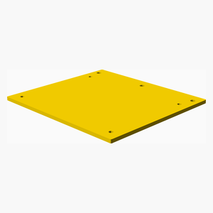 

### Assembly instructions

[Top](#TOP)

---

## PSU_Right_Mount assembly

### 3D Printed parts

| 1 x PSU_Right_Mount.stl |
|---|
| 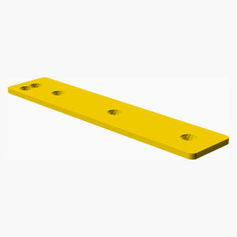 

### Assembly instructions

[Top](#TOP)

---

## PSU_Left_Mount assembly

### 3D Printed parts

| 1 x PSU_Left_Mount.stl |
|---|
| 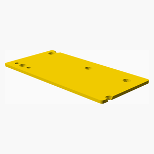 

### Assembly instructions

[Top](#TOP)

---

## Back_Panel assembly

### Vitamins

|Qty|Description|
|---:|:----------|
|1| BigTreeTech SKR E3 Turbo|
|5| Bolt M3 buttonhead x 10mm|
|5| Bolt M3 caphead x  6mm|
|20| Bolt M4 countersunk x  8mm|
|1| LED Switching Power Supply 24V 15A 360W|
|16| Nut M4 hammer|
|5| Pillar hex nylon F/F M3x20|
|1| Sheet polycarbonate 390mm x 400mm x 3mm|

### 3D Printed parts

| 1 x PCB_Mount.stl | 1 x PSU_Left_Mount.stl | 1 x PSU_Upper_Mount.stl |
|---|---|---|
|  |  |  

### CNC Routed parts

| 1 x Back_Panel.dxf |
|---|
|  

### Sub-assemblies

| 1 x PCB_Mounting_Plate_assembly | 1 x PSU_Left_Mount_assembly | 1 x PSU_Right_Mount_assembly |
|---|---|---|
|  |  |  

### Assembly instructions

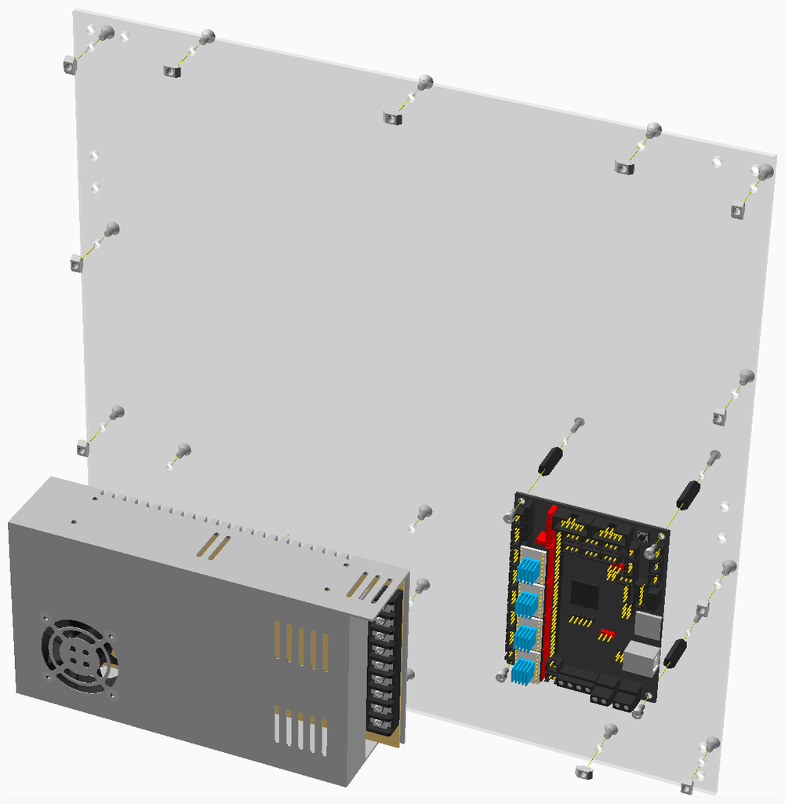

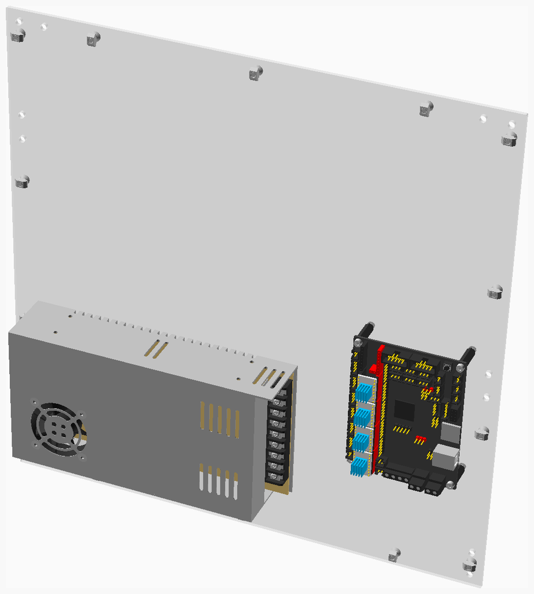

[Top](#TOP)

---

## Right_Side assembly

### Vitamins

|Qty|Description|
|---:|:----------|
|8| Bolt M5 buttonhead x 12mm|
|2| Extrusion E2020 x 400mm|
|2| Extrusion E2040 x 350mm|

### Assembly instructions

1. On a flat surface, bolt the top, middle and lower extrusions into the left and right uprights as shown.

2. Take time to ensure everything is square and then work your way around the bolts tightening them while ensuring
the frame remains square. Don't tighten each bolt fully before moving on to the next, rather tighten each bolt a bit
and move on to the next bolt, making several circuits of the frame to get all the bolts tight.

3. Once the frame is square and tightened, align the motor mount and idler with the top extrusion and tighten them in place.

[Top](#TOP)

---

## Display_Cover_TFT35_E3 assembly

### Vitamins

|Qty|Description|
|---:|:----------|
|1| BigTreeTech TFT35 E3 v3.0|
|4| Bolt M3 caphead x  6mm|

### 3D Printed parts

| 1 x Display_Housing_TFT35_E3.stl |
|---|
| 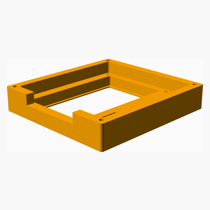 

### Assembly instructions

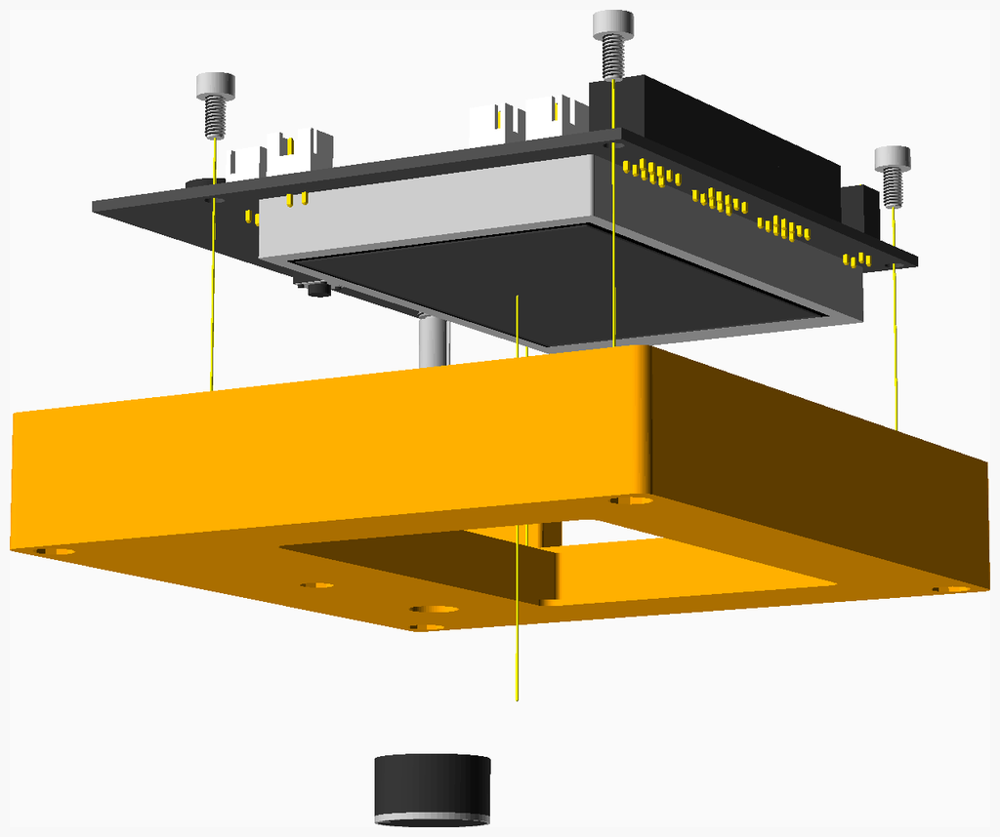

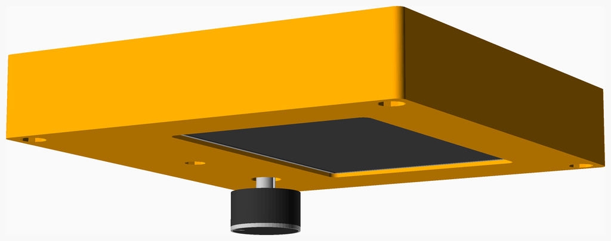

[Top](#TOP)

---

## Display_Housing_TFT35_E3 assembly

### Vitamins

|Qty|Description|
|---:|:----------|
|4| Bolt M3 caphead x 25mm|

### 3D Printed parts

| 1 x Display_Housing_Bracket_TFT35_E3.stl |
|---|
| 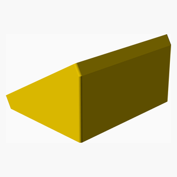 

### Sub-assemblies

| 1 x Display_Cover_TFT35_E3_assembly |
|---|
| 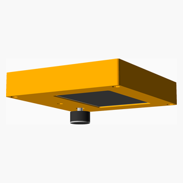 

### Assembly instructions

[Top](#TOP)

---

## Base_Plate assembly

### Vitamins

|Qty|Description|
|---:|:----------|
|1| Aluminium sheet 390mm x 390mm x 3mm|
|8| Bolt M4 buttonhead x  8mm|
|8| Bolt M4 buttonhead x 10mm|
|12| Bolt M5 buttonhead x 12mm|
|1| Extrusion E2040 x 350mm|
|1| Extrusion E2080 x 350mm|
|16| Nut M4 hammer|

### 3D Printed parts

| 4 x Foot_LShaped_12mm.stl |
|---|
|  

### CNC Routed parts

| 1 x BaseAL.dxf |
|---|
|  

### Sub-assemblies

| 1 x Display_Housing_TFT35_E3_assembly |
|---|
|  

### Assembly instructions

[Top](#TOP)

---

## Printbed_Strain_Relief assembly

### 3D Printed parts

| 1 x Printbed_Strain_Relief.stl | 1 x Printbed_Strain_Relief_Clamp.stl |
|---|---|
| 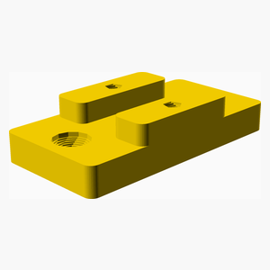 | 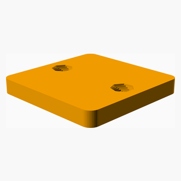 

### Assembly instructions

[Top](#TOP)

---

## Z_Carriage_Center assembly

### Vitamins

|Qty|Description|
|---:|:----------|
|4| Bolt M3 caphead x  8mm|
|4| Bolt M4 buttonhead x 10mm|
|1| Leadscrew nut 8 x 2|
|4| Nut M4 sliding T|

### 3D Printed parts

| 1 x Z_Carriage_Center.stl |
|---|
|  

### Assembly instructions

[Top](#TOP)

---

## Z_Carriage_Right assembly

### Vitamins

|Qty|Description|
|---:|:----------|
|2| Bolt M4 buttonhead x 10mm|
|4| Bolt M5 countersunk x 12mm|
|2| Nut M4 sliding T|
|1| SCS12LUU bearing block|

### 3D Printed parts

| 1 x Z_Carriage_Right.stl |
|---|
| 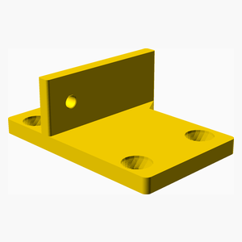 

### Assembly instructions

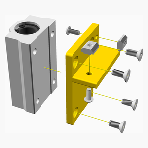

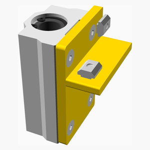

[Top](#TOP)

---

## Z_Carriage_Left assembly

### Vitamins

|Qty|Description|
|---:|:----------|
|2| Bolt M4 buttonhead x 10mm|
|4| Bolt M5 countersunk x 12mm|
|2| Nut M4 sliding T|
|1| SCS12LUU bearing block|

### 3D Printed parts

| 1 x Z_Carriage_Left.stl |
|---|
| 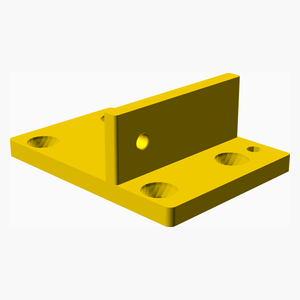 

### Assembly instructions

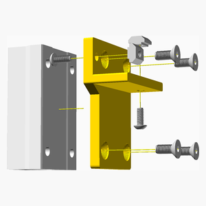

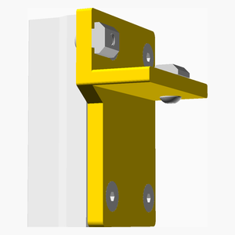

[Top](#TOP)

---

## Printbed_Frame assembly

### Vitamins

|Qty|Description|
|---:|:----------|
|2| Bolt M4 buttonhead x 10mm|
|2| Extrusion E2020 x 275mm|
|1| Extrusion E2040 x 150mm|
|4| Extrusion inner corner bracket 4.5|

### Assembly instructions

[Top](#TOP)

---

## Printbed_Frame_with_Z_Carriages assembly

### Sub-assemblies

| 1 x Printbed_Frame_assembly | 1 x Printbed_Strain_Relief_assembly | 1 x Z_Carriage_Center_assembly |
|---|---|---|
|  |  |  

| 1 x Z_Carriage_Left_assembly | 1 x Z_Carriage_Right_assembly |
|---|---|
|  |  

### Assembly instructions

1. Slide the Z carriages onto the frame as shown.

2. Ensure the Z carriages are square and aligned with the end of the frame and then tighten the bolts.

[Top](#TOP)

---

## Printbed assembly

### Vitamins

|Qty|Description|
|---:|:----------|
|4| Bolt M4 countersunk x 45mm|
|1| Heated Bed 235mm x 235mm|
|4| Heated bed leveling knob|
|4| Spring 8mm OD, 0.9mm gauge x 20mm long, closed end|

### Sub-assemblies

| 1 x Printbed_Frame_with_Z_Carriages_assembly |
|---|
|  

### Assembly instructions

1. With the heatbed upside down, place the bolts through the heatbed and place the springs over the bolts.

2. Thread the bolts through the frame and add the adjusting wheels, tightening them to mid position, to allow later adjustments.

[Top](#TOP)

---

## Z_Motor_Mount assembly

### Vitamins

|Qty|Description|
|---:|:----------|
|4| Bolt M3 buttonhead x 12mm|
|2| Bolt M4 buttonhead x 10mm|
|2| Bolt M4 buttonhead x 12mm|
|1| Cork damper NEMA 17|
|1| Leadscrew 8mm x 280mm|
|4| Nut M4 sliding T|
|1| Stepper motor NEMA17 x 40mm|
|1| Stepper motor cable, 850mm|

### 3D Printed parts

| 1 x Z_Motor_Mount.stl |
|---|
|  

### Assembly instructions

[Top](#TOP)

---

## Left_Side assembly

### Vitamins

|Qty|Description|
|---:|:----------|
|8| Bolt M4 buttonhead x 10mm - not shown|
|8| Bolt M4 countersunk x 10mm|
|8| Bolt M5 buttonhead x 12mm|
|2| Extrusion E2020 x 400mm|
|2| Extrusion E2040 x 350mm|
|8| Nut M4 hammer - not shown|
|8| Nut M4 sliding T|
|4| SK12 shaft support bracket|

### 3D Printed parts

| 1 x Extrusion_Drill_Jig_120_2.stl | 1 x Extrusion_Drill_Jig_120_4.stl | 2 x Z_RodMountGuide_105mm.stl |
|---|---|---|
|  |  | 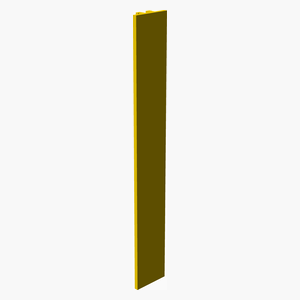 

### Sub-assemblies

| 1 x Z_Motor_Mount_assembly |
|---|
|  

### Assembly instructions

1. On a flat surface, bolt the top, middle and lower extrusions into the left and right uprights as shown. Note
that the lower extrusion is 2020 extrusion, this is to allow access to the power supply and mainboard.

2. Take time to ensure everything is square and then work your way around the bolts tightening them while ensuring
the frame remains square. Don't tighten each bolt fully before moving on to the next, rather tighten each bolt a bit
and move on to the next bolt, making several circuits of the frame to get all the bolts tight.

3. Once the frame is square and tightened, align the motor mount and idler with the top extrusion and tighten them in place.

[Top](#TOP)

---

## main assembly

### Vitamins

|Qty|Description|
|---:|:----------|
|2| Bolt M4 buttonhead x 12mm|
|1| IEC320 C14 switched fused inlet module|
|2| Linear rod 12mm x 300mm|
|1| PTFE tube 488 mm|

### 3D Printed parts

| 1 x IEC_Housing.stl | 1 x Spool_Holder.stl |
|---|---|
|  |  

### Sub-assemblies

| 1 x Back_Panel_assembly | 1 x Base_Plate_assembly | 1 x Extruder_Bracket_assembly |
|---|---|---|
| 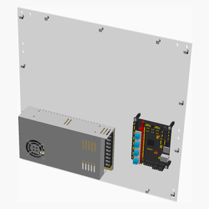 |  | 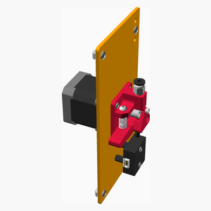 

| 1 x Face_Top_assembly | 1 x IEC_Housing_Mount_assembly | 1 x Left_Side_Panel_assembly |
|---|---|---|
|  |  |  

| 1 x Left_Side_assembly | 1 x Partition_assembly | 1 x Printbed_assembly |
|---|---|---|
|  |  |  

| 1 x Right_Side_Panel_assembly | 1 x Right_Side_assembly |
|---|---|
|  |  

### Assembly instructions

1. Attach the extruder and the spoolholder to the right face.

2. Connect the Bowden tube between the extruder and the printhead.

3. Attach the polycarbonate sheet to the back of the print. Make sure everything is square before tightening the bolts.

[Top](#TOP)
