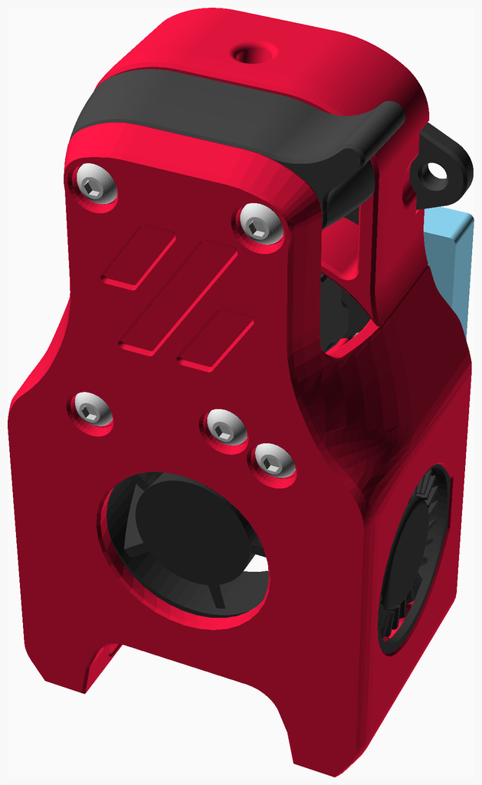
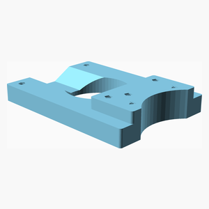
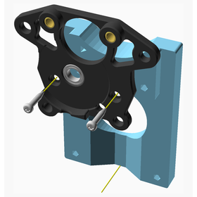
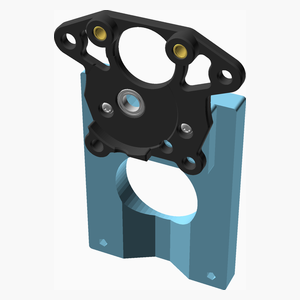
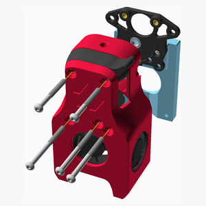
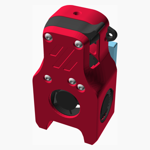

# Voron Mini Afterburner adaptor

---

## Table of Contents

1. [Parts list](#Parts_list)
1. [X_Carriage_Voron_Mini_Afterburner assembly](#X_Carriage_Voron_Mini_Afterburner_assembly)
1. [Printhead_Voron_Mini_Afterburner assembly](#Printhead_Voron_Mini_Afterburner_assembly)

[Top](#TOP)

---

## Parts list

| X Carriage Voron Mini Afterburner | Printhead Voron Mini Afterburner | TOTALS |  |
|-----:|-----:|------:|:-------------|
|      |      |       | **Vitamins** |
|   .  |   2  |    2  |  Bolt M3 buttonhead x 30mm |
|   .  |   3  |    3  |  Bolt M3 buttonhead x 40mm |
|   2  |   .  |    2  |  Screw M2 self tapping (Pan Head) x 10mm |
|   .  |   1  |    1  |  Voron Mini Afterburner assembly |
|   2  |   6  |    8  | Total vitamins count |
|      |      |       | **3D printed parts** |
|   1  |   .  |    1  | X_Carriage_Voron_Mini_Afterburner.stl |
|   1  |   .  |    1  | Total 3D printed parts count |

[Top](#TOP)

---

## X_Carriage_Voron_Mini_Afterburner assembly

### Vitamins

| Qty | Description |
|----:|:------------|
|   2 | Screw M2 self tapping (Pan Head) x 10mm |

### 3D Printed parts

| 1 x X_Carriage_Voron_Mini_Afterburner.stl |
|----------|
|  |

### Assembly instructions

[Top](#TOP)

---

## Printhead_Voron_Mini_Afterburner assembly

### Vitamins

| Qty | Description |
|----:|:------------|
|   2 | Bolt M3 buttonhead x 30mm |
|   3 | Bolt M3 buttonhead x 40mm |
|   1 | Voron Mini Afterburner assembly |

### Sub-assemblies

| 1 x X_Carriage_Voron_Mini_Afterburner_assembly |
|----------|
|  |

### Assembly instructions

[Top](#TOP)
