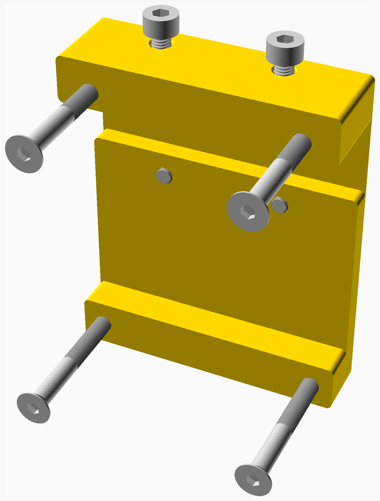
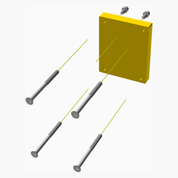
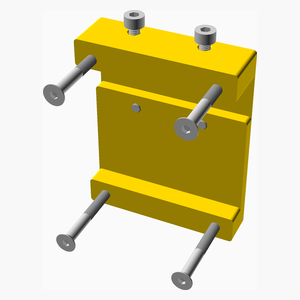

# XChange adaptors

MaybeCube supports the
[Printermods XChange quick change tool head](https://www.kickstarter.com/projects/printermods/xchange-v10-hot-swap-tool-changing-for-every-3d-printer).

---

## Table of Contents

1. [Parts list](#Parts_list)

1. [X_Carriage_XChange assembly](#X_Carriage_XChange_assembly)

[Top](#TOP)

---

## Parts list

| X Carriage XChange | TOTALS |  |
|-----:|------:|:---|
|      |       | **Vitamins** |
|   4  |    4  |  Bolt M3 caphead x  6mm |
|   4  |    4  |  Bolt M3 countersunk x 40mm |
|   8  |    8  | Total vitamins count |
|      |       | **3D printed parts** |
|   1  |    1  | X_Carriage_XChange_16.stl |
|   1  |    1  | Total 3D printed parts count |

[Top](#TOP)

---

## X_Carriage_XChange assembly

### Vitamins

|Qty|Description|
|---:|:----------|
|4| Bolt M3 caphead x  6mm|
|4| Bolt M3 countersunk x 40mm|

### 3D Printed parts

| 1 x X_Carriage_XChange_16.stl |
|---|
|  

### Assembly instructions

[Top](#TOP)
